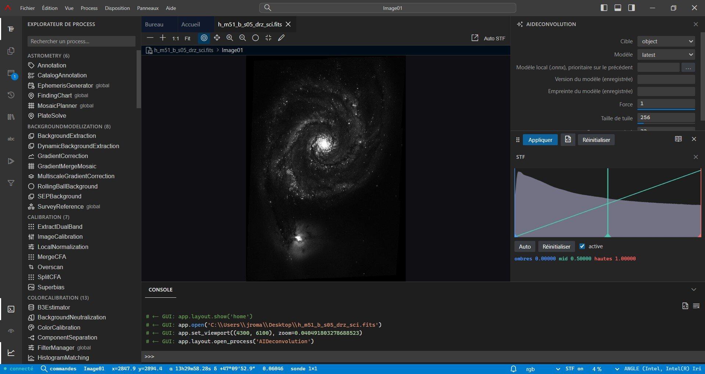

# Retina

**Traitement d'images astrophotographiques open source, entièrement scriptable en Python,
avec une interface façon VS Code.**

Retina calibre, recale, intègre et traite des images astronomiques. Son cœur est une
bibliothèque Python qui fonctionne sans interface ; l'interface en est un client, pas le
propriétaire.



[](LICENSE)


## Le principe fondateur

**Tout est réalisable depuis la console Python intégrée.** Ouvrir et enregistrer, créer une
fenêtre ou une preview, choisir la vue active, appliquer un process, gérer masques et
historique, arranger les docks, lancer un lot — tout passe par l'API `retina`. Aucune
fonctionnalité n'est réservée à l'interface.

Mieux : **chaque geste dans l'interface affiche le code Python équivalent**, exécutable et
copiable. On le voit dans la console en bas de la capture ci-dessus :

```python
# ← GUI: app.open('C:\\Users\\jroma\\Desktop\\h_m51_b_s05_drz_sci.fits')
# ← GUI: app.set_viewport((4300, 6100), zoom=0.0404918)
# ← GUI: app.layout.open_process('AIDeconvolution')
```

On apprend l'API en cliquant, et n'importe quelle suite de clics devient un script.

## Ce qu'il fait

- **141 process** — calibration, correction cosmétique, débayerisation, recalage, intégration,
  extraction de fond, déconvolution, débruitage, étirement, calibration couleur, retrait
  d'étoiles, photométrie, astrométrie, mosaïques, HDR.
- **Pré-traitement automatisé** (`retina.pipeline`) — on lui donne un dossier de brutes, il
  scanne, groupe, construit les masters, calibre, recale et intègre, avec cache et reprise.
- **Inspection et comparaison** — sélecteur de frames, blink, vues liées, rideau avant/après,
  en-tête FITS.
- **Gestes interactifs** — masques composés dans le shader, recadrage à poignées, tampon de
  clonage, PSF au clic, recalage manuel par paires de points, readout céleste.
- **Mode script** — éditeur Monaco pleine page, survol et aide de signature depuis l'IPython
  embarqué, et un process `Script` qui rend une exécution annulable et rejouable.
- **Projets** — un fichier `.retina` enregistre toute une session, historique d'annulation
  compris.
- **Bilingue** — anglais par défaut, français complet, langue détectée au lancement.

## Installation

**Prérequis** : Python ≥ 3.11, une [chaîne Rust](https://rustup.rs/), Node ≥ 20.

```bash
git clone https://github.com/jromang/retina && cd retina
python -m venv .venv && source .venv/bin/activate.fish
pip install maturin
pip install -e '.[web,xisf,astro,project,dev]'

# Cœur natif. Sous Python 3.14, le drapeau de compatibilité abi3 est nécessaire :
PYO3_USE_ABI3_FORWARD_COMPATIBILITY=1 maturin develop --release

# Frontend, construit dans le paquet Python.
cd web && npm install && npm run build && cd ..

python -m retina.web          # serveur + fenêtre native
```

Accélération GPU optionnelle (Linux et Windows uniquement — la roue CuPy est liée à une
branche CUDA, d'où son absence de la ligne ci-dessus) :

```bash
pip install -e '.[cuda]'      # CUDA 13 ; '.[cuda12]' pour un pilote CUDA 12
```

Sans interface, en pur script :

```bash
python -m retina.run recipe.py        # aucune dépendance graphique
python -m retina.pipeline /data/M31   # pré-traitement automatisé, headless
```

### Installateur Windows

Chaque release fournit un MSI, publié sur la
[page des releases](https://github.com/jromang/retina/releases).

L'installateur n'est **pas signé**, donc SmartScreen avertit au premier lancement : choisir
*Informations complémentaires* → *Exécuter quand même*. Vérifier le téléchargement avec le
`SHA256SUMS.txt` publié à côté — en sachant qu'un MSI n'est pas reproductible au bit près (WiX y
inscrit des horodatages et des GUID engendrés) : une empreinte identifie un artefact, pas une
version.

Chaque release est construite par un workflow public
([`release-windows.yml`](.github/workflows/release-windows.yml)) depuis les sources de ce
dépôt, avec des logs publics : rien n'est construit sur une machine de développement puis
téléversé à la main.

Ce que le logiciel fait de vos données : [PRIVACY.md](PRIVACY.md) (en anglais). En résumé, il
ne transmet aucune information à un autre système en réseau sans que vous le lui demandiez.

## Lancer les tests

```bash
pytest -q -m "not gpu"                     # Python : domaine + serveur, headless
ruff check python tests scripts
cd web && npm test                         # vitest
cd web && npx playwright test              # bout en bout, dans un vrai navigateur
```

La suite s'auto-skippe sur ce qui n'est pas installé : installer les extras ci-dessus pour
qu'elle veuille dire quelque chose.

## Documentation

- **[ARCHITECTURE.md](ARCHITECTURE.md)** (en anglais) — la conception : les quatre
  non-négociables, les trois couches, le modèle objet, le moteur de pré-traitement, la coque
  web, le dispatch GPU, le packaging, et les pièges à connaître avant d'y toucher.
- La documentation de référence de chaque process est embarquée dans l'application (panneau
  d'aide), en anglais et en français, sous
  [`python/retina/resources/doc/`](python/retina/resources/doc/).

## Contribuer

Les issues et les pull requests sont bienvenues. Lire
[ARCHITECTURE.md](ARCHITECTURE.md) d'abord — en particulier la règle de parité console/GUI,
qui est la contrainte la plus susceptible de faire retoucher un patch : toute capacité ajoutée
à l'interface doit d'abord exister dans l'API scriptable.

Le code source, les commentaires et les messages de commit sont **en anglais**. Le français ne
subsiste que dans les catalogues du produit, et `python scripts/check_english.py` tient la
frontière.

## Licence

[GPL-3.0-or-later](LICENSE).

Retina embarque des composants tiers ; `app.credits()` en console, ou **Aide → Licences** dans
l'interface, les recense tous avec leur licence. Un point mérite d'être dit d'emblée : les
**modèles IA GraXpert**, optionnels, sont sous CC BY-NC-SA 4.0 — libres d'usage, mais **l'usage
commercial en est interdit**. Cette restriction vient des modèles, pas de Retina, qui ne
restreint rien.

---

*[English README](README.md)*
