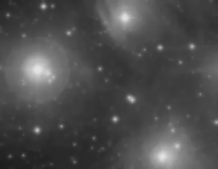

## Summary

`ACDNR` reproduces the core of PixInsight's tool of the same name: an **adaptive** denoiser that
smooths noise heavily in flat regions (sky background, diffuse halos) while preserving
high-contrast detail (stars, nebula edges). The principle is simple and robust — a standard
Gaussian blur, blended pixel by pixel with the original image through a **protection mask**
computed from the image's local gradient.

*Before, and after ACDNR at sigma 3 with a protection threshold of 0.3.*

## Use cases

- **Clean up background noise** on an already-stretched image without blurring stars or the
  edges of nebulosity.
- **Gentle finishing pass** at the end of processing, after a stronger denoise (NLM, TGV), to
  smooth remaining residuals without losing micro-structure.
- **Fast alternative** to `NonLocalMeansDenoise`/`TGVDenoise` when compute time matters: ACDNR
  is just a combination of two `scipy.ndimage` filters, so it is very fast.
- **Progressive tuning**: raising `protection` moves continuously from near-total smoothing to
  near-perfect preservation of the original image.

## How it works

For each color channel, the algorithm computes two derived images:

1. **A Gaussian blur** `blurred` of the image, with radius `sigma` — the candidate "smoothed"
   version, which removes high-frequency noise but also fine detail.
2. **A gradient map** `grad` (gradient magnitude of a lightly Gaussian-smoothed version, fixed
   radius 1.0) that locates high-contrast areas: star outlines, structure edges. This map is
   normalized by its maximum, scaled by `protection`, and clipped to `[0, 1]` to form the
   **protection mask** — 1 means "keep the original", 0 means "take the blur entirely".

The final result is a **per-pixel linear blend** between the original and the blur, weighted by
this mask: high-gradient areas (where `protect` is near 1) stay essentially untouched, while
flat areas (`protect` near 0) are replaced by the smoothed version — that is where all the
noise disappears.

## Mathematics

Let $I$ be an image channel and $\sigma$ the `sigma` parameter. Define the Gaussian blur:

$$ B = G_\sigma * I $$

where $G_\sigma$ is the Gaussian kernel of radius $\sigma$. The local gradient magnitude is then
computed after a fixed-radius-1 Gaussian smoothing (to limit sensitivity to pixel-level noise):

$$ \nabla_g I = \left\| \nabla \big(G_1 * I\big) \right\|_2
= \sqrt{\left(\frac{\partial (G_1 * I)}{\partial x}\right)^2
+ \left(\frac{\partial (G_1 * I)}{\partial y}\right)^2} $$

This field is normalized by its maximum $g_{\max}$ (guarded against division by zero), scaled by
the `protection` parameter $p \in [0,1]$, and clipped:

$$ M(x,y) = \operatorname{clip}\!\left(p \cdot \frac{\nabla_g I(x,y)}{g_{\max}},\; 0,\; 1\right) $$

The output pixel is the convex blend:

$$ I'(x,y) = M(x,y)\, I(x,y) + \big(1 - M(x,y)\big)\, B(x,y) $$

With `protection = 0`, $M \equiv 0$ everywhere: the output is simply the full Gaussian blur
(maximum denoising, blurred structures). With `protection = 1`, $M$ reaches 1 exactly where the
local gradient is highest in the image — those pixels stay unchanged, while the rest of the
background keeps being smoothed in proportion to its own gradient.

## Parameters

- **`sigma`** — *real*, default `2.0`, range `0.1`–`20.0`. Radius (standard deviation) of the
  Gaussian blur applied to the background. Larger = stronger noise smoothing, but wider blur in
  unprotected areas.
- **`protection`** — *real*, default `0.5`, range `0.0`–`1.0`. Scale factor of the gradient-
  derived protection mask. `0` = no protection (uniform blur across the whole image); `1` =
  maximum protection of high-gradient areas (stars and edges nearly untouched).

## Tips & pitfalls

> **Warning** — the protection threshold is **relative to the image's maximum gradient**
> (`grad.max()`). A single very saturated star can crush the scale and make the mask too
> restrictive elsewhere; in that case, lower `protection` or denoise an isolated background
> region (preview) rather than the whole image.

- Too large a `sigma` combined with low `protection` can leave a visible blurry halo around
  stars, since the mask has no smooth transition zone.
- ACDNR does not estimate the actual noise level (unlike `NonLocalMeansDenoise`): there is no
  automatic scaling — tune `sigma`/`protection` visually or via a preview.
- For significant chroma noise, prefer working on luminance alone (a temporary
  `ConvertToGrayscale` or a luminance mask) to avoid colored edge artifacts.

## See also

- [NoiseReduction](retina-doc://NoiseReduction) — generic multi-method denoising.
- [TGVDenoise](retina-doc://TGVDenoise) — total generalized variation, no staircasing.
- [NonLocalMeansDenoise](retina-doc://NonLocalMeansDenoise) — averaging of similar patches.
- [WaveletDenoise](retina-doc://WaveletDenoise) — wavelet-thresholding denoise.

## References

- PixInsight — *ACDNR* (Adaptive Contrast-Driven Noise Reduction) tool reference.
- scipy.ndimage — *gaussian_filter*, *gaussian_gradient_magnitude*.
