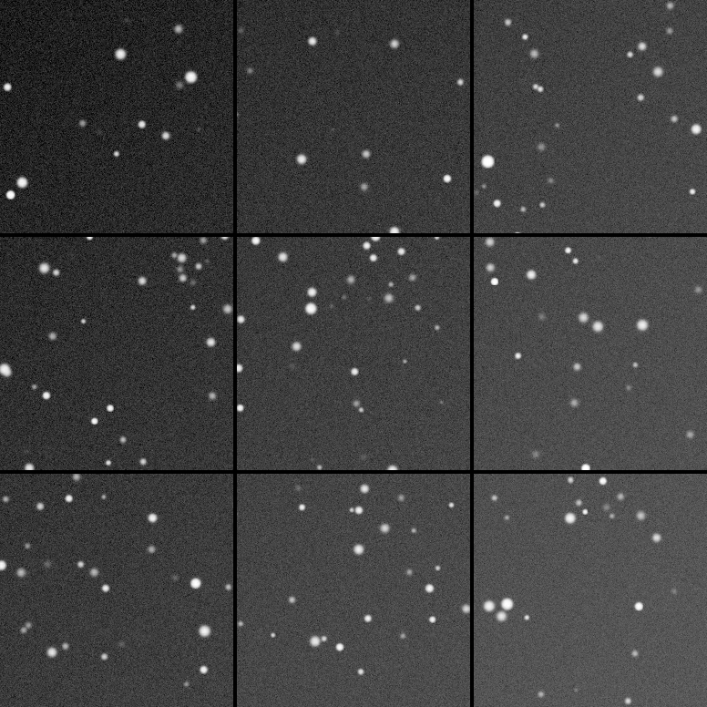

## Summary

`AberrationInspector` cuts `mosaic_size` × `mosaic_size` panels spread over the whole image —
the four corners, the edges, the centre — and assembles them side by side in a **new window**.

The gesture is a simple one, and that is its strength. Comparing the four corners of a
fifty-megapixel image otherwise takes four zoom round trips, during which the eye forgets what
it just saw. Placed side by side, coma, tilt and field curvature become immediately readable.

*The whole frame, and the mosaic of its corners, edges and centre at the pixel scale. Optical faults live at the edges and nobody scrolls to nine of them in turn; a tile larger than the frame allows is cropped, never enlarged, since enlarging pixels would invent an aberration.*

## Use cases

- **Check a coma corrector** or focal reducer: the corners should look alike.
- **Adjust focuser tilt**, iteratively: one mosaic before, one after.
- **Choose a crop**: if two corners are beyond saving, better to know before processing.

## How it works

Panel origins run from zero to the opposite edge, so the mosaic's corners really are the
image's corners, and its centre the centre. Panels are separated by `separation` black pixels,
which stop you mistaking a seam for a structure.

A panel larger than the image allows is **cropped**, never enlarged: enlarging pixels would
give the illusion of an optical defect.

## Parameters

- **`mosaic_size`** — *int*, default `3`, range `2`–`9`. Panels per side. Three is enough
  almost always: corners, edge midpoints, centre.
- **`panel_size`** — *int*, default `256`, range `32`–`2048`. Side of one panel, in pixels of
  the source image.
- **`separation`** — *int*, default `4`, range `0`–`64`. Thickness of the black line between
  panels.

Produces a **new window**; the source image is untouched.

## Tips & pitfalls

> **Look at it at 100%.** A mosaic shrunk to fit the screen shows nothing: it is star shape
> you are inspecting, at pixel scale.

- On **linear** data, apply an STF before looking — otherwise the mosaic will seem black, like
  the image it came from.
- `AberrationInspector` shows, it does not measure. For a number, see
  [FWHMEccentricity](retina-doc://FWHMEccentricity).

## See also

- [FWHMEccentricity](retina-doc://FWHMEccentricity) — the same question, as numbers and a map.
- [DynamicPSF](retina-doc://DynamicPSF) — the shape of one particular star.
- [RadialProfileMeasurement](retina-doc://RadialProfileMeasurement) — radial profile and curve
  of growth.

## References

- PixInsight — *AberrationInspector* script.
