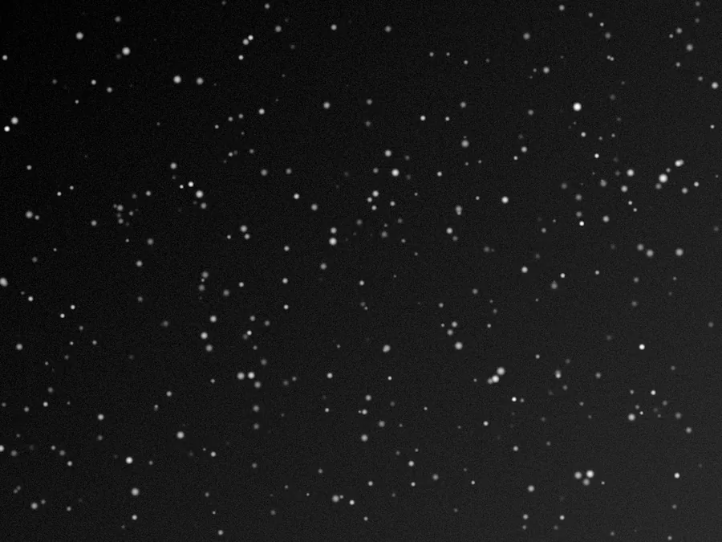

## Résumé

`ArcsinhStretch` applique un étirement non linéaire fondé sur la fonction **arc sinus
hyperbolique** (`asinh`), réputée en imagerie scientifique pour compresser fortement les
hautes lumières tout en restant quasi linéaire près de zéro. Contrairement à un étirement
par canal indépendant, le facteur d'étirement est ici calculé **une seule fois sur la
luminance** puis réappliqué à chaque canal RVB par un même ratio : les rapports entre canaux
sont conservés, donc les **teintes ne dérivent pas vers le blanc** quand les étoiles ou le
cœur d'une galaxie approchent la saturation. C'est un process **destructif** (il réécrit les
pixels), à la différence de la STF qui n'agit que sur l'affichage.

*La pose linéaire telle que stockée, et la même après un étirement arcsinh.*

## Cas d'usage

- **Étirer une image linéaire** (issue de l'intégration) en gardant des couleurs fidèles sur
  les objets très contrastés (noyaux galactiques, étoiles brillantes, régions HII saturées).
- **Alternative à HistogramTransformation** quand un étirement MTF classique fait virer les
  étoiles vers le blanc ou désature le cœur des objets lumineux.
- **Révéler les extensions faibles** (queues de marée, nébulosité diffuse) sans écraser les
  parties déjà bien exposées, grâce à la compression douce et progressive de `asinh`.
- **Pipeline scientifique/photométrique** où la préservation des rapports de couleur entre
  canaux est requise (imagerie façon Lupton et al. pour les composites RVB).

## Fonctionnement

L'opérateur travaille en deux temps :

1. **Retrait du point noir** : les pixels sont remappés linéairement depuis `black_point`
   vers `1.0`, avec écrêtage dans `[0, 1]` — identique en esprit au remappage `shadows` de
   `HistogramTransformation`, mais sans point blanc réglable (le point blanc reste fixé à 1).
2. **Compression arcsinh normalisée** : la valeur remappée est passée dans
   `asinh(stretch · x) / asinh(stretch)`, une courbe qui vaut 0 en 0 et 1 en 1, quasi linéaire
   pour les petites valeurs et fortement comprimée pour les grandes — plus `stretch` est
   élevé, plus la compression des hautes lumières est marquée.

En couleur (≥ 3 canaux), la courbe n'est évaluée **qu'une fois sur la luminance** (moyenne
R, V, B). Le rapport `luminance étirée / luminance originale` sert ensuite de facteur
d'échelle commun, multiplié tel quel sur chaque canal. Ainsi un pixel rouge saturé reste
rouge (juste plus clair), au lieu de blanchir comme le ferait un étirement canal par canal.
Pour une image mono/N&B, la courbe est appliquée directement au canal unique.

## Mathématiques

Soit $x$ la valeur d'un pixel dans $[0,1]$, $b$ = `black_point`, $k$ = `stretch` (avec
$k > 1$). On calcule d'abord la valeur remappée après retrait du point noir :

$$ x_n = \operatorname{clip}\!\left(\frac{x - b}{\,1 - b\,},\; 0,\; 1\right) $$

puis la **fonction d'étirement arcsinh normalisée** :

$$ f(x_n) = \frac{\operatorname{asinh}(k\, x_n)}{\operatorname{asinh}(k)} $$

Cette fonction envoie $0 \mapsto 0$ et $1 \mapsto 1$. Pour $x_n$ petit, $\operatorname{asinh}$
est quasi linéaire ($\operatorname{asinh}(u) \approx u$), donc $f$ préserve les tons faibles
proportionnellement ; pour $x_n$ proche de 1, $\operatorname{asinh}(u) \approx \ln(2u)$ pour
$k$ grand, ce qui **comprime logarithmiquement** les hautes lumières au lieu de les écrêter.

En couleur, avec $L = \tfrac{1}{3}(R_n + V_n + B_n)$ la luminance remappée, on calcule un
unique facteur d'échelle :

$$ r = \frac{f(L)}{L} \qquad (L > \varepsilon) $$

et chaque canal est mis à l'échelle par ce même ratio, $C' = \operatorname{clip}(C_n \cdot r,\,
0,\,1)$ pour $C \in \{R, V, B\}$ — ce qui garantit $R'\!:\!V'\!:\!B' = R_n\!:\!V_n\!:\!B_n$, donc
la conservation de la teinte et de la saturation relative.

## Paramètres

- **`stretch`** — *real*, défaut `10.0`, plage `1`–`1000`. Facteur d'étirement (le $k$ de la
  formule). Plus il est élevé, plus la compression des hautes lumières est agressive et plus
  les tons faibles sont dilatés relativement. Une valeur proche de 1 donne un étirement quasi
  nul ; les valeurs typiques utiles vont de quelques unités à plusieurs centaines.
- **`black_point`** — *real*, défaut `0.0`, plage `0`–`1`. Point noir : niveau d'entrée mappé
  sur 0 avant l'étirement. Permet d'ancrer le fond de ciel avant compression, comme le
  `shadows` de `HistogramTransformation`, mais sans réglage indépendant du point blanc.

## Astuces & pièges

> **Attention** — un `stretch` très élevé combiné à un `black_point` nul peut sur-comprimer
> l'ensemble de l'image en ne laissant plus de contraste perceptible dans le fond de ciel.
> Réglez d'abord `black_point` pour ancrer le fond, puis augmentez `stretch` progressivement.

> **Note** — la préservation de couleur repose sur la luminance moyenne des trois canaux ; sur
> une image fortement dominée par un canal (déséquilibre de balance des blancs important), une
> `ColorCalibration` ou `BackgroundNeutralization` préalable donne de meilleurs résultats.

- Contrairement à `HistogramTransformation`, il n'y a pas de curseur `midtones` indépendant :
  toute la forme de la courbe est pilotée par `stretch` seul, ce qui simplifie le réglage mais
  offre moins de contrôle fin sur le point milieu.
- Pour des étoiles très brillantes qui saturent encore malgré `ArcsinhStretch`, combiner avec
  un masque protégeant les hautes lumières (façon `MaskedStretch`) plutôt que d'augmenter
  `stretch` à l'excès.

## Voir aussi

- [HistogramTransformation](retina-doc://HistogramTransformation) — étirement MTF classique à
  trois points (shadows/midtones/highlights).
- [MaskedStretch](retina-doc://MaskedStretch) — étirement itératif avec protection active des
  hautes lumières par masque.
- [AutoHistogram](retina-doc://AutoHistogram) — auto-stretch « cuit » dérivé de la médiane
  robuste, bon point de départ avant un `ArcsinhStretch` fin.
- [ExponentialTransformation](retina-doc://ExponentialTransformation) — autre étirement non
  linéaire simple (loi de puissance), sans préservation explicite de la couleur.

## Références

- PixInsight — *ArcsinhStretch* tool reference.
- Lupton, R. et al. (2004) — *Preparing Red-Green-Blue Images from CCD Data*.
