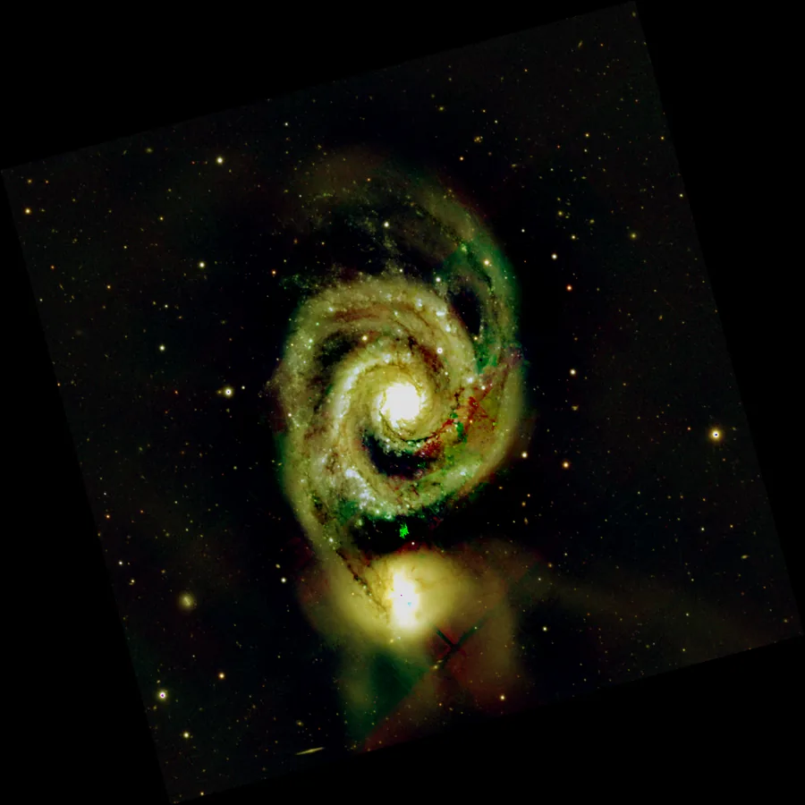
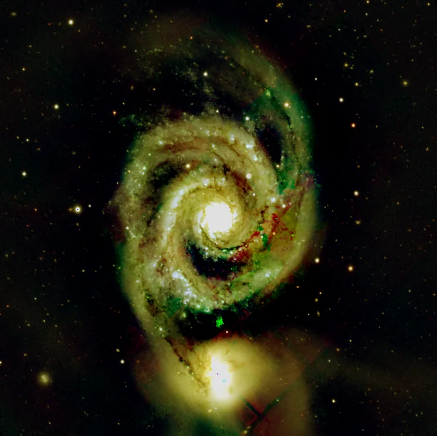

## Résumé

`AutoCrop` supprime la bordure d'une image intégrée qui n'a **pas été vue par toutes les
poses**. Après recalage, les frames ne se superposent pas exactement — c'est le principe même
du dithering, qui décale volontairement le pointage entre les poses. La zone commune est donc
plus petite que le capteur, et tout ce qui dépasse n'a reçu qu'une partie des poses, quand ce
n'est aucune.

Contrairement à [Crop](retina-doc://Crop), qui applique des bornes qu'on lui donne,
`AutoCrop` les **trouve**.

*Une pose tournée, avec les marges noires que la rotation laisse, et la même une fois rognées. Les marges ne sont pas mises en scène : les retirer est l'étape qui suit normalement une rotation.*

## Cas d'usage

- **Après une intégration**, comme dernière étape : c'est le réglage par défaut du
  pré-traitement automatisé (`retina.pipeline`), et celui de WBPP.
- **Avant un étirement automatique** : une bordure à faible couverture fausse la médiane et
  la MAD dont la STF tire ses seuils, et l'image entière s'en trouve mal étirée.
- **Avant toute mesure de bruit ou de fond**, pour la même raison.
- **Avant un export**, pour ne pas livrer une image bordée d'un liseré sombre irrégulier.

## Fonctionnement

La couverture se mesure sur les **frames recalées**, passées en `frames`, et non sur l'image
intégrée. C'est le point important : dans l'intégrée, un bord vu par la moitié des poses n'est
pas nul, seulement atténué. Il passerait donc inaperçu — alors que c'est précisément le cas
qu'on veut éliminer, puisque son rapport signal/bruit est deux fois moindre que celui du
centre sans que rien ne le signale.

Chaque frame recalée contribue un masque « pixel observé » (valeur non nulle : c'est pourquoi
`StarAlignment` remplit les zones hors champ avec zéro plutôt qu'avec une valeur plausible).
La somme de ces masques, divisée par le nombre de poses, donne la carte de couverture.

Le rognage est ensuite **itératif**, et il doit l'être : une seule colonne vide fait tomber la
couverture de *toutes* les lignes sous le seuil. Évaluer lignes et colonnes une fois pour
toutes sur l'image entière rognerait donc bien au-delà du nécessaire. À chaque tour, on retire
le bord le moins couvert, on recalcule sur le rectangle restant, et on s'arrête dès que les
quatre bords atteignent `coverage`.

Sans liste `frames`, on retombe sur le seul test possible à partir d'une image isolée — les
pixels exactement nuls —, qui ne détecte que les bords vus par *aucune* pose.

## Mathématiques

Soit $N$ frames recalées $F_k$ de dimensions $H \times W$. Le masque d'observation de la
frame $k$ vaut

$$ m_k(y,x) = \begin{cases} 1 & \text{si } \max_c |F_k(y,x,c)| > 0 \\ 0 & \text{sinon} \end{cases} $$

et la carte de couverture est leur moyenne :

$$ C(y,x) = \frac{1}{N} \sum_{k=1}^{N} m_k(y,x) \in [0,1] $$

On cherche un rectangle $R = [y_0, y_1) \times [x_0, x_1)$ tel que chacun de ses quatre bords
ait une couverture complète en proportion au moins $\tau$ (`coverage`) :

$$ \frac{1}{x_1-x_0}\sum_{x=x_0}^{x_1-1} \mathbb{1}\!\left[C(y_0,x) \ge 1\right] \ \ge\ \tau $$

et symétriquement pour $y_1-1$, $x_0$ et $x_1-1$. Le rectangle est initialisé à l'image
entière puis réduit d'une ligne ou d'une colonne à la fois, en retirant à chaque tour le bord
de plus faible couverture, jusqu'à satisfaction ou jusqu'à la limite `max_fraction`.

## Paramètres

- **`coverage`** — *real*, défaut `0.98`, plage `0`–`1`. Fraction minimale de pixels
  **entièrement couverts** exigée sur un bord pour le conserver. La valeur par défaut tolère
  quelques pixels manquants (un défaut isolé, une étoile saturée en bordure) sans rogner.
- **`max_fraction`** — *real*, défaut `0.25`, plage `0`–`0.9`. Part maximale de chaque
  dimension qu'on s'autorise à retirer. Garde-fou : au-delà, la cause est plus probablement
  une image légitimement sombre sur ses bords qu'un défaut de couverture.
- **`frames`** — *pathlist*, défaut vide. Les frames recalées qui ont servi à l'intégration.
  Vide, la couverture est déduite de l'image elle-même — beaucoup moins fiable.

## Astuces & pièges

> **Attention** — mesurer la couverture sur l'intégrée seule (sans `frames`) ne détecte que
> les bords où **aucune** pose n'a contribué. Les bords partiellement couverts, qui sont le
> cas courant du dithering, y sont invisibles : la moyenne les atténue sans les annuler.

> **Note** — `AutoCrop` suppose que les zones non observées valent zéro. C'est le cas des
> sorties de [StarAlignment](retina-doc://StarAlignment), dont le paramètre `fill_value` vaut
> zéro par défaut. Un remplissage par la médiane, courant ailleurs, fabriquerait du ciel
> plausible là où rien n'a été vu et rendrait la couverture indétectable.

- Appliquez `AutoCrop` **avant** la normalisation ou l'étirement, jamais après : c'est
  justement pour que ces étapes ne voient plus les bords douteux.
- Un rognage inhabituellement large signale souvent un dithering trop ample, ou une frame de
  référence mal choisie en bordure du lot : la valeur retournée par `bounds()` est un bon
  diagnostic.

## Voir aussi

- [Crop](retina-doc://Crop) — recadrage selon des bornes explicites.
- [DynamicCrop](retina-doc://DynamicCrop) — recadrage interactif combiné à une rotation.
- [StarAlignment](retina-doc://StarAlignment) — produit les frames recalées et leur remplissage.
- [Integration](retina-doc://Integration) — l'empilement dont `AutoCrop` nettoie le résultat.

## Références

- PixInsight — *WeightedBatchPreprocessing*, étape AutoCrop (activée par défaut).
- Fruchter & Hook (2002) — couverture et poids en reconstruction d'images dithered.
