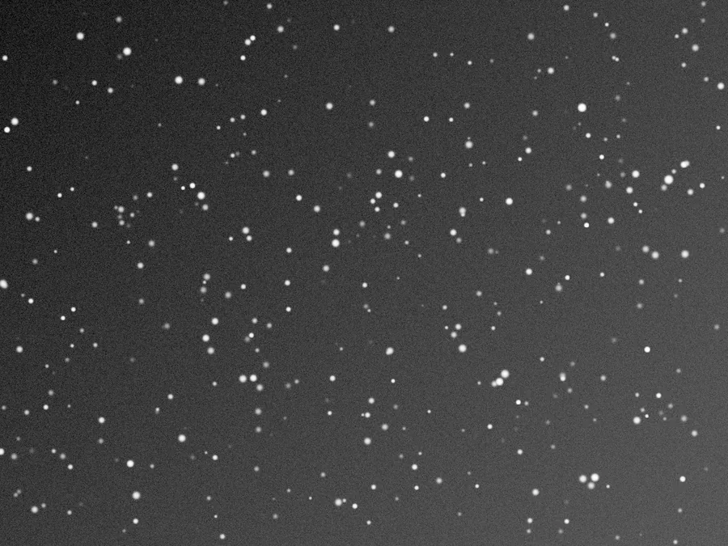

## Résumé

`AutoHistogram` calcule un étirement automatique par canal — même algorithme que le bouton
« AutoStretch » de la STF dans PixInsight — puis l'**applique définitivement aux pixels**.
C'est la version « cuite » (destructive) de l'auto-stretch : là où la STF ne fait que changer
l'affichage sans toucher aux données, `AutoHistogram` réécrit l'image dans l'historique de la
vue. Il n'a qu'un seul réglage, `target_background`, qui fixe la luminosité du fond de ciel visé.

*La pose linéaire telle que stockée, et la même avec son fond porté à 0,25.*

## Cas d'usage

- **Dégrossir rapidement une image linéaire** fraîchement intégrée, pour juger de sa qualité
  (bruit, gradients, étoiles) sans régler des curseurs à la main.
- **Étape de départ** avant un affinage au `HistogramTransformation` ou aux `CurvesTransformation`.
- **Traitement par lot** (scripts, recettes) où l'on veut un étirement cohérent et reproductible
  sur une série d'images sans intervention manuelle.
- Obtenir un résultat **identique à ce que montre la STF en aperçu**, mais figé dans les pixels
  pour l'exporter ou l'enchaîner avec d'autres opérations destructives.

## Fonctionnement

Le process délègue entièrement le calcul à `STF.auto_from_image` (la même fonction qui pilote
l'AutoStretch de la STF à l'affichage) — source unique de vérité garantissant que le rendu
« cuit » correspond exactement à l'aperçu non destructif. Pour chaque canal :

1. On calcule la **médiane** (centre robuste) et le **MADN** (Median Absolute Deviation
   normalisé, ≈ écart-type robuste, insensible aux étoiles et pixels chauds).
2. Selon que l'image est **sombre** (médiane < 0,5, cas linéaire classique) ou **claire**
   (médiane ≥ 0,5, image déjà inversée), on positionne le point noir ou le point blanc à
   quelques MADN de la médiane (`shadows_clip = -2,8` en interne), pour rejeter le bruit de fond
   sans écrêter le signal utile.
3. On résout le point milieu (`midtones`) de la MTF pour que la médiane, une fois remappée dans
   la plage `[point noir, point blanc]`, tombe exactement sur `target_background` en sortie.
4. La STF ainsi construite est **appliquée aux pixels** (`stf.apply(data)`) — remap linéaire puis
   MTF — ce qui produit le résultat final, écrit à la place des données brutes.

## Mathématiques

Soit, pour un canal donné, $\tilde{x}$ la médiane et
$\sigma = 1{,}4826 \cdot \operatorname{med}(|x_i - \tilde{x}|)$ le MADN. Si $\tilde{x} < 0{,}5$
(image linéaire à fond sombre) :

$$ s = \operatorname{clip}(\tilde{x} + c\,\sigma,\; 0,\; 1), \qquad h = 1, $$

avec $c = -2{,}8$ (constante de rejet du bruit de fond). Le point milieu de la MTF est choisi
pour que la médiane remappée $x = \tilde{x} - s$ atteigne exactement le fond cible $b$ :

$$ m = \operatorname{mtf}(b,\, x) = \frac{(b-1)\,x}{(2b-1)\,x - b}. $$

(Cas symétrique si $\tilde{x} \ge 0{,}5$, avec $h$ resserré et la formule appliquée à
$h - \tilde{x}$, puis $m \leftarrow 1 - m$.) Le résultat final par pixel est alors le remap
linéaire suivi de la MTF :

$$ x_n = \operatorname{clip}\!\left(\frac{x - s}{\,h - s\,},\, 0,\, 1\right), \qquad
   y = \operatorname{mtf}(m,\, x_n) = \frac{(m-1)\,x_n}{(2m-1)\,x_n - m}. $$

Cette fonction envoie la médiane sur `target_background` tout en gardant $0 \mapsto 0$ et
$1 \mapsto 1$ : c'est un étirement de gamma piloté par les statistiques de l'image, pas par un
réglage manuel.

## Paramètres

- **`target_background`** — *real*, défaut `0.25`, plage `0.01`–`0.9`. Fond cible : niveau de
  gris (dans `[0,1]`) que doit atteindre la médiane après étirement. Une valeur plus basse
  (~0,15) donne un fond plus sombre et un contraste plus marqué ; une valeur plus haute (~0,35)
  éclaircit le fond, utile sur des données très bruitées où l'on veut « lever » le signal faible.

## Astuces & pièges

> **Attention** — process **destructif** : contrairement à l'auto-stretch de la STF (juste un
> affichage), `AutoHistogram` réécrit les pixels. Appliquez-le sur une copie ou vérifiez que
> l'étirement obtenu est satisfaisant avant d'enchaîner d'autres opérations irréversibles.

> **Note** — le calcul suppose des données **linéaires** (fond proche de zéro). Sur une image
> déjà étirée, `AutoHistogram` peut sur-étirer ou produire un résultat incohérent ; réservez-le
> à la première mise à niveau après intégration/calibration.

- Le MADN étant robuste aux valeurs extrêmes, quelques étoiles saturées ou pixels chauds
  n'influencent pas le calcul du point noir — contrairement à un simple écart-type.
- Pour un contrôle fin (protection des étoiles, itérations), préférez `MaskedStretch` ; pour un
  réglage manuel des trois curseurs à partir de ce point de départ, enchaînez avec
  `HistogramTransformation`.

## Voir aussi

- [HistogramTransformation](retina-doc://HistogramTransformation) — réglage manuel des trois
  curseurs (shadows/midtones/highlights) à partir du même modèle MTF.
- [MaskedStretch](retina-doc://MaskedStretch) — étirement itératif protégeant les hautes lumières.
- [ArcsinhStretch](retina-doc://ArcsinhStretch) — alternative préservant la couleur sans MTF.
- [BackgroundNeutralization](retina-doc://BackgroundNeutralization) — à appliquer avant l'étirement
  pour neutraliser une dominante colorée du fond de ciel.

## Références

- PixInsight — *ScreenTransferFunction*, bouton *AutoStretch*.
- Conejero, J. — *Midtones Transfer Function (MTF)*.
