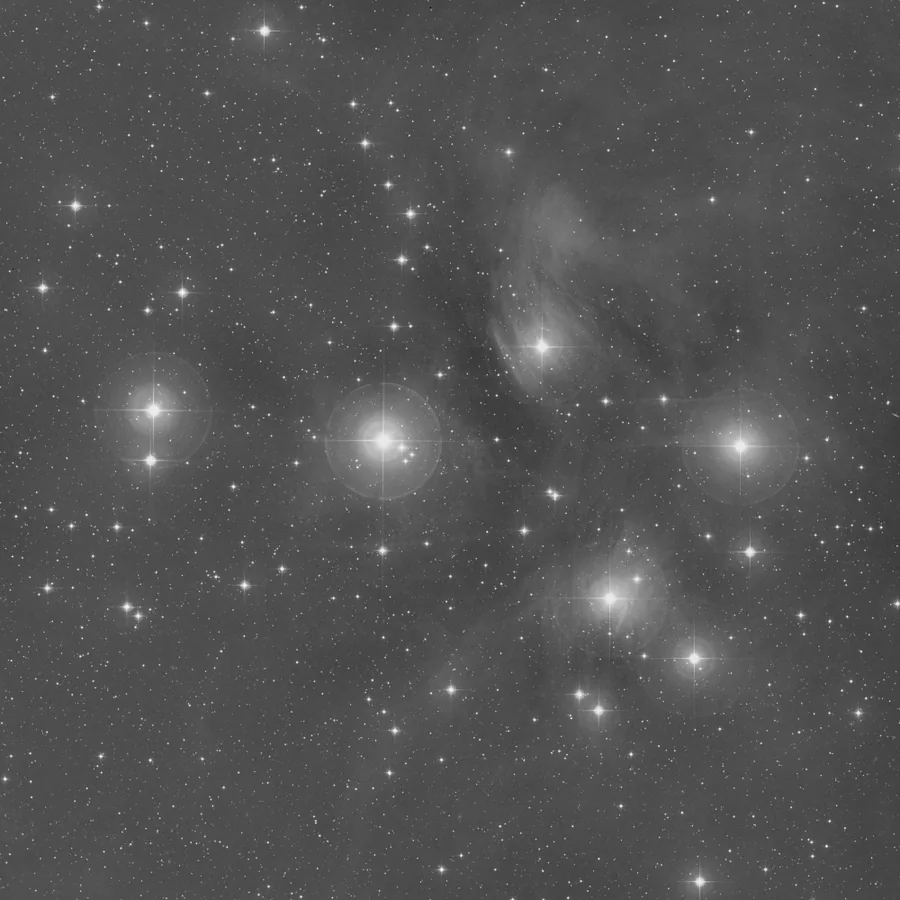

## Summary

`BackgroundExtraction` models the **sky background** (light-pollution gradients, residual
vignetting, moon glow) on a robust grid, then **subtracts** it. It is the equivalent of
PixInsight's ABE: essential to flatten the background before stretching and color calibration.

*Before, and after removing the modelled background. Same screen stretch on both, taken from the source: the sky flattens, the nebulosity stays.*

## Use cases

- **Remove a gradient** from light pollution or the moon over a wide field.
- **Correct residual vignetting** poorly calibrated by flats.
- Prepare a **flat** background before `BackgroundNeutralization` and color calibration.

## How it works

Two engines produce the background surface $B$; both then obey the same `subtract` / `pedestal`
contract.

**`photutils`** (default) — the image is tiled into boxes of side `box_size`. Within each box, a
**star-resistant** background statistic is estimated after sigma-clipping (median,
`SExtractorBackground`, or `MMMBackground` depending on `estimator`). These local estimates form
a low-resolution grid interpolated into a smooth **background surface** $B$ at full image size.

**`ai`** — the **GraXpert** background-extraction network. Because the background is smooth by
assumption, the *whole* image is downscaled to 256×256, the network estimates the background there
in a single pass, and the result is smoothed and upscaled back to full resolution — no tiling. A
mono image is replicated to three channels for the network, then its background is broadcast back.
The model actually used (name, version, SHA-256) is written into the processing history and the
FITS keywords `AIMODEL`, `AIMODVER`, `AIMODSHA`.

Depending on `subtract`, the surface is subtracted (adding back a small **pedestal** to avoid
negatives), or the model $B$ is output directly for inspection.

> **GraXpert models are licensed CC BY-NC-SA 4.0** — free to use for **non-commercial** purposes
> only. This restriction comes from GraXpert, not from Retina. See the *Licenses* screen. Models
> are downloaded on demand (or discovered from a local GraXpert install).

## Mathematics

Over each box $b$, the robust estimator $\mu_b$ is computed after iterative rejection of pixels
more than $k\sigma$ from the median (the stars). The SExtractor estimator combines clipped
median and mean:

$$ \mu_b^{\text{sex}} = 2.5\,\operatorname{med}_b - 1.5\,\overline{x}_b $$

valid when median and mean are close (lightly contaminated background). The background surface
$B(x,y)$ interpolates the $\{\mu_b\}$. The corrected image is:

$$ I'(x,y) = I(x,y) - B(x,y) + p, \qquad p = \texttt{pedestal}, $$

where the pedestal $p$ shifts the result toward positive values. With `subtract = False`, the
output is $B(x,y)$ itself.

## Parameters

- **`backend`** — *enum*, default `photutils`, choices: `photutils`, `ai`. The estimation engine.
- **`box_size`** — *int*, default `64`, range `4`–`1024`. *(photutils)* Side (pixels) of the
  estimation boxes. Large = very smooth background (broad gradients); small = follows fine
  variations (risk of eating into extended nebulosity).
- **`subtract`** — *bool*, default `True`. Subtract the model (otherwise output the model alone).
- **`pedestal`** — *real*, default `0.1`, range `0`–`1`. Offset added after subtraction.
- **`estimator`** — *enum*, default `median`, choices: `median`, `sextractor`, `mmm`. *(photutils)*
  Per-box background statistic.
- **`model_id`** — *enum*, default `latest`. *(ai)* Which catalogue model to use; the menu is
  filled live from the manifest and any local GraXpert install. `latest` picks the newest.
- **`model`** — *path*, default empty. *(ai)* A local `.onnx` file, overriding `model_id`.
- **`model_version`**, **`model_sha256`** — *str*, filled in at run time to record the exact model.

## Tips & pitfalls

> **Warning** — too small a `box_size` models extended nebulosity as background and sucks it
> away. On extended objects, increase the box or protect them with a mask.

- Output the **model** first (`subtract = False`) to check it holds no real signal.
- For control via manual sample points, prefer
  [DynamicBackgroundExtraction](retina-doc://DynamicBackgroundExtraction).

## See also

- [DynamicBackgroundExtraction](retina-doc://DynamicBackgroundExtraction) — background from chosen points (≈DBE).
- [GradientCorrection](retina-doc://GradientCorrection) — global gradient removal.
- [BackgroundNeutralization](retina-doc://BackgroundNeutralization) — colorimetric background neutralization.

## References

- PixInsight — *AutomaticBackgroundExtractor* / *DynamicBackgroundExtraction*.
- photutils — *Background2D* and 2D background estimation.
