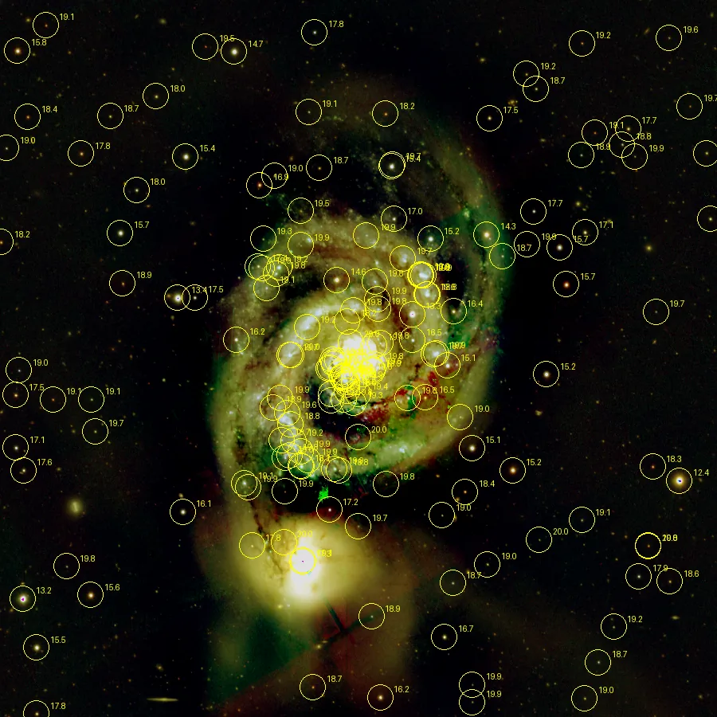

## Résumé

`CatalogAnnotation` interroge le catalogue stellaire **Gaia DR3** pour le champ couvert par
l'image, puis **dessine des marqueurs** (cercles) et, en option, les **magnitudes** au-dessus
de chaque source repérée. Contrairement à `Annotation` (grille de coordonnées RA/Dec),
il place des objets ponctuels réels sur l'image — utile pour identifier des étoiles, vérifier
une solution astrométrique ou préparer une planche annotée. C'est un process **destructif** :
il peint directement dans les pixels (comme un burn-in), pas une couche superposée éditable.

*Un champ résolu, et le même avec les objets Gaia DR3 marqués dans les pixels — magnitude 20 et rayon de 16 pixels, bien au-delà des défauts, pour que les marqueurs survivent à l'échelle de la page.*

## Cas d'usage

- **Vérifier une solution `PlateSolve`** en superposant les positions Gaia attendues sur
  l'image et en contrôlant visuellement leur alignement avec les vraies étoiles.
- **Identifier des étoiles** dans un champ pour un rapport d'observation ou une publication.
- **Repérer les étoiles brillantes** d'un champ (tri par magnitude croissante) avant de
  choisir des étoiles de référence pour la photométrie ou la calibration couleur.
- **Tests headless** : injecter un catalogue synthétique via `set_objects([(ra, dec, mag), …])`
  sans dépendre d'un accès réseau à Gaia.

## Fonctionnement

Le process exige un **WCS valide** sur la fenêtre (`window.wcs`), posé au préalable par
`PlateSolve` — sans quoi il lève une erreur explicite.

1. **Récupération du catalogue** : si aucun catalogue n'a été fourni via `set_objects()`, une
   requête **ADQL** est envoyée à Gaia DR3 via `astroquery.gaia.Gaia.launch_job_async`. Le
   centre du champ et un rayon de recherche (borné à 2°) sont déduits du WCS ; la requête
   sélectionne les `max_objects` étoiles les plus brillantes (`ORDER BY phot_g_mean_mag ASC`)
   sous la limite `limit_mag`, dans un cône `CIRCLE(...)` en ICRS. Ce tri par magnitude
   (plutôt qu'une simple recherche par proximité au centre) garantit de ne pas manquer les
   étoiles brillantes situées en périphérie du champ.
2. **Projection ciel → pixel** : les coordonnées `(ra, dec)` de chaque objet sont converties
   en coordonnées image `(x, y)` via `wcs.world_to_pixel_values`.
3. **Rendu** : l'image est convertie en RGB 8 bits, puis dessinée avec Pillow
   (`ImageDraw.ellipse`) — un cercle jaune de rayon `marker_radius` par objet visible dans le
   cadre, avec le texte de la magnitude accolé si `labels` est actif. Le résultat est reconverti
   en float32 `[0,1]` et devient la nouvelle image de la vue (`view.set_image`), encadré par
   `begin_process`/`end_process` pour l'historique et l'undo.

Le nombre d'objets effectivement annotés (dans le cadre de l'image) est disponible après
exécution via l'attribut `count` de l'instance.

## Mathématiques

Il n'y a pas de transformation de pixel au sens signal ; l'opération est une **projection
géométrique** suivie d'un tracé vectoriel. Pour un objet catalogue de coordonnées célestes
$(\alpha, \delta)$ (ascension droite, déclinaison), la solution WCS $W$ (matrice de rotation/
échelle + distorsion) donne la position pixel :

$$ (x, y) = W^{-1}(\alpha, \delta) $$

L'objet est retenu si $0 \le x < w$ et $0 \le y < h$ (dans le cadre de l'image de largeur $w$
et hauteur $h$). Le rayon de recherche angulaire $\rho$ du cône Gaia est dérivé de la diagonale
du champ vue du centre :

$$ \rho = \min\!\big(\operatorname{sep}(c,\,W(0,0)),\; 2°\big) $$

où $c$ est la coordonnée céleste du centre image et $\operatorname{sep}$ la séparation
angulaire sur la sphère. Le filtre de magnitude est une simple borne :
$m_G \le \texttt{limit\_mag}$, avec tri croissant sur $m_G$ pour privilégier les étoiles
brillantes lors de la troncature à `max_objects`.

## Paramètres

- **`catalog`** — *enum*, défaut `gaia`, choix : `gaia`. Catalogue de référence interrogé.
  Seul Gaia DR3 est disponible actuellement.
- **`limit_mag`** — *real*, défaut `12.0`, plage `-5`–`25`. Magnitude limite (bande G Gaia) :
  seules les sources plus brillantes que cette valeur sont récupérées.
- **`max_objects`** — *int*, défaut `300`, plage `1`–`5000`. Nombre maximal d'objets ramenés
  par la requête (les plus brillants en premier).
- **`marker_radius`** — *real*, défaut `6.0`, plage `1.0`–`50.0`. Rayon en pixels des cercles
  marquant chaque source.
- **`labels`** — *bool*, défaut `True`. Affiche la magnitude en texte à côté de chaque marqueur.

## Astuces & pièges

> **Attention** — sans `PlateSolve` préalable (WCS absent), le process lève une `ValueError`.
> Résolvez toujours le champ avant d'annoter.

> **Note** — la requête Gaia nécessite un accès réseau et peut être lente sur de grands champs
> ou des `limit_mag` élevées (beaucoup de sources). Réduisez `limit_mag` ou `max_objects` pour
> accélérer, ou fournissez un catalogue local via `set_objects()` en environnement hors ligne.

- Le rendu est **destructif** : travaillez sur une copie ou une preview si vous voulez
  conserver l'image d'origine sans annotations.
- Si les marqueurs sont visiblement décalés par rapport aux étoiles réelles, c'est souvent le
  signe d'une solution `PlateSolve` imprécise ou d'une distorsion optique non modélisée.
- Pour une grille de coordonnées plutôt que des objets ponctuels, utilisez `Annotation`.

## Voir aussi

- [PlateSolve](retina-doc://PlateSolve) — calcule le WCS requis en amont.
- [Annotation](retina-doc://Annotation) — grille de coordonnées RA/Dec superposée.
- [GaiaCatalog](retina-doc://GaiaCatalog) — accès direct au catalogue Gaia sans annotation image.
- [EphemerisGenerator](retina-doc://EphemerisGenerator) — positions d'objets du système solaire via WCS.

## Références

- Gaia Collaboration — *Gaia Data Release 3 (DR3)*.
- astroquery.gaia — interface de requête TAP+/ADQL sur Gaia.
- PixInsight — script *AnnotateImage* (superposition de catalogue).
