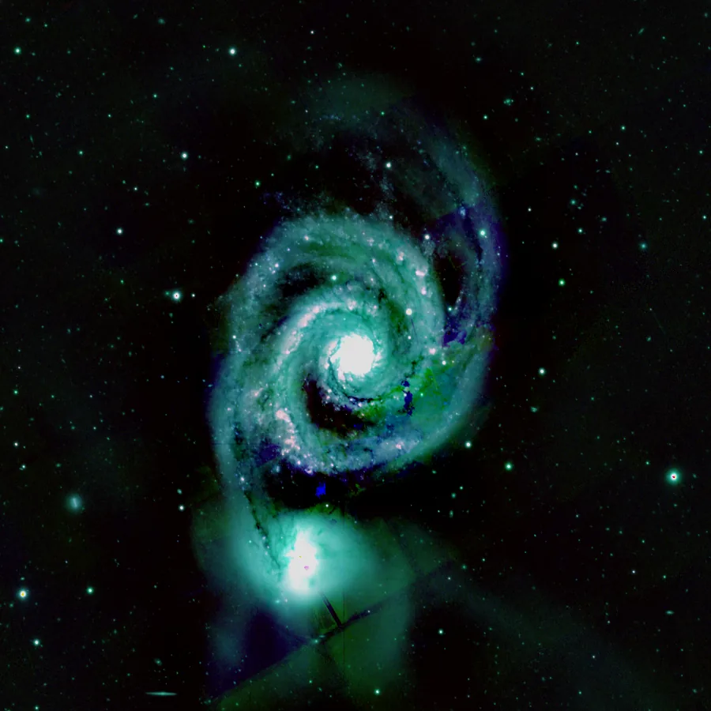

## Résumé

`ChannelCombination` reconstitue une image couleur en assemblant trois vues existantes —
désignées par leur **identifiant** — respectivement dans les canaux **R**, **G** et **B** de
la vue résultat. C'est l'opération inverse de `ChannelExtraction` : là où celle-ci sépare une
image RGB en composantes isolées, `ChannelCombination` les recolle. Elle sert aussi bien à
reformer un RGB classique après traitement séparé des canaux qu'à construire une **fausse
couleur en bande étroite** (palette SHO/HOO) à partir de trois captures monochromes.

*Avant, et après recombinaison des plans R, V et B de l'image dans un autre ordre.*

## Cas d'usage

- **Reformer un RGB** après avoir traité `ChannelExtraction`(R), (G) et (B) indépendamment
  (étirement, débruitage ou déconvolution différents par canal).
- **Composer une palette bande étroite** : assigner Ha → R, OIII → G, SII → B (SHO/Hubble),
  ou Ha → R, OIII → G, OIII → B (HOO bicolore), à partir de vues monochromes calibrées.
- **Fabriquer un composite LRGB manuel** canal par canal avant un raffinement de luminance
  via `LRGBCombination`.
- **Tester des assignations de canaux** rapidement en changeant simplement les identifiants
  de vue, sans dupliquer ni ré-empiler les données.

## Fonctionnement

Le process prend trois paramètres texte — `r`, `g`, `b` — contenant chacun l'**identifiant**
d'une vue déjà ouverte. Pour chaque canal :

1. Si l'identifiant est vide, le canal reprend le **premier canal de l'image courante**
   (celle sur laquelle le process est exécuté) — utile pour ne remplacer qu'un ou deux canaux
   et laisser les autres inchangés.
2. Sinon, la vue correspondante est résolue via le registre interne des images ouvertes
   (`retina.process.context.resolve_image_full`) et son **premier canal** (index 0) est
   extrait — si la vue référencée est déjà RGB, seul son canal rouge est utilisé.
3. Si l'identifiant ne correspond à aucune vue ouverte, le process retombe silencieusement
   sur le canal de l'image courante (même comportement qu'un identifiant vide).

Les trois canaux ainsi obtenus (même géométrie `H×W` requise) sont empilés le long du
troisième axe pour former une image `(H, W, 3)` en float32.

## Mathématiques

Il n'y a pas de transformation photométrique : l'opération est une **réorganisation pure**
des échantillons, sans interpolation ni pondération. Notant $S_R$, $S_G$, $S_B$ les tableaux
2D source (premier canal des vues `r`, `g`, `b`, ou de l'image courante par défaut), le
résultat $I$ est l'empilement :

$$ I(x, y) = \big(S_R(x,y),\; S_G(x,y),\; S_B(x,y)\big) $$

soit, en notation tableau, $I = \operatorname{dstack}(S_R, S_G, S_B)$. Aucune borne n'est
appliquée : les valeurs de sortie héritent directement de la plage des sources (typiquement
$[0,1]$ pour des images déjà normalisées).

## Paramètres

- **`r`** — *str*, défaut `""`. Identifiant de la vue à placer dans le canal rouge. Vide →
  reprend le canal de l'image courante.
- **`g`** — *str*, défaut `""`. Identifiant de la vue à placer dans le canal vert. Vide →
  reprend le canal de l'image courante.
- **`b`** — *str*, défaut `""`. Identifiant de la vue à placer dans le canal bleu. Vide →
  reprend le canal de l'image courante.

## Astuces & pièges

> **Attention** — si une vue référencée est déjà en couleur, seul son **canal 0 (rouge)**
> est utilisé ; le vert et le bleu de cette vue sont ignorés silencieusement. Utilisez
> `ChannelExtraction` en amont pour isoler proprement un canal monochrome avant combinaison.

> **Note** — un identifiant introuvable (vue fermée, faute de frappe) ne provoque **aucune
> erreur** : le canal correspondant retombe discrètement sur l'image courante. Vérifiez les
> identifiants de vue (`app.windows`) en cas de résultat inattendu.

- Les trois vues sources doivent avoir la **même géométrie** (largeur/hauteur) ; sinon
  `numpy.dstack` échoue avec une erreur de forme.
- Pour une palette bande étroite classique, alignez et étirez chaque canal monochrome
  *avant* la combinaison — `ChannelCombination` ne fait aucun étirement ni équilibrage.
- Un léger `ColorCalibration` ou `SCNR` après combinaison corrige souvent une dominante
  verte ou un déséquilibre de balance issu de canaux traités séparément.

## Voir aussi

- [ChannelExtraction](retina-doc://ChannelExtraction) — opération inverse : isoler un canal.
- [LRGBCombination](retina-doc://LRGBCombination) — injecter une luminance dans un RGB existant.
- [ConvertToRGBColor](retina-doc://ConvertToRGBColor) — convertir une image mono en espace RGB.
- [ComponentSeparation](retina-doc://ComponentSeparation) — décomposition en composantes indépendantes.

## Références

- PixInsight — *ChannelCombination* tool reference.
- numpy — *dstack*, empilement de tableaux le long du troisième axe.
