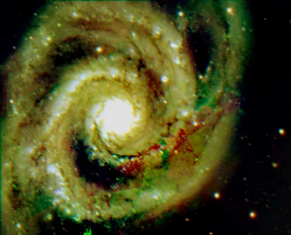
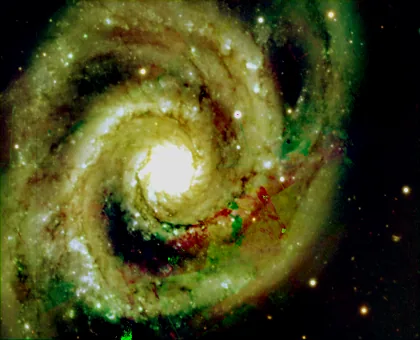

## Summary

`ChannelMatch` shifts each channel of a color image independently, with sub-pixel
precision, and applies an optional linear correction factor per channel. It is the tool
for **colored fringes**: lateral chromatic aberration, or a slight drift between filters
in a mono+filters session combined into RGB.

*Coloured fringes, and the same field after the channels are shifted back into register. The misalignment is injected — the source is built band by band on one grid and carries no chromatic aberration of its own.*

## Use cases

- **Kill red/blue fringes** around stars after `ChannelCombination`.
- **Fine-tune** an RGB set registered globally but not per channel.
- **Balance channels** linearly (factors) without touching histograms.

## How it works

Each channel is translated by (`dx[c]`, `dy[c]`) pixels using spline interpolation
(`scipy.ndimage.shift`, order `order`), then multiplied by `factors[c]`. Uncovered
borders are filled with zeros, like after a registration. The result is clipped to
$[0,1]$. On single-channel images the process is a documented no-op.

## Parameters

- **X offsets (px)** / **Y offsets (px)** — per-channel sub-pixel shifts, `[R, G, B]`.
- **Linear correction factors** — per-channel multiplier, default `1.0`.
- **Interpolation order** — spline order (3 = cubic; 1 = bilinear for speed).

## Tips

- Work on **linear** data; measure the offset on a bright star with the readout probe.
- Prefer negative/positive pairs summing to zero to keep the geometric center.

## See also

StarAlignment, ChannelCombination, ChannelExtraction
