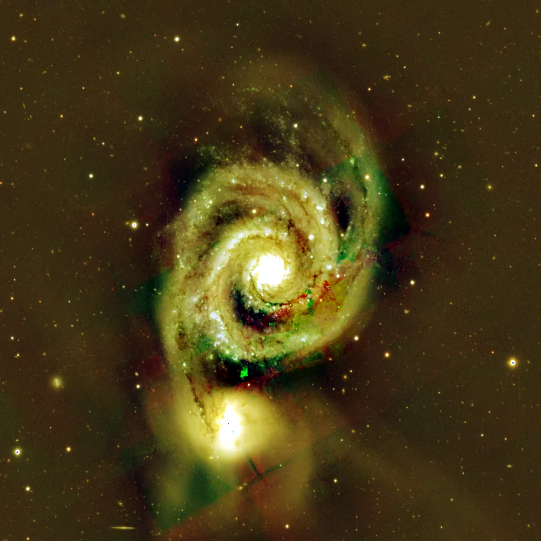
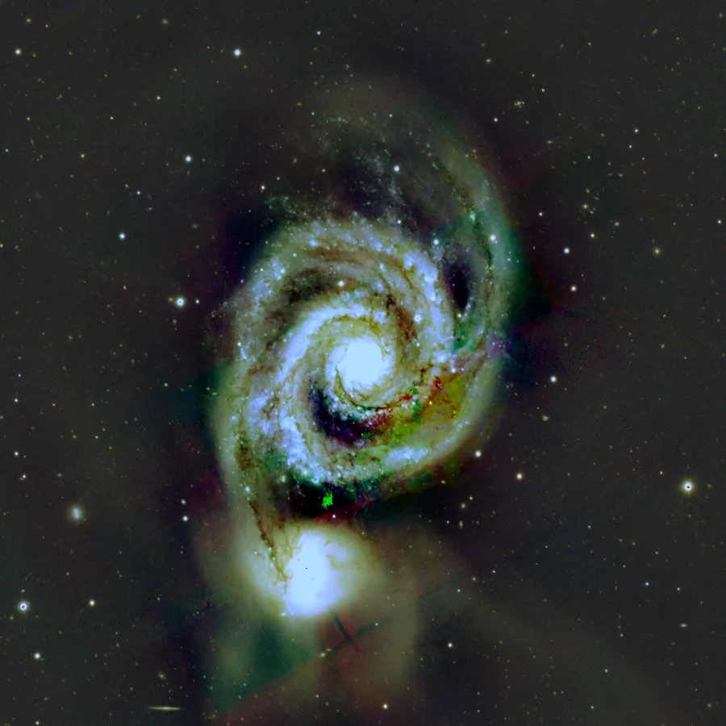

## Résumé

`ColorCalibration` corrige la dominante colorée d'une image RVB en deux temps : une **balance
des blancs** qui égalise les gains par canal sur une région censée être neutre, puis une
**neutralisation du fond de ciel** qui aligne les médianes des canaux dans une région de fond
pour supprimer tout résidu de teinte dans le noir. C'est l'équivalent léger de l'outil
`ColorCalibration` de PixInsight (par opposition à sa variante photométrique, qui s'appuie sur
un catalogue d'étoiles).

*Avant, et après équilibrage des blancs « monde gris » avec neutralisation du fond.*

## Cas d'usage

- **Corriger une dominante** due à la pollution lumineuse, à un filtre ou à un capteur non
  balancé, sans disposer de mesures photométriques de référence.
- **Neutraliser le fond de ciel** avant l'étirement, pour éviter un fond verdâtre ou magenta
  qui se retrouverait amplifié par `HistogramTransformation` ou `CurvesTransformation`.
- **Calibrer rapidement** en mode gray-world quand aucune région de référence évidente n'est
  disponible (champ riche, pas de galaxie neutre repérable).
- **Affiner sur une région choisie** (preview posée sur une étoile blanche connue, ou sur un
  patch de fond bien exempt de signal) quand le gray-world global échoue (champ dominé par une
  nébuleuse rouge, par exemple).

## Fonctionnement

Le process ignore les images non-RVB (moins de 3 canaux, retournées inchangées) et opère en
deux passes indépendantes :

1. **Balance des blancs.** La région désignée par `white_reference` (une preview nommée) sert
   de référence « neutre » ; si le paramètre est vide, la référence est **l'image entière**
   (hypothèse *gray-world* : en moyenne, une scène naturelle est grise). On calcule la moyenne
   de chaque canal dans cette région, puis un gain par canal qui ramène les trois moyennes à
   une valeur commune. Ce gain est appliqué à **toute l'image**, pas seulement à la région de
   référence.
2. **Neutralisation du fond.** La région désignée par `background_reference` (une autre preview
   nommée) sert de référence de fond ; si le paramètre est vide, c'est **l'image après gain**
   (résultat de l'étape 1) qui est utilisée. Pour chaque canal, une médiane robuste est estimée
   par sigma-clipping (`astropy.stats.sigma_clipped_stats`, `sigma=3`), afin d'ignorer les
   étoiles ou le signal faible qui pourraient s'y trouver. Le canal dont la médiane est la plus
   basse sert de plancher ; les autres canaux sont décalés vers le bas pour égaler ce plancher,
   sans jamais remonter aucun canal. Le résultat est enfin écrêté à `[0, 1]`.

> **Note** — quand `background_reference` est explicitement renseigné, sa médiane est calculée
> sur les pixels **originaux** de la vue/preview nommée, et non sur l'image après application
> du gain de l'étape 1. Ceci n'a d'importance que si la preview de fond partage des pixels avec
> l'image gainée d'une manière non triviale (usage normal : préviews distinctes → aucun impact).

## Mathématiques

Soit $I(x,y,c)$ l'image d'entrée pour $c \in \{R,G,B\}$, et $W$ la région de référence blanche
(l'image entière si `white_reference` est vide). On calcule la moyenne par canal :

$$ \mu_c^{W} = \max\!\big(\operatorname{mean}(W_c),\ 10^{-6}\big) $$

et la **cible** commune, moyenne des trois moyennes :

$$ t = \frac{1}{3}\sum_{c} \mu_c^{W}. $$

Le gain appliqué à chaque canal égalise les moyennes de la région blanche sur cette cible :

$$ g_c = \frac{t}{\mu_c^{W}}, \qquad I'(x,y,c) = I(x,y,c)\cdot g_c. $$

Pour la neutralisation du fond, soit $B$ la région de fond (image gainée $I'$ si
`background_reference` est vide, sinon les pixels originaux de la preview désignée). On estime
une médiane robuste par canal via sigma-clipping à $3\sigma$ :

$$ m_c = \operatorname{med}_{3\sigma}(B_c), \qquad f = \min_c m_c. $$

Le décalage final soustrait l'excès de chaque canal par rapport au plancher $f$ :

$$ I''(x,y,c) = \operatorname{clip}\!\big(I'(x,y,c) - (m_c - f),\ 0,\ 1\big). $$

Le canal de plus faible médiane de fond n'est donc jamais modifié à cette étape ; les autres
sont abaissés jusqu'à ce que les trois médianes de fond coïncident.

## Paramètres

- **`white_reference`** — *str*, défaut `''`. Identifiant d'une preview servant de référence
  « blanche » pour la balance des blancs. Vide → gray-world (moyenne de l'image entière).
- **`background_reference`** — *str*, défaut `''`. Identifiant d'une preview servant de
  référence de fond pour la neutralisation. Vide → utilise l'image entière (après gain).

## Astuces & pièges

> **Attention** — la balance des blancs en gray-world suppose que la couleur moyenne du champ
> est neutre. Sur un champ dominé par une grande nébuleuse rouge ou une galaxie chromatiquement
> marquée, cette hypothèse est fausse : posez une preview sur une région neutre (étoile blanche,
> fond de ciel large) via `white_reference` plutôt que de laisser le mode gray-world par défaut.

- Posez toujours la preview de fond (`background_reference`) sur une zone **sans signal**
  (pas d'étoile, pas de nébulosité faible) : la médiane robuste tolère quelques intrus, mais pas
  une région majoritairement occupée par du signal réel.
- Ce process opère sur des données **déjà linéaires calibrées** (après `ImageCalibration` et
  idéalement après `BackgroundExtraction`) ; l'appliquer sur une image déjà étirée déplace les
  tons de façon non physique.
- Pour une calibration ancrée sur de vraies mesures spectrophotométriques plutôt que sur des
  hypothèses statistiques, voir `PhotometricColorCalibration` ou
  `SpectrophotometricColorCalibration`.
- Les images mono ou à moins de 3 canaux traversent le process sans modification.

## Voir aussi

- [PhotometricColorCalibration](retina-doc://PhotometricColorCalibration) — calibration ancrée sur un catalogue photométrique.
- [SpectrophotometricColorCalibration](retina-doc://SpectrophotometricColorCalibration) — calibration à partir de spectres de référence.
- [BackgroundNeutralization](retina-doc://BackgroundNeutralization) — neutralisation du fond seule, sans balance des blancs.
- [LinearFit](retina-doc://LinearFit) — alignement linéaire des canaux/frames sur une référence.

## Références

- PixInsight — *ColorCalibration* tool reference.
- Buchsbaum, G. — *A spatial processor model for object colour perception*, 1980 (hypothèse gray-world).
- astropy.stats — *sigma_clipped_stats* (estimateur robuste de médiane).
