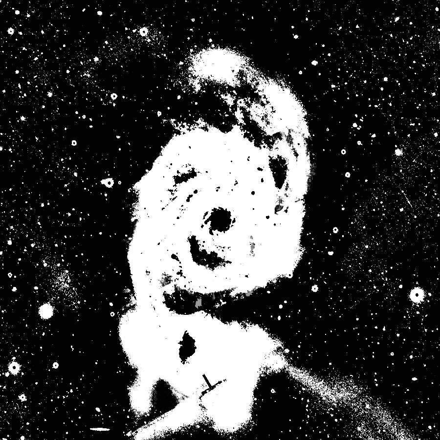

## Résumé

`ColorMask` est le pendant chromatique de [RangeSelection](retina-doc://RangeSelection), qui ne
sait sélectionner que des *intensités*. Il produit un masque (1 canal, nouvelle fenêtre)
retenant les pixels dont la **teinte** tombe dans une plage.

À quoi cela sert : renforcer les régions Hα d'une nébuleuse sans toucher au reste, corriger la
dominante verte des étoiles, désaturer un halo bleu. Ce sont des gestes qu'un masque de
luminance ne peut pas faire — la teinte n'a rien à voir avec la clarté.

*L'image source, et le masque de la plage de teintes sélectionnée.*

## Trois pièges, et comment ils sont traités

**La teinte est circulaire.** Le rouge est à la fois à 0° et à 360°. Une plage « de 340 à 20 »
doit donc passer par zéro, et une comparaison naïve `h ≥ min et h ≤ max` ne sélectionnerait
rien — précisément pour la couleur la plus demandée. Le process travaille sur la **distance
circulaire** à `hue_center`, ce qui referme le cercle par construction.

**Une teinte sans saturation n'existe pas.** Sur un pixel gris, la teinte est un arrondi : elle
vaut n'importe quoi. D'où `min_saturation`.

**Et sur un fond sombre, `min_saturation` ne protège de rien.** La saturation HSV est un
*rapport*, $(\max - \min)/\max$ : un fond de ciel à 0,06 avec 0,01 de bruit affiche une
saturation de 0,4, aussi « coloré » qu'un aplat franc. C'est `min_lightness` qui exclut le fond.
Les deux gardes ne font pas le même travail, et il faut souvent les deux.

## Paramètres

- **`hue_center`** — *real*, défaut `0.0`, plage `0`–`360`. La teinte visée, en degrés. Repères :
  rouge 0, jaune 60, vert 120, cyan 180, bleu 240, magenta 300.
- **`hue_width`** — *real*, défaut `30.0`. **Demi**-largeur de la plage nette, en degrés.
- **`fuzziness`** — *real*, défaut `15.0`. Largeur de la rampe au-delà de la plage nette. À
  zéro, le masque est binaire — et se voit comme tel sur l'image.
- **`min_saturation`** — *real*, défaut `0.1`. En deçà, le pixel est considéré sans teinte.
- **`min_lightness`** / **`max_lightness`** — *real*, défauts `0.0` / `1.0`. Bornes de clarté.
- **`smoothness`** — *real*, défaut `0.0`. Lissage gaussien du masque, en pixels.
- **`invert`** — *bool*, défaut `False`.

Produit une **nouvelle fenêtre** à un canal, comme `StarMask` et `RangeSelection`.

## Astuces & pièges

> **Adoucissez toujours un peu.** Un masque binaire laisse des bords en escalier qui se voient
> sur l'image traitée. `fuzziness` adoucit dans l'espace des teintes, `smoothness` dans
> l'espace de l'image ; les deux servent, et pas au même endroit.

- Sur données **linéaires**, presque tout est sombre : posez `min_lightness` bas et fiez-vous
  plutôt à la saturation. Sur données étirées, l'inverse.
- Pour isoler le Hα d'une image RGB, visez le rouge (0°) avec une largeur étroite ; la plupart
  des étoiles rouges seront prises aussi — combinez avec un `StarMask` inversé.

## Voir aussi

- [RangeSelection](retina-doc://RangeSelection) — le même geste, sur l'intensité.
- [StarMask](retina-doc://StarMask) — masque d'étoiles, à combiner.
- [ColorSaturation](retina-doc://ColorSaturation) — agir sur la saturation par teinte, sans
  passer par un masque.
- [SCNR](retina-doc://SCNR) — le cas particulier du vert, traité directement.

## Références

- PixInsight — script *ColorMask*.
