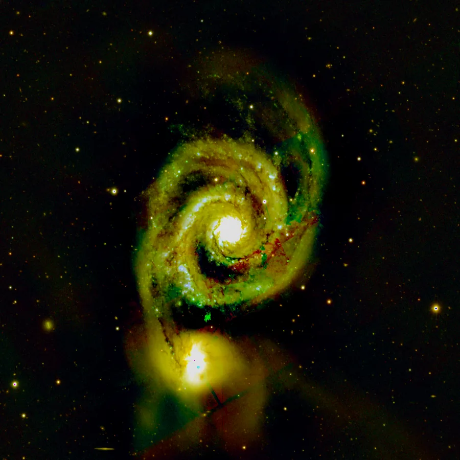

## Résumé

`ColorSaturation` renforce ou atténue l'intensité des couleurs de l'image en agissant sur la
composante **S** (saturation) de l'espace **HSV** (Teinte/Saturation/Valeur). C'est un ajustement
global simple, à un seul curseur : un facteur multiplicatif appliqué au canal de saturation,
appliqué de façon identique à toute l'image. Contrairement à `SCNR` (qui cible spécifiquement le
vert) ou à `ColorCalibration` (qui rééquilibre les gains par canal), `ColorSaturation` ne change ni
la teinte ni la luminosité perçue : il pousse ou retire de la « couleur » sans toucher au dessin
lumineux de l'image.

*Avant, et après doublement de la saturation — teinte et luminance inchangées.*

## Cas d'usage

- **Faire ressortir la couleur** de nébuleuses ou de galaxies dont le signal chromatique est ténu
  après l'étirement (les étirements non linéaires tendent à désaturer l'image).
- **Redonner du peps aux couleurs** d'une image planétaire ou d'un champ riche en étoiles
  colorées, en fin de traitement.
- **Réduire une saturation excessive** (bruit chromatique amplifié, artefacts de debayering) en
  utilisant un facteur inférieur à 1.
- **Désaturer totalement** (facteur 0) pour produire une version en niveaux de gris tout en
  gardant l'espace colorimétrique RGB (comparer avec `ConvertToGrayscale`).

## Fonctionnement

Le process convertit les trois premiers canaux de l'image (RVB) de l'espace RGB vers l'espace HSV
via `skimage.color.rgb2hsv`, après écrêtage des valeurs dans `[0, 1]` (rgb2hsv exige des entrées
non négatives et normalisées). Il multiplie ensuite le canal **S** par le paramètre `saturation`,
en ré-écrêtant le résultat dans `[0, 1]`, puis reconvertit en RGB via `hsv2rgb`. Les canaux **H**
(teinte) et **V** (valeur/luminosité) ne sont jamais modifiés : la luminance perçue de chaque
pixel reste globalement stable, seule la « pureté » de la couleur change.

Si l'image ne comporte pas au moins 3 canaux (image mono), le process est un no-op et retourne une
copie inchangée des données. Si l'image comporte des canaux supplémentaires au-delà de RVB (canal
alpha, etc.), seuls les trois premiers sont traités ; les autres sont préservés tels quels.

## Mathématiques

Pour chaque pixel RVB $(r, g, b) \in [0,1]^3$, la conversion vers HSV donne une teinte $h$, une
saturation $s$ et une valeur $v$ tels que :

$$ v = \max(r, g, b), \qquad
   s = \begin{cases} 0 & \text{si } v = 0 \\ \dfrac{v - \min(r,g,b)}{v} & \text{sinon} \end{cases} $$

Soit $k$ = `saturation` le facteur réglé par l'utilisateur. Le process applique :

$$ s' = \operatorname{clip}(k \cdot s,\; 0,\; 1) $$

et laisse $h$ et $v$ inchangés, avant de reconvertir $(h, s', v)$ en $(r', g', b')$ par la
transformation HSV → RGB inverse. Avec $k = 1$ l'image est inchangée (identité). Avec $k = 0$,
$s' = 0$ pour tout pixel : l'image devient un pur niveau de gris (au sens de $v$), toujours
codé sur 3 canaux RGB égaux. Avec $k > 1$, la saturation croît proportionnellement jusqu'à
l'écrêtage à $s' = 1$ (couleur pleinement saturée), au-delà duquel l'effet sature visuellement.

## Paramètres

- **`saturation`** — *real*, défaut `1.5`, plage `0.0`–`5.0`. Facteur multiplicatif appliqué au
  canal de saturation HSV. `1.0` = aucun changement ; `< 1` désature (jusqu'à `0` = niveaux de
  gris) ; `> 1` sursature.

## Astuces & pièges

> **Attention** — un facteur élevé (`> 2`) amplifie fortement le bruit chromatique dans les zones
> peu saturées (fond de ciel, halos d'étoiles), qui peut apparaître sous forme de taches colorées
> parasites. Débruitez la chrominance (`NoiseReduction` sur les canaux couleur, ou `ComponentSeparation`
> + traitement séparé de la luminance) avant de sursaturer.

- La saturation s'exprime en HSV, un espace non linéaire perceptuellement grossier : un même
  facteur `saturation` peut donner des résultats très différents selon la teinte dominante de
  l'image (le vert et le magenta ne « répondent » pas pareil).
- Pour un contrôle plus fin et localisé (par plage de teinte), utilisez plutôt `CurvesTransformation`
  sur la courbe de saturation, qui permet de cibler certaines teintes.
- Ce process opère toujours sur les 3 premiers canaux : appliquez-le **après** un éventuel
  `Debayer` ou `ConvertToRGBColor`, jamais sur une image mono brute.

## Voir aussi

- [SCNR](retina-doc://SCNR) — suppression ciblée d'une dominante (typiquement le vert).
- [CurvesTransformation](retina-doc://CurvesTransformation) — contrôle tonal et chromatique par
  courbe libre, y compris la saturation.
- [ColorCalibration](retina-doc://ColorCalibration) — équilibrage des couleurs par gains de canaux.
- [RGBWorkingSpace](retina-doc://RGBWorkingSpace) — pondération des canaux pour le calcul de la
  luminance.

## Références

- scikit-image — *skimage.color.rgb2hsv* / *hsv2rgb*.
- Foley, van Dam et al. — *Computer Graphics: Principles and Practice* (modèle HSV).
