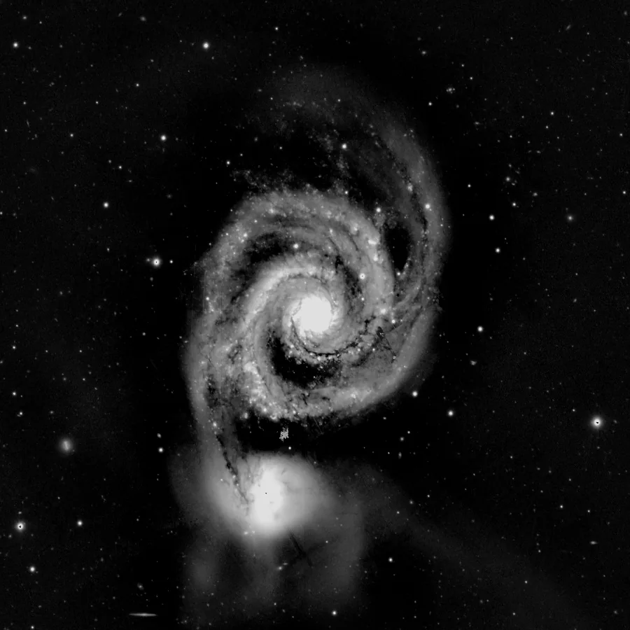

## Summary

`ConvertToGrayscale` turns an RGB image into a **single-channel monochrome** image by
combining the three color channels through a **weighted sum** (perceptual luminance) rather
than a plain average. It is the equivalent of PixInsight's tool of the same name: a color
space conversion that changes the image's **geometry** (channel count), not just its
appearance.

*Before, and after collapsing the three channels to weighted luminance.*

## Use cases

- Prepare a **luminance image** ahead of an LRGB combination (`LRGBCombination`), from an
  already-processed color image.
- Produce a single channel for treatments that only make sense in monochrome: star detection,
  PSF measurements, structural masks, or export destined for a mono instrument.
- Simplify a noisy color image to assess the real signal without chrominance-noise artifacts.
- Preliminary step before `ComponentSeparation` when only the luminance component matters.

## How it works

The process inspects the number of channels of the active image:

- If the image is **already monochrome** (1 channel), it is simply copied unchanged.
- Otherwise, each RGB pixel is reduced to a single value through a **weighted linear
  combination** of the three channels, and that result is stored as the sole output channel
  (the array shape goes from `(H, W, 3)` to `(H, W, 1)`).

The weights used are the **Rec. 709 relative luminance** coefficients (the same ones used in
sRGB-to-luminance conversion), reflecting the eye's differing sensitivity to red, green and
blue — the green channel dominates perceived brightness by far.

This conversion is **irreversible**: the three original channels are lost, only the combined
luminance information survives in the resulting channel.

## Mathematics

Let an RGB pixel be $(r, g, b) \in [0,1]^3$. The luminance value $y$ is computed as the linear
combination:

$$ y = w_r\,r + w_g\,g + w_b\,b $$

with the Rec. 709 coefficients used by the implementation:

$$ w_r = 0.2126, \qquad w_g = 0.7152, \qquad w_b = 0.0722, \qquad w_r + w_g + w_b = 1. $$

Since the weights sum to $1$, a neutral gray pixel ($r=g=b$) keeps its value unchanged after
conversion. The dominance of $w_g$ reflects the fact that the eye is far more sensitive to
variations in the green channel than to red or (especially) blue: two images with different
hues but the same perceived luminance will produce nearly identical monochrome results.

The output image has shape $(H, W, 1)$, each plane $(h, w)$ holding $y(h, w)$ computed
channel-by-channel over the whole image.

## Parameters

This process has no adjustable parameters: the channel weighting is hard-coded (Rec. 709
coefficients) and cannot be tuned from the interface or from a script.

## Tips & pitfalls

> **Warning** — the conversion is destructive and irreversible: once the channels are merged,
> the original RGB proportions cannot be reconstructed. Work on a copy of the view or a preview
> if you need to keep the color information.

> **Note** — if you need different per-channel weights (for example to mimic a particular
> instrument spectral response), use `PixelMath` or `ChannelExtraction` combined with a manual
> weighted sum instead: `ConvertToGrayscale` does not expose the coefficients.

- Applied to an already-monochrome image, the process is a plain no-op (copy), which makes it
  safe to chain in a pipeline without checking the channel count beforehand.
- To go back to RGB (three identical channels, no recoloring), use `ConvertToRGBColor`.

## See also

- [ConvertToRGBColor](retina-doc://ConvertToRGBColor) — inverse conversion (replicate into 3 channels).
- [ChannelExtraction](retina-doc://ChannelExtraction) — extract a single channel instead of a combined luminance.
- [ColorSaturation](retina-doc://ColorSaturation) — adjust saturation without losing color.
- [ComponentSeparation](retina-doc://ComponentSeparation) — separate color components (PCA/ICA) rather than merging them.

## References

- PixInsight — *ConvertToGrayscale* tool reference.
- ITU-R BT.709-6 — luma coefficients for HD/sRGB primaries.
