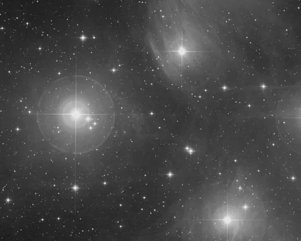
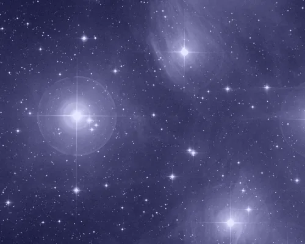

## Summary

`ConvertToRGBColor` changes a single-channel (grayscale) image's **color space** to a
three-channel RGB space by **replicating** the sole channel onto the three output channels.
Unlike `ChannelCombination`, it does not mix in any new chromatic information: the result is
an achromatic "color" image (R = G = B at every pixel), visually identical to the original
but with the channel geometry expected by RGB-specific processes (`SCNR`, `ColorSaturation`,
`LRGBCombination`, …).

*A mono frame, and the three-channel frame it becomes — here with one channel tinted afterwards, since the promotion itself changes no value: what it changes is that there are now three per site, so the frame can receive colour at all.*

## Use cases

- Prepare a grayscale image (luminance, an L master, a mono CCD/CMOS frame) for a process
  that requires three channels, for instance before `LRGBCombination` where the chrominance
  input must already be RGB.
- Subsequently assign a color or tint to a mono image via `PixelMath` or `ColorSaturation`,
  operations that only make sense on a multi-channel space.
- Normalize the channel geometry of a mixed batch (mono + color) before batch processing or
  a joint integration.
- Create a neutral starting point for a false-color or narrowband composite where each RGB
  channel will subsequently be filled separately (`ChannelCombination`, `PixelMath`).

## How it works

The process inspects the channel count of the active image:

- if the image already has **3 channels or more**, it is returned **unchanged** (plain copy,
  no operation) — the conversion is an idempotent no-op;
- otherwise (a **single-channel** image), the lone channel is **duplicated three times** to
  produce the red, green and blue channels, yielding an achromatic image in RGB space.

No interpolation, no weighting, no value rescaling: every output pixel carries exactly the
value of its corresponding source pixel, in all three channels.

## Mathematics

Let $I_L(x, y)$ be the single-channel source image. The conversion produces the RGB image
$I_{\text{RGB}}(x, y, c)$ for $c \in \{R, G, B\}$ by plain duplication:

$$ I_{\text{RGB}}(x, y, c) = I_L(x, y), \qquad \forall\, c \in \{R, G, B\} $$

This operation is the formal (non-exact) inverse of the weighted-luminance grayscale
conversion $L = 0.2126\,R + 0.7152\,G + 0.0722\,B$ used by `ConvertToGrayscale`: applying the
two in sequence (`ConvertToRGBColor` then `ConvertToGrayscale`) reproduces the original image
exactly, since $R = G = B$ cancels out the weighting ($0.2126 + 0.7152 + 0.0722 = 1$). The
inverse order (`ConvertToGrayscale` then `ConvertToRGBColor`), however, is **destructive**:
any hue and saturation information present in the starting RGB image is irrecoverably lost,
since luminance carries only a single scalar per pixel.

## Parameters

This process has **no parameters**: it is a purely structural operation, fully determined by
the channel count of the input image.

## Tips & pitfalls

> **Warning** — the result stays **achromatic** ($R = G = B$) until some color treatment is
> applied afterwards. `ConvertToRGBColor` does not colorize anything; it only opens up the
> channel geometry needed by processes such as `ColorSaturation`, `SCNR` or
> `LRGBCombination`.

- This process does **not** change the channel count of an image that is already RGB or
  more (LRGB, extra channels), so it is safe to apply unconditionally at the top of a
  pipeline regardless of the input's state.
- Because the process is flagged `is_maskable = False` (it may change the channel count), it
  cannot be combined with a mask: apply the conversion first, then mask subsequent steps if
  needed.
- To go the other way (color → grayscale) without losing luminance information, use
  `ConvertToGrayscale`, which weights the channels rather than naively averaging them.

## See also

- [ConvertToGrayscale](retina-doc://ConvertToGrayscale) — the reverse conversion, RGB to weighted grayscale.
- [ChannelCombination](retina-doc://ChannelCombination) — assembles three distinct views into a true RGB image.
- [ChannelExtraction](retina-doc://ChannelExtraction) — extracts a single RGB channel into a mono image.
- [LRGBCombination](retina-doc://LRGBCombination) — combines a luminance with an existing RGB chrominance.

## References

- PixInsight — *ConvertToRGBColor* tool reference.
