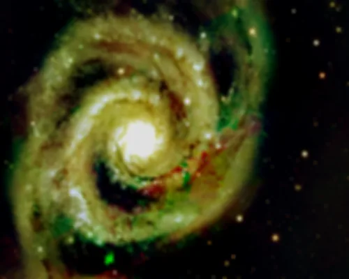

## Résumé

`Convolution` est un opérateur de filtrage spatial générique offrant trois noyaux usuels au
choix : **gaussien** (lissage doux), **boîte** (moyenne uniforme, lissage rapide et brutal) et
**laplacien** (rehaussement de contours). Il complète `GaussianConvolution`, l'opérateur natif
Rust dédié au seul flou gaussien : là où celui-ci vise la performance sur de grandes images,
`Convolution` s'appuie directement sur `scipy.ndimage` pour offrir plus de variété de filtres au
prix d'une implémentation plus simple, mono-thread.

*Avant, et après un noyau carré de rayon 6 — l'étalement à bords droits qui le distingue d'une gaussienne de même rayon.*

## Cas d'usage

- **Lisser légèrement le bruit** avant une analyse d'étoiles, un masquage ou une détection de
  sources, quand un flou gaussien fin suffit.
- **Flou rapide et grossier** (mode `box`) pour créer un masque de fond ou une carte de luminance
  basse fréquence, à moindre coût de calcul.
- **Rehausser les contours** (mode `laplacian`) pour accentuer la texture fine avant un traitement
  de netteté plus élaboré comme `UnsharpMask`.
- **Comparer rapidement des filtres** scipy usuels en console sans reconstruire un pipeline
  Rust dédié à chaque variante.

## Fonctionnement

Le process itère sur chaque canal de couleur indépendamment et lui applique le filtre choisi via
`scipy.ndimage` :

1. **`gaussian`** — convolution par un noyau gaussien 2D isotrope de paramètre `radius` (utilisé
   comme écart-type σ) : `ndimage.gaussian_filter(channel, sigma=radius)`. Lissage doux, sans
   ondulations, qui atténue préférentiellement les hautes fréquences (bruit, détails fins).
2. **`box`** — moyenne glissante sur une fenêtre carrée de côté `round(radius)` pixels :
   `ndimage.uniform_filter(channel, size=...)`. Flou rapide mais moins « propre » optiquement
   (peut introduire des artefacts en anneaux sur des contours nets).
3. **`laplacian`** — calcule le laplacien de l'image lissée par un gaussien de sigma `radius`
   (`gaussian_laplace`, une approximation continue du filtre LoG) et l'**ajoute** à l'image
   d'origine. Le laplacien étant négatif au centre des transitions et positif sur leurs bords,
   cette addition accentue localement le contraste aux contours — un effet de rehaussement de
   netteté doux, apparenté à un unsharp mask simplifié.

Dans tous les cas, le résultat est écrêté dans `[0, 1]` et reconverti en `float32` avant d'être
réinjecté dans l'image.

## Mathématiques

Soit $I(x,y)$ un canal image et $\sigma$ = `radius`.

**Filtre gaussien.** Le noyau isotrope est

$$ G_\sigma(x,y) = \frac{1}{2\pi\sigma^2}\, e^{-\frac{x^2+y^2}{2\sigma^2}}, \qquad
   I'(x,y) = (G_\sigma * I)(x,y). $$

**Filtre boîte.** Le noyau est une fenêtre uniforme de côté $n = \operatorname{round}(\sigma)$ :

$$ I'(x,y) = \frac{1}{n^2} \sum_{i=-n/2}^{n/2}\sum_{j=-n/2}^{n/2} I(x+i,\,y+j). $$

**Filtre laplacien (rehaussement).** On calcule d'abord le laplacien de l'image gaussiennement
lissée — le *Laplacian of Gaussian* (LoG) —, puis on l'ajoute à l'image :

$$ \operatorname{LoG}_\sigma(I) = \nabla^2 (G_\sigma * I)
   = \left(\frac{\partial^2}{\partial x^2} + \frac{\partial^2}{\partial y^2}\right) (G_\sigma * I), $$

$$ I'(x,y) = I(x,y) + \operatorname{LoG}_\sigma(I)(x,y). $$

Le noyau LoG a la forme analytique classique en « chapeau mexicain » :

$$ \operatorname{LoG}_\sigma(x,y) = -\frac{1}{\pi\sigma^4}
   \left[1 - \frac{x^2+y^2}{2\sigma^2}\right] e^{-\frac{x^2+y^2}{2\sigma^2}}, $$

négatif au centre d'une transition et positif sur ses flancs : ajouté à l'image, il creuse
légèrement le côté sombre d'un contour et éclaircit son côté clair, ce qui augmente le contraste
local perçu. Dans les trois cas, la sortie est finalement écrêtée : $I'' = \operatorname{clip}(I', 0, 1)$.

## Paramètres

- **`filter`** — *enum*, défaut `gaussian`, choix `gaussian` / `box` / `laplacian`. Type de noyau
  appliqué : lissage gaussien, moyenne en boîte, ou rehaussement de contours par laplacien de
  gaussienne.
- **`radius`** — *real*, défaut `2.0`, plage `0.1`–`100.0`. Rayon effectif du filtre : écart-type
  σ du noyau pour `gaussian` et `laplacian`, côté de la fenêtre (arrondi à l'entier) pour `box`.

## Astuces & pièges

> **Attention** — en mode `laplacian`, un `radius` trop grand ou une image à fort contraste
> produit des halos sombres/clairs autour des étoiles brillantes et des contours marqués (effet
> de sur-accentuation). Commencez par de petites valeurs (1–3 px) et contrôlez le résultat.

- En mode `box`, un `radius` inférieur à 0,5 est arrondi à une fenêtre de 1 pixel : le filtre
  devient alors sans effet.
- Pour un flou gaussien pur sur de grandes images, préférez `GaussianConvolution` : le noyau
  natif Rust libère le GIL et est nettement plus rapide que `scipy.ndimage.gaussian_filter`.
- Le rehaussement laplacien amplifie aussi le bruit fin ; envisagez un léger débruitage
  (`NoiseReduction`) avant de l'appliquer sur des images bruitées.

## Voir aussi

- [GaussianConvolution](retina-doc://GaussianConvolution) — flou gaussien natif Rust, optimisé
  pour les grandes images.
- [UnsharpMask](retina-doc://UnsharpMask) — rehaussement de netteté plus configurable
  (quantité, seuil).
- [MorphologicalTransformation](retina-doc://MorphologicalTransformation) — filtrage non linéaire
  (érosion/dilatation) pour des effets structurants différents.
- [NoiseReduction](retina-doc://NoiseReduction) — débruitage à effectuer avant un rehaussement
  agressif.

## Références

- SciPy — *scipy.ndimage* : `gaussian_filter`, `uniform_filter`, `gaussian_laplace`.
- PixInsight — *Convolution* tool reference.
