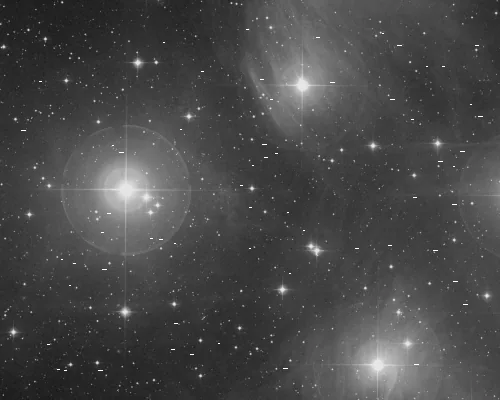
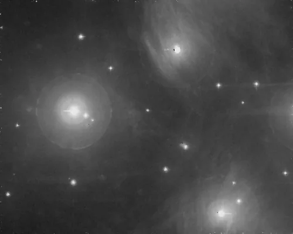

## Résumé

`CosmicClip` élimine les **rayons cosmiques** et pixels chauds isolés d'une image en s'appuyant
sur **astroscrappy**, l'implémentation Python de l'algorithme **L.A.Cosmic** (Laplacian Cosmic
Ray Identification, van Dokkum 2001). Contrairement à un simple filtre statistique sur la valeur
du pixel, L.A.Cosmic exploite la **forme** du défaut : un impact cosmique a un profil beaucoup
plus abrupt (quasi ponctuel, sous-échelle du seeing) que le cœur d'une étoile réelle, ce qui
permet de le détecter et de le remplacer sans éroder les sources astronomiques.

*Des impacts de rayons cosmiques, et la pose après détection et remplacement. Les impacts sont injectés : ce sont les traînées courtes, vives et à bords nets qui distinguent un rayon cosmique d'une étoile, et sur quoi le détecteur s'appuie.*

## Cas d'usage

- **Nettoyer une pose unitaire** (sub-frame) avant intégration, notamment pour les captures
  longue pose où les rayons cosmiques laissent des traits ou points brillants ponctuels.
- **Compléter `Integration`** : le rejet sigma inter-frames élimine déjà l'essentiel des impacts
  sur une pile, mais `CosmicClip` reste utile sur des poses isolées ou en pré-traitement.
- **Traiter les pixels chauds résiduels** que la calibration par dark n'a pas totalement annulés
  (dérive thermique du capteur entre l'acquisition du dark et celle du light).

## Fonctionnement

L'algorithme opère canal par canal (l'image interne est `(H, W, C)` float32 dans `[0,1]`) :

1. **Mise à l'échelle** : nos données étant normalisées en `[0,1]`, elles sont temporairement
   reconverties en pseudo-ADU 16-bit (facteur `65535`) avant l'appel à `astroscrappy`, car son
   modèle de bruit (`gain`, `readnoise`) est calibré pour des valeurs en **ADU réels**. Le
   résultat nettoyé est ensuite redivisé par le même facteur.
2. **Détection par laplacien sous-échantillonné** : l'image est suréchantillonnée d'un facteur 2
   puis convoluée par un noyau laplacien, ce qui amplifie fortement les transitions abruptes
   (rayons cosmiques) tout en restant modéré sur le profil plus doux d'une étoile (limité par la
   PSF/le seeing).
3. **Normalisation par le modèle de bruit** : la réponse laplacienne est divisée par une carte de
   bruit attendu dérivée du modèle Poisson+lecture (`gain`, `readnoise`), donnant un rapport
   signal/bruit local comparé au seuil `sigclip`.
4. **Filtre de forme (`objlim`)** : un second test compare l'amplitude du pic à une estimation de
   structure fine (médiane locale soustraite), ce qui rejette les vrais pics stellaires trop
   « larges » pour être un rayon cosmique — c'est le garde-fou anti-érosion des étoiles.
5. **Itération** (`iterations`) : la détection est répétée sur les pixels non encore identifiés
   comme cosmiques, car un impact large peut d'abord ne révéler que son centre au premier passage.
6. **Réparation** : chaque pixel détecté comme rayon cosmique est remplacé (interpolation depuis
   le voisinage sain), puis l'image est reconvertie en `[0,1]` et bornée par sécurité.

## Mathématiques

Soit $I$ l'image en pseudo-ADU. L'algorithme construit l'image suréchantillonnée $I_2$ (facteur
2 dans les deux dimensions) et lui applique le noyau laplacien discret

$$ L = \begin{pmatrix} 0 & -1 & 0 \\ -1 & 4 & -1 \\ 0 & -1 & 0 \end{pmatrix}, \qquad
   L_2 = L * I_2, $$

puis ramène $L_2$ à l'échelle originale en ne gardant que sa partie positive
$L_2^{+} = \max(L_2, 0)$ (les rayons cosmiques créent un excès local, jamais un déficit).

Le modèle de bruit attendu par pixel combine le bruit de photon (loi de Poisson sur le signal
lissé $\hat I$) et le bruit de lecture $\sigma_\text{RN}$ = `readnoise` :

$$ \sigma(x,y) = \sqrt{\frac{\hat I(x,y)}{g} + \sigma_\text{RN}^2}, \qquad g = \texttt{gain} = 1, $$

où `gain` est fixé à `1.0` dans cette intégration (nos données étant déjà normalisées, pas de
gain capteur distinct à appliquer). Un pixel est **candidat rayon cosmique** si son rapport
laplacien/bruit dépasse le seuil de coupure :

$$ \frac{L_2^{+}(x,y)}{\sigma(x,y)} > \texttt{sigclip}. $$

Pour écarter les cœurs d'étoiles (structure large, pas un pic isolé), on compare à une image de
structure fine $F$ (obtenue par une médiane locale soustractive) via le second critère :

$$ \frac{L_2^{+}(x,y)}{F(x,y)} > \texttt{objlim}, $$

seuls les pixels satisfaisant les **deux** conditions étant marqués et réparés. Le processus est
répété `iterations` fois pour capturer les impacts multi-pixels.

## Paramètres

- **`sigclip`** — *real*, défaut `4.5`, plage `0.5`–`20.0`. Seuil de détection en unités de
  rapport signal/bruit laplacien. Plus bas = détection plus agressive (risque de faux positifs
  sur le bruit de fond) ; plus haut = plus conservateur (rayons faibles non détectés).
- **`objlim`** — *real*, défaut `5.0`, plage `0.5`–`20.0`. Seuil du critère de forme qui protège
  les vraies sources astronomiques. Plus bas = protège moins bien les étoiles fines (risque
  d'éroder leur cœur) ; plus haut = protège davantage mais peut laisser passer des rayons proches
  d'étoiles.
- **`iterations`** — *int*, défaut `4`, plage `1`–`20`. Nombre de passes de détection/réparation.
  Utile pour les impacts cosmiques étendus sur plusieurs pixels contigus ; au-delà de 4–5 passes
  le gain est généralement marginal.
- **`readnoise`** — *real*, défaut `6.5`, plage `0.0`–`100.0`. Bruit de lecture du capteur, en
  électrons, utilisé par le modèle de bruit. À renseigner d'après la fiche technique de la
  caméra (ou les statistiques d'un bias) pour un seuillage fiable.

## Astuces & pièges

> **Attention** — le facteur d'échelle interne (`65535`) suppose une image `[0,1]` **linéaire**
> et calibrée. Appliquer `CosmicClip` sur une image déjà étirée (STF cuite, courbes) fausse le
> modèle de bruit Poisson et dégrade la détection.

> **Note** — un `readnoise` erroné (trop bas) rend le seuillage trop permissif sur les zones
> sombres et peut faire disparaître de vrais pixels de fond faible ; un `readnoise` trop élevé
> laisse passer des rayons cosmiques discrets.

- Sur des poses courtes ou peu bruitées, il est parfois plus économique de laisser le rejet
  sigma de `Integration` faire le travail sur la pile plutôt que de traiter chaque sub-frame.
- Sur des lights isolés (un seul master, sans pile disponible), `CosmicClip` reste le seul
  recours car il n'y a pas de rejet inter-frames possible.
- Combiner avec `CosmeticCorrection` : celle-ci cible les défauts fixes du capteur (pixels
  chauds/froids systématiques), `CosmicClip` cible les événements aléatoires par pose.

## Voir aussi

- [CosmeticCorrection](retina-doc://CosmeticCorrection) — correction des défauts fixes du capteur.
- [DefectMap](retina-doc://DefectMap) — carte de défauts appliquée explicitement.
- [NoiseReduction](retina-doc://NoiseReduction) — débruitage général, complémentaire.
- [ImageCalibration](retina-doc://ImageCalibration) — calibration bias/dark/flat en amont.

## Références

- van Dokkum, P. G. (2001) — *Cosmic-Ray Rejection by Laplacian Edge Detection*, PASP 113, 1420.
- McCully, C. et al. — *astroscrappy* (implémentation Python de L.A.Cosmic).
