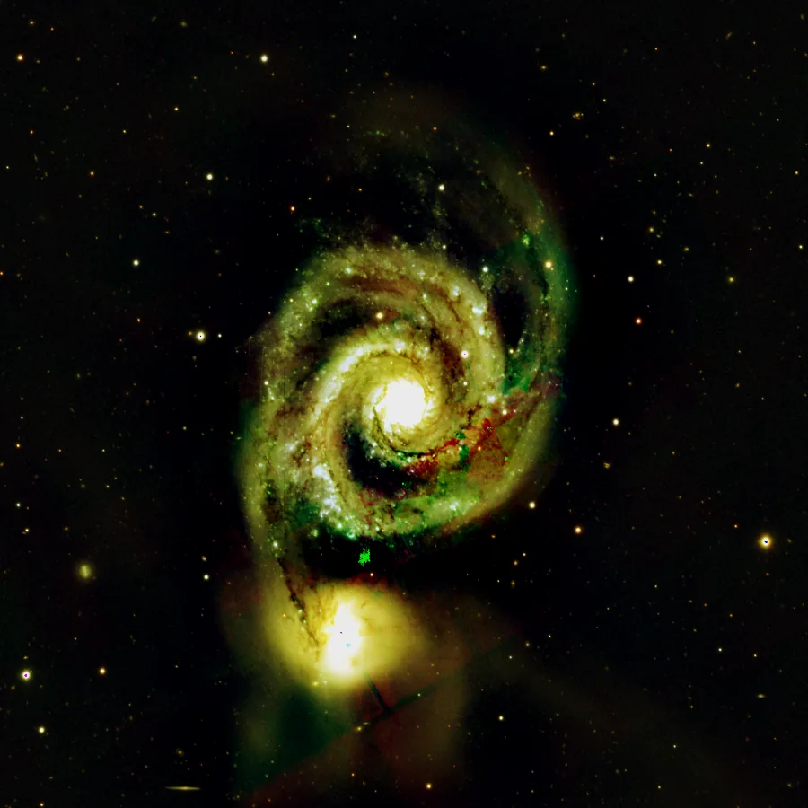

## Summary

`CurvesTransformation` remaps pixel values through a **free tone curve**, defined by a list
of **control points** `(x, y)` in `[0, 1]`. Unlike `HistogramTransformation`, which is limited
to three sliders (black/mid/white point), the curve can take an arbitrary shape — an S-curve
for contrast, a flat segment to protect a tonal range, locally inverted regions — making it
the finest and most general tonal control tool in the software. It can apply globally
(`RGB/K`) or to a single channel (`R`, `G`, `B`), which also enables targeted color
corrections.

*Before, and after a contrast S-curve.*

## Use cases

- **Boost local contrast** with an S-curve: dig into the shadows, lift the highlights, while
  leaving midtones nearly untouched.
- **Protect a tonal range** (e.g. the sky background) by flattening the curve locally around
  its value, while stretching the rest of the dynamic range.
- **Correct a color cast** by applying a different curve on a single channel
  (`channel = R`, `G`, or `B`) instead of a plain global gain.
- **Fine-tune a stretch already performed** by `HistogramTransformation` or an STF, with
  point-by-point control that three sliders alone cannot provide.

## How it works

The user (or a script) supplies a list of points `(x, y)` — at minimum the two endpoints
`(0, 0)` and `(1, 1)` by default, which yields the identity. The process:

1. **Sorts** the points by ascending x (input order does not matter).
2. Builds, for each targeted channel (`_target_channels`, driven by `channel`), the curve
   through these points using **monotone cubic Hermite interpolation**
   (PCHIP / Fritsch–Carlson).
3. **Evaluates** this curve at every pixel of the channel, then **clips** the result to
   `[0, 1]`.

Choosing PCHIP over a classic cubic spline is deliberate: a natural spline can **overshoot**
between two points that are close in value but far apart in position, creating halos or an
unwanted local tone reversal. PCHIP guarantees the curve stays **monotone between two
increasing control points** — no overshoot, no reversal — which is exactly the expected
behavior of a tone curve.

## Mathematics

Let $n$ sorted control points $(x_0, y_0), \dots, (x_{n-1}, y_{n-1})$, with steps
$h_k = x_{k+1} - x_k$ and secant slopes $\delta_k = (y_{k+1} - y_k) / h_k$.

**Node slopes (Fritsch–Carlson).** At the endpoints, the slope equals the adjacent secant:
$d_0 = \delta_0$, $d_{n-1} = \delta_{n-2}$. For an interior node $k$, if the secants
surrounding it change sign (a local extremum), the slope is forced to zero to prevent any
overshoot:

$$
d_k =
\begin{cases}
0 & \text{if } \delta_{k-1}\,\delta_k \le 0 \\[4pt]
\dfrac{w_1 + w_2}{\dfrac{w_1}{\delta_{k-1}} + \dfrac{w_2}{\delta_k}} & \text{otherwise}
\end{cases}
\qquad w_1 = 2h_k + h_{k-1},\quad w_2 = h_k + 2h_{k-1}
$$

(a weighted harmonic mean of the two neighboring secants).

**Per-segment evaluation.** For $x$ in the interval $[x_k, x_{k+1}]$, letting
$t = (x - x_k) / h_k \in [0, 1]$, the interpolated value uses the cubic Hermite basis
functions:

$$
y(x) = h_{00}(t)\,y_k + h_{10}(t)\,h_k\,d_k + h_{01}(t)\,y_{k+1} + h_{11}(t)\,h_k\,d_{k+1}
$$

$$
h_{00}(t)=(1+2t)(1-t)^2,\quad h_{10}(t)=t(1-t)^2,\quad
h_{01}(t)=t^2(3-2t),\quad h_{11}(t)=t^2(t-1)
$$

Finally the result is clipped: $y_{\text{final}} = \operatorname{clip}(y(x),\,0,\,1)$. Values
of $x$ outside $[x_0, x_{n-1}]$ are first clipped to the bounds before evaluation.

## Parameters

- **`points`** — *points* (list of pairs), default `[[0.0, 0.0], [1.0, 1.0]]`. Control points
  `(x, y)` in `[0, 1]` defining the transfer curve. Input order does not matter (points are
  sorted by x before interpolation); two points are enough for the identity, more for a
  complex shape. Avoid two points sharing the same `x`.
- **`channel`** — *enum*, default `RGB/K`, choices: `RGB/K`, `R`, `G`, `B`. Channel the curve
  applies to. `RGB/K` treats all channels identically (or the single channel of a grayscale
  image); `R`/`G`/`B` targets one channel for a color correction.

## Tips & pitfalls

> **Warning** — at least two control points are required, and no two points may share the
> same `x` value (interpolation becomes undefined: `h_k = 0`).

> **Note** — points are **not constrained to be increasing in `y`**: a curve can deliberately
> invert a tonal range (a rare creative or technical use), but it is piecewise monotonicity
> that then prevents erratic overshoot, not any global constraint.

- For a classic S-curve (contrast), place a point below the diagonal in the shadows (e.g.
  `(0.25, 0.15)`) and one above it in the highlights (e.g. `(0.75, 0.85)`).
- Fewer, well-chosen points beat an overloaded curve: PCHIP interpolates *exactly* through the
  given points, so a badly placed point shows directly in the result.
- As with any destructive stretch, ideally work under a **mask** to protect a region (stars,
  sky background) from tonal changes applied elsewhere.

## See also

- [HistogramTransformation](retina-doc://HistogramTransformation) — three-slider stretch
  (black/mid/white point), simpler and faster to tune.
- [ArcsinhStretch](retina-doc://ArcsinhStretch) — color-ratio-preserving stretch.
- [LocalHistogramEqualization](retina-doc://LocalHistogramEqualization) — adaptive local contrast (CLAHE).
- [MaskedStretch](retina-doc://MaskedStretch) — iterative star-preserving stretch.

## References

- PixInsight — *CurvesTransformation* tool reference.
- Fritsch, F. N. & Carlson, R. E. (1980) — *Monotone Piecewise Cubic Interpolation*.
