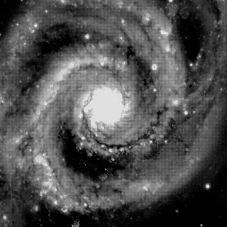
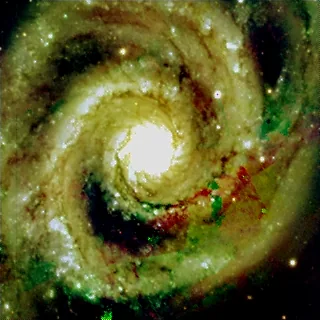

## Résumé

`Debayer` transforme une image **brute mono-canal** issue d'un capteur couleur à filtre de
Bayer (CFA — Color Filter Array) en une image **RGB à trois canaux**, en interpolant les
valeurs manquantes de chaque plan couleur à partir des pixels voisins. C'est l'étape
obligatoire entre l'acquisition d'un capteur one-shot-color (OSC) — ou d'une caméra couleur
non pré-débayerisée — et tout traitement colorimétrique ultérieur.

*Une mosaïque de Bayer et sa reconstruction en couleur. La mosaïque est bâtie depuis les bandes du relevé, le dépôt ne portant aucune brute couleur réelle.*

## Cas d'usage

- **Première étape de traitement** d'une pose brute issue d'une caméra couleur (DSLR, OSC
  astro) avant calibration ou intégration.
- **Reconstruire une couleur exploitable** après un `MergeCFA` ayant recombiné des sous-trames
  monochromes en un mosaïque CFA de synthèse.
- Comparer visuellement les artefacts de **différentes méthodes d'interpolation** (`bilinear`
  vs `malvar`) sur une même image brute avant de figer le pipeline d'acquisition.

## Fonctionnement

Le capteur CFA ne mesure qu'**une seule couleur par photosite** : les pixels rouges, verts et
bleus sont entrelacés selon un motif $2\times2$ répété (`pattern` : `RGGB`, `BGGR`, `GRBG` ou
`GBRG`). Le process construit d'abord trois **masques binaires** $R_m$, $G_m$, $B_m$ qui
indiquent, pour chaque position du capteur, quel canal a réellement été échantillonné, puis
comble les deux tiers manquants de chaque plan par **interpolation spatiale** :

- **`bilinear`** — convolution du plan CFA masqué avec un noyau $3\times3$ dédié par canal
  (moyenne pondérée des voisins directs). Rapide, mais produit des franges colorées
  (*zippering*) sur les bords à fort contraste.
- **`malvar`** (Malvar, He & Cutler 2004) — variante de l'interpolation bilinéaire enrichie
  d'un terme de **correction haute fréquence** dérivé des gradients du canal vert, qui affine
  nettement les contours tout en restant un simple filtre linéaire (donc rapide).

Si l'image possède déjà plusieurs canaux (donc n'est pas une trame CFA brute), le process est
un **no-op** : les données sont recopiées telles quelles. Le résultat est toujours **borné à
`[0, 1]`** et produit en `float32`.

## Mathématiques

Le plan CFA $C(x,y)$ est décomposé selon le motif de Bayer en trois plans épars :

$$ R(x,y) = C(x,y)\cdot R_m(x,y), \quad G(x,y) = C(x,y)\cdot G_m(x,y), \quad B(x,y) = C(x,y)\cdot B_m(x,y) $$

où $R_m, G_m, B_m \in \{0,1\}$ sont les masques d'échantillonnage complémentaires
($R_m + G_m + B_m = 1$ partout). L'interpolation **bilinéaire** applique une convolution 2D
par canal :

$$ \hat{G} = G * H_G, \qquad H_G = \frac{1}{4}\begin{pmatrix}0&1&0\\1&4&1\\0&1&0\end{pmatrix},
\qquad
\hat{R} = R * H_{RB}, \; \hat{B} = B * H_{RB}, \qquad
H_{RB} = \frac{1}{4}\begin{pmatrix}1&2&1\\2&4&2\\1&2&1\end{pmatrix} $$

Le vert, deux fois plus échantillonné dans le motif de Bayer, utilise un noyau en croix ; le
rouge et le bleu, un noyau plein $3\times3$ pondéré par la distance. La méthode de **Malvar**
reprend ce schéma mais ajoute, à chaque canal manquant, une correction proportionnelle au
**laplacien local** du canal déjà connu (typiquement le vert), de la forme :

$$ \hat{C}(x,y) = \big(C * H_{\text{bilin}}\big)(x,y) \;+\; \alpha \cdot \nabla^2 G(x,y) $$

avec des noyaux $5\times5$ dont les coefficients $\alpha$ (issus de l'article original) exploitent
la corrélation entre les hautes fréquences des trois canaux pour réduire l'aliasing de couleur
sans coût de calcul supplémentaire notable par rapport au bilinéaire.

## Paramètres

- **`pattern`** — *enum*, défaut `RGGB`, choix `RGGB`, `BGGR`, `GRBG`, `GBRG`. Motif CFA du
  capteur, c'est-à-dire l'agencement $2\times2$ des filtres rouge/vert/bleu tel que défini par
  le fabricant du capteur (à vérifier dans la documentation de la caméra ou l'en-tête FITS
  `BAYERPAT`). Un motif erroné produit une image aux couleurs incohérentes et décalées d'un
  pixel.
- **`method`** — *enum*, défaut `bilinear`, choix `bilinear`, `malvar`. Algorithme
  d'interpolation. `bilinear` est plus rapide et plus doux (légèrement flou) ; `malvar` restitue
  davantage de détail fin au prix d'un calcul un peu plus lourd et d'un risque accru
  d'artefacts en cas de bruit fort.

## Astuces & pièges

> **Attention** — un `pattern` incorrect ne produit pas une erreur visible immédiatement : les
> couleurs sont simplement fausses et décalées. Vérifiez toujours le motif indiqué par le
> constructeur du capteur ou le mot-clé FITS `BAYERPAT` en cas de doute.

> **Note** — sur des données très bruitées (gain élevé, poses courtes), la méthode `malvar`
> peut amplifier le bruit chromatique en interpolant des gradients parasites. Un débruitage
> léger avant débayerisation, ou l'usage de `bilinear`, limite cet effet.

- La débayerisation doit intervenir **avant** l'étirement d'histogramme mais généralement
  **après** la soustraction du bias/dark, sur données encore linéaires.
- Pour examiner des canaux CFA sans les recombiner, voir `SplitCFA` ; pour reconstruire un
  mosaïque CFA de synthèse à partir de sous-trames, voir `MergeCFA`.

## Voir aussi

- [SplitCFA](retina-doc://SplitCFA) — sépare une trame CFA en ses quatre sous-canaux sans interpolation.
- [MergeCFA](retina-doc://MergeCFA) — recombine des sous-trames en un mosaïque CFA de synthèse.
- [CosmeticCorrection](retina-doc://CosmeticCorrection) — correction des pixels chauds/morts, utile avant ou après débayerisation.
- [PixelInterpolation](retina-doc://PixelInterpolation) — schémas d'interpolation génériques utilisés ailleurs (rééchantillonnage, alignement).

## Références

- colour-science/colour-demosaicing — *demosaicing_CFA_Bayer_bilinear* / *Malvar2004*.
- Malvar, H., He, L.-W., Cutler, R. — *High-Quality Linear Interpolation for Demosaicing of Bayer-Patterned Color Images* (2004).
- Losson, O., Macaire, L., Yang, Y. — *Comparison of Color Demosaicing Methods* (2010).
