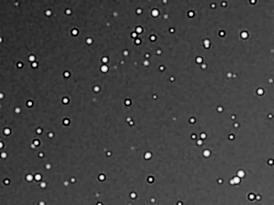

## Summary

`Deconvolution` attempts to **invert the blur** introduced by the atmosphere and optics
(the *point-spread function*, or PSF) in order to restore fine detail. It uses the iterative
**Richardson-Lucy** algorithm, which is robust to Poisson noise.

Three things set it apart from a bare Richardson-Lucy:

- the PSF can be **parametric**, **measured on the stars of the field**, or taken from
  **another view**;
- a multiscale **regularization** keeps the background noise from exploding as you iterate;
- **deringing** attenuates the rings around bright sources.

*Before, and after 8 regularized iterations with deringing. Star profiles tighten without the dark rings an unregularized run leaves behind.*

## Use cases

- **Tighten stars** and reveal galaxy structure on well-sampled exposures.
- **Recover detail** on an image softened by turbulence (moderate seeing).
- A **linear** processing step (before stretching).

## How it works

The observed image $g$ is modelled as the convolution of the "true" image $f$ by the PSF $h$,
plus noise. Richardson-Lucy estimates $f$ through multiplicative iterations that maximize the
likelihood under a Poisson noise assumption:

$$ f^{(t+1)} = f^{(t)} \cdot \frac{1}{\hat h \circledast 1} \left( \hat h \circledast
   \frac{g}{\,h \circledast f^{(t)}\,} \right) $$

The ratio $g / (h \circledast f^{(t)})$ measures the mismatch between the observation and the
reprojection of the current estimate; back-convolving it by $\hat h$ (the flipped PSF) corrects
$f^{(t)}$ multiplicatively. The $1/(\hat h \circledast 1)$ factor compensates for the fact that
right at the frame edge the kernel only sees part of its neighbourhood: without it a dark rim
digs into the borders and creeps inwards at every pass. It equals exactly 1 as soon as you are
more than one PSF radius away from the edge.

### The three PSF sources

| `psf_mode` | What is used as the kernel |
|---|---|
| `parametric` | A Gaussian — or a Moffat when `psf_function = moffat` — of standard deviation `psf_sigma`. |
| `measured` | The **actual PSF of the field**: stars are detected and fitted, then the median of their shape parameters (per-axis widths, orientation, $\beta$) is used to evaluate the model. The measured eccentricity is therefore restored, which an isotropic Gaussian cannot do. |
| `external` | The view named by `psf_view`: a synthetic PSF, a cropped star, a PSF from elsewhere. Its median background is removed and the kernel normalized. |

### Regularization

At each iteration the "à trous" transform separates the fine layers of the estimate, and
whatever does not exceed `regularization` robust deviations there is zeroed. The thresholding is
**hard**: a significant coefficient passes through untouched, so stars — fine yet significant
structures — are not shaved off.

Two more obvious regularizers were tried and dropped, with measurements to back it: **total
variation** and White's **damping** merely slow convergence down — at equal background noise, a
bare Richardson-Lucy stopped earlier restores more stellar flux. On a synthetic field with
ground truth, at 600 iterations:

| | RMS vs truth | background noise | stellar flux |
|---|---|---|---|
| bare RL, 30 iterations | 0.02581 | 0.00254 | 0.751 |
| bare RL, 600 iterations | 0.02598 | 0.00940 | 1.041 |
| regularized, 600 iterations | **0.02313** | **0.00102** | 0.768 |

Bare RL *degrades* as it iterates: its background noise is multiplied by 3.7, and its stellar
flux overshoots the truth — it is manufacturing signal. The regularized run keeps the
background stable.

> **That is a laboratory figure.** The noise there is **white**, so the fine layer holds
> nothing else and thresholding removes almost all of it. On a real image that layer also
> carries structure, and the measured gain drops to around 15–20%. Regularization is no
> substitute for reducing noise **before** deconvolving — it only stops you from creating more.

## Parameters

- **`psf_mode`** — *enum* `parametric` | `measured` | `external`, default `parametric`.
- **`psf_function`** — *enum* `gaussian` | `moffat`, default `gaussian`. Profile for the
  `parametric` and `measured` modes. The Moffat has longer wings, often closer to real seeing.
- **`psf_sigma`** — *real*, default `2.0`, range `0.1`–`20`. Standard deviation (pixels) of the
  parametric PSF. Also the starting guess in `measured` mode, and the radius scale for star
  protection. Match it to the measured FWHM (see `DynamicPSF`): $\sigma \approx$ FWHM / 2.355.
- **`psf_beta`** — *real*, default `2.5`, range `1.05`–`10`. Moffat exponent.
- **`psf_view`** — *str*. Identifier of the view acting as the PSF (`external` mode).
- **`star_threshold`** — *real*, default `5.0`. Star detection threshold, in background σ. Used
  by `measured` mode and by `star_protection`.
- **`iterations`** — *int*, default `20`, range `1`–`500`. Without regularization, beyond a few
  dozen you mostly amplify noise.
- **`regularization`** — *real*, default `0.0`, range `0`–`10`. Significance threshold of the
  fine layers, in robust deviations. `0` disables it; `3` is a working value.
- **`dering_dark`** / **`dering_bright`** — *real*, default `0.0`, range `0`–`1`. Attenuate the
  dark and bright parts of the residual, weighted by the local gradient of the input, so the
  attenuation concentrates where ringing actually appears.
- **`star_protection`** — *real*, default `0.0`, range `0`–`1`. Blends the input back over the
  stars themselves, on soft-edged disks proportional to `psf_sigma`.
- **`luminance_only`** — *bool*, default `False`. Deconvolves luminance only and reapplies the
  ratio to the three channels: three times less work, and above all no chromatic drift
  (deconvolving channels separately makes them converge at different rates, which tints star
  edges).

## Tips & pitfalls

> **Warning** — deconvolution amplifies background noise and creates dark rings around stars.
> On linear, low-noise data, prefer turning `regularization` on over cutting iterations down.

- Measure the PSF rather than guessing it: `psf_mode = measured` avoids both failure modes of a
  guessed PSF — too wide (over-correction, ringing) and too narrow (no gain at all).
- The output is **not clipped at white**: Richardson-Lucy concentrates flux, and clipping star
  cores at 1.0 would destroy their photometry.
- A window mask still works as usual; `star_protection` does the same job without having to
  build the mask.

## See also

- [DynamicPSF](retina-doc://DynamicPSF) — measures star PSF/FWHM.
- [RestorationFilter](retina-doc://RestorationFilter) — Wiener deconvolution (non-iterative).
- [StarMask](retina-doc://StarMask) — star mask, if you would rather set it yourself.
- [UnsharpMask](retina-doc://UnsharpMask) — local sharpening, a gentler alternative.

## References

- Richardson, W. H. (1972). *Bayesian-Based Iterative Method of Image Restoration*. JOSA.
- Lucy, L. B. (1974). *An iterative technique for the rectification of observed distributions*. AJ.
- Starck, J.-L. & Murtagh, F. (1998). *Automatic noise estimation from the multiresolution support*. PASP.
