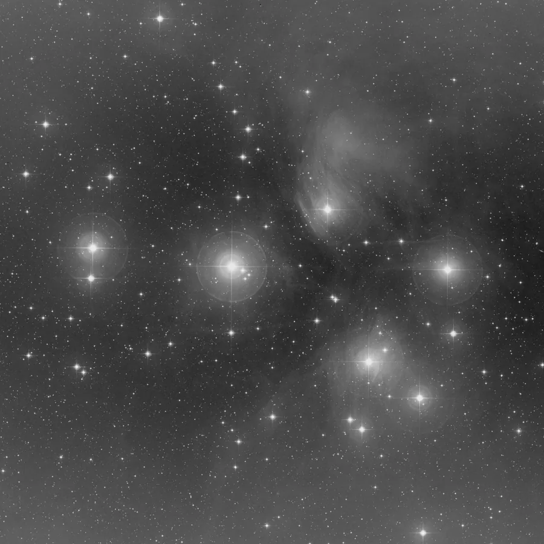

## Résumé

`DynamicBackgroundExtraction` (DBE) modélise le fond de ciel à partir d'un ensemble de
**points d'échantillonnage placés par l'utilisateur** aux endroits jugés « du fond » (pas
d'étoile ni de nébulosité). À chaque point, une statistique robuste locale est mesurée, puis
une **surface lisse** est ajustée à travers ces mesures — par interpolation RBF (thin-plate
spline) ou par régression polynomiale — avant d'être soustraite (ou divisée) de l'image. C'est
l'équivalent direct du DBE de PixInsight : plus lent à mettre en œuvre que l'extraction
automatique par grille, mais bien plus puissant sur les gradients complexes ou irréguliers,
car l'utilisateur choisit exactement où l'algorithme doit faire confiance au fond.

*Avant, et après un modèle RBF ajusté sur une grille d'échantillons, contre un gradient réel.*

## Cas d'usage

- **Gradients complexes** que l'extraction automatique par grille (`BackgroundExtraction`,
  `RollingBallBackground`) ne suit pas bien — halo de lune asymétrique, pollution lumineuse
  directionnelle, vignetage résiduel irrégulier.
- **Champs très riches en nébulosité étendue**, où une grille automatique risque de confondre
  signal faible et fond : ici, l'utilisateur évite volontairement de poser des points sur la
  nébuleuse.
- **Contrôle fin et reproductible** : les points peuvent être ajustés un par un jusqu'à obtenir
  un modèle qui n'emporte aucun signal réel, avant de figer le traitement dans une recette.
- **Génération d'un modèle de fond seul** (`subtract=False`) pour inspection, ou pour le
  réutiliser ailleurs (soustraction manuelle, `PixelMath`, comparaison entre sessions).

## Fonctionnement

1. **Mesure locale robuste.** Pour chaque point `(x, y)` de `samples`, un patch carré de rayon
   `sample_radius` est extrait autour du point, par canal. La médiane du patch sert de centre,
   et un MAD normalisé (`1.4826 × MAD`) sert d'échelle robuste ; les pixels s'écartant de plus
   de `tolerance` × cette échelle sont rejetés (ce sont typiquement des pixels d'étoiles ou de
   nébulosité qui contaminent l'échantillon). La médiane des pixels conservés donne la valeur
   de fond retenue pour ce point et ce canal.
2. **Ajustement d'une surface.** Les valeurs mesurées aux points retenus (au moins 3 nécessaires)
   servent de nœuds à un interpolateur/régresseur 2D, canal par canal :
   - `model = "rbf"` : interpolation par **fonctions de base radiales thin-plate spline**
     (`scipy.interpolate.RBFInterpolator`), qui passe (approximativement, selon `smoothing`)
     par chaque point tout en restant aussi lisse que possible ailleurs.
   - `model = "poly"` : régression polynomiale 2D de degré `degree` par moindres carrés, sur
     coordonnées normalisées `[0, 1]`.
3. **Application.** La surface obtenue est évaluée sur toute la grille image, produisant un
   modèle de fond `B(x, y)` par canal. Si `subtract=True`, on calcule `I − B + pedestal`,
   sinon on renvoie directement `B`. Le résultat est écrêté dans `[0, 1]`.

## Mathématiques

**Mesure robuste par point.** Soit $p$ le patch de pixels autour d'un point échantillon, pour
un canal donné. On calcule sa médiane $\tilde{p}$ et son échelle robuste :

$$ \sigma_p = 1.4826 \cdot \operatorname{med}\big(|p - \tilde{p}|\big) $$

puis on ne garde que les pixels compatibles avec le fond :

$$ K = \{\, v \in p : |v - \tilde{p}| < \tau\,\sigma_p \,\}, \qquad \tau = \texttt{tolerance} $$

la valeur retenue au point étant $\operatorname{med}(K)$. Ce rejet élimine les étoiles et les
structures nébulaires qui, sinon, biaiseraient la mesure vers le haut.

**Interpolation RBF (thin-plate spline).** Étant donné $n$ points de contrôle
$\{(\mathbf{c}_i, v_i)\}_{i=1}^{n}$ avec $\mathbf{c}_i \in \mathbb{R}^2$, le modèle s'écrit :

$$ B(\mathbf{x}) = \sum_{i=1}^{n} w_i\,\phi(\lVert \mathbf{x} - \mathbf{c}_i \rVert)
   + a_0 + a_1 x + a_2 y, \qquad \phi(r) = r^2 \log r $$

où le noyau thin-plate $\phi$ minimise l'énergie de flexion (rotation-invariante) de la
surface interpolée — d'où une reconstruction naturellement lisse entre les points, sans
oscillations parasites. Les poids $w_i$ et les coefficients affines $a_k$ sont déterminés en
résolvant un système linéaire imposant $B(\mathbf{c}_i) = v_i$ (interpolation exacte si
`smoothing = 0`) plus les contraintes $\sum_i w_i = \sum_i w_i \mathbf{c}_i = 0$. Un
`smoothing > 0` relâche la contrainte d'interpolation exacte en pénalisant la courbure, ce qui
lisse le modèle face à des points bruités.

**Régression polynomiale.** Avec des coordonnées normalisées $\hat{x} = x/(w-1)$,
$\hat{y} = y/(h-1)$, on ajuste par moindres carrés les coefficients $\beta_{ij}$ de :

$$ B(\hat{x}, \hat{y}) = \sum_{i=0}^{d} \sum_{j=0}^{d-i} \beta_{ij}\, \hat{x}^{\,i}\, \hat{y}^{\,j},
   \qquad d = \texttt{degree} $$

en minimisant $\lVert A\boldsymbol\beta - \mathbf{v} \rVert_2^2$ (résolu via
`numpy.linalg.lstsq`) — un modèle globalement plus rigide que la RBF, adapté aux gradients
très doux et réguliers.

**Composition finale.** Si `subtract = True` :

$$ I'(x,y) = \operatorname{clip}\big(I(x,y) - B(x,y) + p,\; 0,\; 1\big), \qquad p = \texttt{pedestal} $$

sinon $I' = \operatorname{clip}(B,\,0,\,1)$.

## Paramètres

- **`samples`** — *pointlist*, défaut `[]`. Liste des points `(x, y)` en coordonnées image où
  mesurer le fond. Au moins 3 points valides (dans le cadre de l'image) sont requis.
- **`sample_radius`** — *int*, défaut `15`, plage `2`–`200`. Rayon (en pixels) du patch carré
  utilisé pour mesurer le fond local autour de chaque point.
- **`tolerance`** — *real*, défaut `3.0`, plage `0.1`–`20.0`. Seuil de rejet, en multiples du MAD
  normalisé, appliqué à l'intérieur du patch pour écarter étoiles et structures avant de
  mesurer la médiane du fond.
- **`model`** — *enum*, défaut `rbf`, choix `rbf` / `poly`. Type de surface ajustée aux mesures :
  interpolation thin-plate spline (`rbf`, souple, épouse les irrégularités locales) ou
  régression polynomiale (`poly`, plus rigide et globale).
- **`degree`** — *int*, défaut `2`, plage `1`–`6`. Degré du polynôme 2D, utilisé uniquement
  quand `model = "poly"`.
- **`smoothing`** — *real*, défaut `0.0`, plage `0.0`–`100.0`. Facteur de lissage de la RBF
  (utilisé uniquement quand `model = "rbf"`) ; `0` impose une interpolation exacte aux points,
  une valeur plus grande tolère un écart pour produire une surface plus régulière.
- **`subtract`** — *bool*, défaut `True`. Si vrai, soustrait le modèle de fond de l'image ; si
  faux, renvoie le modèle lui-même (utile pour vérifier qu'aucun signal réel n'y est capturé).
- **`pedestal`** — *real*, défaut `0.1`, plage `0.0`–`1.0`. Décalage additif appliqué après
  soustraction, pour éviter de pousser des pixels sous zéro.

## Astuces & pièges

> **Attention** — placer un point sur une étoile brillante ou au bord d'une nébuleuse fausse
> localement le modèle : même avec le rejet sigma du patch, un point mal placé peut tirer la
> surface vers le haut ou le bas sur une large zone. Vérifiez toujours le modèle
> (`subtract=False`) avant de l'appliquer.

> **Note** — avec peu de points, un `degree` polynomial élevé ou un `smoothing` RBF trop faible
> peuvent sur-ajuster (la surface oscille entre les points au lieu de rester lisse). Préférez
> plus de points bien répartis à un modèle plus complexe.

- Répartissez les points sur **toute l'image**, y compris dans les coins : la RBF comme le
  polynôme extrapolent mal en dehors de l'enveloppe convexe des points.
- Pour un gradient simple (vignetage doux, pente linéaire de pollution lumineuse), un `model =
  "poly"` de faible degré (1 ou 2) est souvent plus stable qu'une RBF.
- Pour un premier passage automatique avant d'affiner avec DBE, `BackgroundExtraction` ou
  `RollingBallBackground` donnent un point de départ rapide.

## Voir aussi

- [BackgroundExtraction](retina-doc://BackgroundExtraction) — extraction automatique par grille
  (équivalent ABE).
- [RollingBallBackground](retina-doc://RollingBallBackground) — estimation de fond par
  rolling-ball.
- [GradientCorrection](retina-doc://GradientCorrection) — correction de gradient global.
- [BackgroundNeutralization](retina-doc://BackgroundNeutralization) — neutralisation
  colorimétrique du fond, une fois celui-ci aplani.

## Références

- PixInsight — *DynamicBackgroundExtraction* tool reference.
- scipy.interpolate — *RBFInterpolator*, interpolation par thin-plate spline.
- Duchon, J. (1977) — *Splines minimizing rotation-invariant seminorms in Sobolev spaces*
  (fondement mathématique des thin-plate splines).
