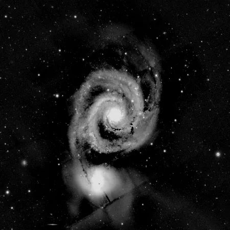
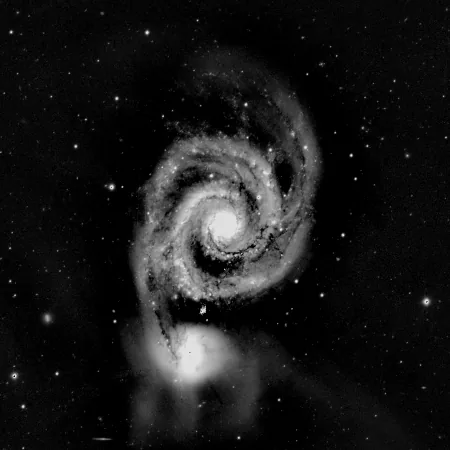

## Summary

`ExtractDualBand` turns a **raw, un-demosaiced one-shot-color (OSC) frame** shot through a
**dual-band Ha/OIII filter** into a single **monochrome narrowband image**. It reads the color
filter array directly: the Hα line (656 nm) reaches only the **red** photosites, the [O III]
line (500 nm) only the **green** ones. One 2×2 CFA block yields one output pixel — a
**super-pixel** decimation, with no interpolation at all. The output is half the width and
half the height, single channel.

This is the process to reach for with smart telescopes (Seestar, Dwarf) and any OSC camera
behind an L-eXtreme / L-Ultimate style filter.

*The two bands a dual-band filter separates, Hα and OIII, from one colour mosaic.*

## Use cases

- **Split a dual-band OSC session into true Ha and OIII masters**: run the extraction on each
  calibrated light, integrate the Ha set and the OIII set separately, then recombine as an
  HOO (or SHO-like) palette with `ChannelCombination`.
- **Avoid the color bleed of demosaicing**: `Debayer` interpolates each missing sample from
  its neighbors, which mixes two physically unrelated emission lines. Extracting first keeps
  each line pure.
- **Get a real signal-to-noise measurement per line** — background, gradient, and star
  profiles of the Ha frame are those of Hα only, not of a red channel contaminated by OIII.
- **Feed narrowband-specific tools** (`NarrowbandNormalization`, `NBRGBCombination`,
  starless processing) with genuine monochrome narrowband data.

## How it works

The input must be a **single-channel CFA mosaic** — the sensor's native output, before any
demosaicing. A multi-channel image is rejected with an explicit error rather than silently
processed, because an already-demosaiced frame no longer carries a recoverable mosaic.

1. Height and width are truncated to the next-lower even number, so the 2×2 block grid tiles
   the image exactly (a trailing odd row or column is dropped).
2. The four letters of `pattern` are mapped onto the block positions in reading order:
   `(0,0)`, `(0,1)`, `(1,0)`, `(1,1)`.
3. With `band = ha`, the plane sitting on the **R** site is returned as-is.
4. With `band = oiii`, the **two G planes are averaged**.

The blue site is deliberately discarded. Some OIII light does pass the blue filter, but with a
markedly different quantum efficiency and a different sky background contribution; folding it
in would degrade the measurement rather than improve it.

Averaging the two greens is not cosmetic: the two green samples of a block are independent
measurements of the same emission at essentially the same location, so their mean carries the
same signal with noise reduced by a factor of √2.

## Mathematics

Let $C(y,x)$ be the CFA mosaic, and let $\pi \in \{$RGGB, BGGR, GRBG, GBRG$\}$ assign a
filter letter to each of the four positions $(a,b)$, $a,b \in \{0,1\}$, of the repeating
block. Write $(a_R, b_R)$ for the position of the red site and $(a_{G_1}, b_{G_1})$,
$(a_{G_2}, b_{G_2})$ for the two green ones. For $i \in [0, H/2)$, $j \in [0, W/2)$:

$$ \mathrm{Ha}(i,j) = C(2i + a_R,\; 2j + b_R), $$

$$ \mathrm{OIII}(i,j) = \tfrac{1}{2}\Big[ C(2i + a_{G_1},\, 2j + b_{G_1}) + C(2i + a_{G_2},\, 2j + b_{G_2}) \Big]. $$

If both green samples carry the same signal $s$ with independent noise of standard deviation
$\sigma$, then their mean has signal $s$ and noise

$$ \sigma_{\mathrm{OIII}} = \frac{\sigma}{\sqrt{2}} \approx 0.707\,\sigma, $$

i.e. a √2 gain in signal-to-noise ratio at no cost in resolution, since the two samples belong
to the same output pixel.

Both outputs have shape $(\lfloor H/2 \rfloor, \lfloor W/2 \rfloor, 1)$. Every output sample
is either a relocated input pixel (Ha) or the mean of two of them (OIII): no interpolation
kernel, no filtering, no invented data.

## Parameters

- **`pattern`** — *enum*, default `RGGB`, choices: `RGGB`, `BGGR`, `GRBG`, `GBRG`. The
  sensor's CFA pattern, exactly as in `Debayer`.
- **`band`** — *enum*, default `ha`, choices: `ha`, `oiii`. `ha` takes the red site (656 nm);
  `oiii` takes the mean of the two green sites (500 nm).

## Tips & pitfalls

> **Warning** — apply this **before** `Debayer`, on the raw mosaic. On a color image the
> process raises an error: there is no mosaic left to read.

> **Warning** — a wrong `pattern` does not produce an obviously broken image, it produces a
> **plausible but wrong** one: with a red/green mix-up, "Ha" would actually be a green site.
> Check the pattern reported by the acquisition software (`BAYERPAT` keyword) and remember
> that an earlier crop offset by an odd number of pixels **changes** the effective pattern.

> **Note** — the extraction is a decimation: the result is half-size in each dimension. Run it
> on every light of the session (never on some only), otherwise registration and integration
> would face mismatched geometries.

- Calibrate (bias/dark/flat) **before** extracting: calibration frames are themselves CFA
  mosaics and must be subtracted photosite by photosite.
- Ha and OIII extracted from the same frame share the same WCS geometry up to the factor-2
  scale change, so a plate solve done on one transfers to the other.
- The OIII signal of a dual-band target is usually much fainter than Ha: expect to stretch the
  two integrations very differently before recombining.

## See also

- [Debayer](retina-doc://Debayer) — full color demosaicing, the exact opposite intent.
- [SplitCFA](retina-doc://SplitCFA) — keeps all four CFA sites as separate planes, lossless.
- [MergeCFA](retina-doc://MergeCFA) — recomposes a full-resolution mosaic.
- [ChannelCombination](retina-doc://ChannelCombination) — builds the HOO/SHO color image from
  the integrated narrowband masters.
- [NBRGBCombination](retina-doc://NBRGBCombination) — blends narrowband data into an RGB image.

## References

- Bayer CFA convention RGGB/BGGR/GRBG/GBRG — see `Debayer`.
- Hα 656.3 nm and [O III] 500.7 nm emission lines; typical dual-band filters (L-eXtreme,
  L-Ultimate) pass only those two bands.
