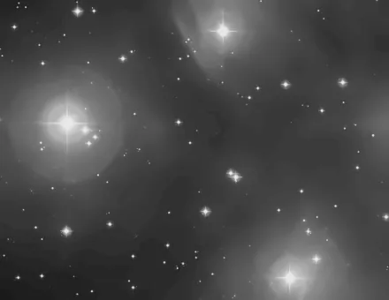

## Summary

`FastNLMeansDenoise` applies the **Non-Local Means** algorithm through OpenCV's optimized
implementation (`cv2.fastNlMeansDenoising`). Like `NonLocalMeansDenoise`, it averages each pixel
with pixels from other regions of the image whose neighborhood ("patch") is similar — a denoising
approach that respects fine structure better than a Gaussian blur. The OpenCV variant trades a
little precision (8-bit processing) for **markedly higher speed**, making it well suited to
wide-field images where the scikit-image variant becomes too slow.

*Before, and after fast non-local means at strength 6, on a crop at the pixel scale.*

## Use cases

- **Quickly denoise a mosaic or a wide field** where `NonLocalMeansDenoise` (scikit-image, in
  float) would be too costly in compute time.
- **Fast preview** of a Non-Local Means effect before a finer, slower pass.
- **Smooth background noise** on an already-stretched image without crushing faint stars or
  nebulosity detail, thanks to the filter's non-local nature.
- **Batch processing** of many sub-images (mosaic tiles) where cumulative runtime matters.

## How it works

The process first converts each channel of the linear `[0, 1]` image to unsigned 8-bit integers
`[0, 255]` (quantization, with clipping), since `cv2.fastNlMeansDenoising` only operates on
unsigned integer images. For each channel:

1. A **reference patch** of side `template_size` is centered on the pixel being denoised.
2. The algorithm compares it against patches of the same size centered on every pixel within a
   **search window** of side `search_size` around it (rather than the whole image, to stay
   computationally tractable).
3. Each candidate pixel receives a **weight** that decreases with the dissimilarity of its patch
   to the reference patch, controlled by the strength `strength` (OpenCV's *h* parameter).
4. The output pixel is the **weighted average** of all candidate pixels.

The 8-bit result is then converted back to float32 `[0, 1]`. Odd patch/window sizes are enforced
internally (`| 1`) because OpenCV requires them. Unlike `NonLocalMeansDenoise`, there is no
automatic per-channel noise estimate: `strength` is an absolute manual setting.

## Mathematics

Let $I$ be the 8-bit quantized image and $p$ a pixel to denoise. For every candidate pixel $q$
within the search window $\Omega(p)$ (of side `search_size`), the patches of side
`template_size` centered at $p$ and $q$ are compared via a squared distance:

$$ d(p, q) = \sum_{k \in \mathcal{N}} \big( I(p+k) - I(q+k) \big)^2 $$

where $\mathcal{N}$ ranges over the patch offsets. The weight assigned to $q$ decays
exponentially with this distance, normalized by the strength parameter $h$ = `strength`:

$$ w(p, q) = \exp\!\left( -\frac{\max(d(p,q) - 2\sigma^2,\, 0)}{h^2} \right) $$

and the restored pixel is the normalized weighted average:

$$ \hat{I}(p) = \frac{1}{Z(p)} \sum_{q \in \Omega(p)} w(p, q)\, I(q),
   \qquad Z(p) = \sum_{q \in \Omega(p)} w(p, q). $$

A small $h$ preserves detail but lets more residual noise through; a large $h$ smooths strongly
at the risk of flattening texture and the faintest stars. OpenCV computes this sum efficiently
(integral image of patch differences), which is the source of its speed advantage over a naive
implementation.

## Parameters

- **`strength`** — *real*, default `3.0`, range `0.1`–`50.0`. Filtering strength (OpenCV's *h*
  parameter). Higher values remove more noise, at the cost of increasingly smoothing fine detail.
- **`template_size`** — *int*, default `7`, range `3`–`21`. Size (in pixels) of the patch
  compared around each pixel. A larger patch averages over broader regions, more robust to noise
  but less sensitive to small structures.
- **`search_size`** — *int*, default `21`, range `5`–`51`. Size of the window in which similar
  patches are searched for. A larger window finds better matches but noticeably increases
  computation time.

## Tips & pitfalls

> **Warning** — the internal 8-bit quantization limits precision: on a very low-noise or very
> low-dynamic-range image, this process can introduce visible **banding** that
> `NonLocalMeansDenoise` (float processing) avoids.

> **Note** — `template_size` and `search_size` are forced to odd values internally; an even
> value entered will silently be incremented by 1.

- Start with a moderate `strength` (2–4) and increase gradually while watching for loss of
  detail on faint stars and fine nebulosity structure.
- For more faithful denoising on a reasonably sized image, `NonLocalMeansDenoise`
  (scikit-image) offers finer control (strength relative to per-channel estimated noise) at the
  cost of longer runtime.
- Working under a **mask** (stars or sky background) lets you concentrate denoising where it is
  useful without affecting high-signal areas.

## See also

- [NonLocalMeansDenoise](retina-doc://NonLocalMeansDenoise) — scikit-image float variant, more
  precise but slower.
- [TGVDenoise](retina-doc://TGVDenoise) — total generalized variation denoising.
- [WaveletDenoise](retina-doc://WaveletDenoise) — multiscale wavelet denoising.
- [NoiseReduction](retina-doc://NoiseReduction) — generic denoising toolbox.

## References

- Buades, A., Coll, B., Morel, J.-M. — *A non-local algorithm for image denoising* (CVPR 2005).
- OpenCV — *cv2.fastNlMeansDenoising* / *fastNlMeansDenoisingColored* documentation.
