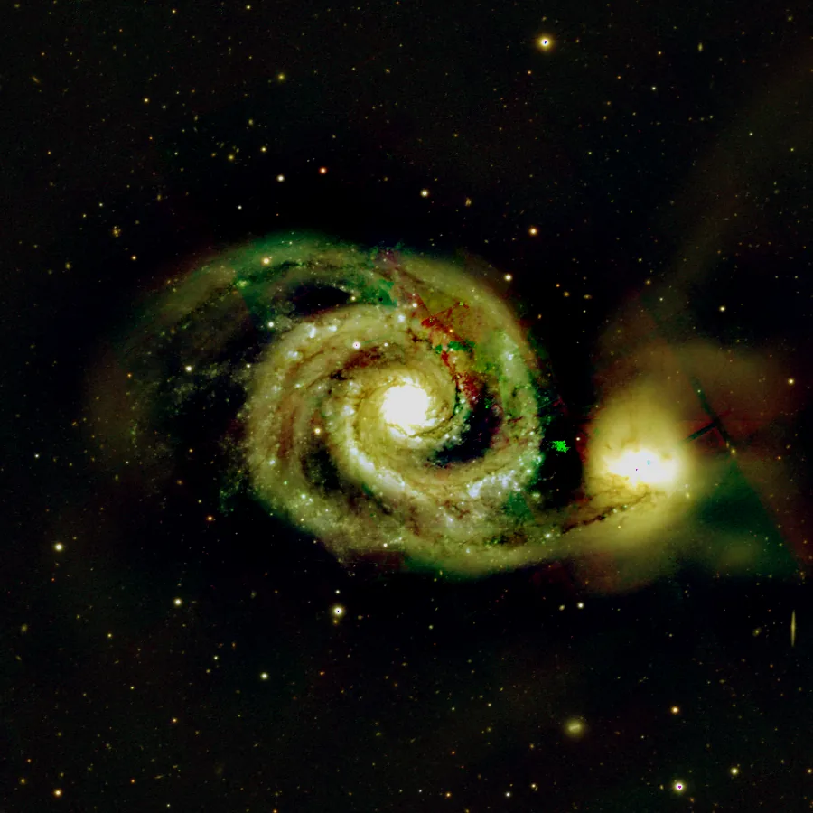

## Summary

`FastRotation` performs the five most common geometric transforms — rotation by 90°, 180°,
270°, and horizontal or vertical mirroring — by simply **reindexing** the pixel array, with no
interpolation whatsoever. Unlike `Rotation` (arbitrary angle), these operations are **exact
and lossless**: every output pixel is a direct copy of an input pixel, never a weighted blend
of neighbors.

*Before, and after a quarter turn. Nothing is interpolated and no corner is lost — the same pixels, in another order.*

## Use cases

- **Fix camera orientation** when a sensor is mounted at 90°/180°/270° from the expected
  reference, before alignment or stacking.
- **Reconcile frames** from different instruments (guide camera, filter wheel with a flipped
  mount) before `StarAlignment`.
- **Correct an optical mirror** (optical train with a fold mirror, mirror-mounted camera) via
  `hmirror`/`vmirror`, upstream of any photometric or astrometric processing.
- **Quickly reorient** an image for display or composition without degrading sharpness —
  handy right before a screenshot or final export.

## How it works

Depending on the `operation` parameter, the operator selects one of five reindexings of the
`(H, W, C)` array:

- `rotate90` / `rotate180` / `rotate270` — counter-clockwise rotation of the image plane via
  `numpy.rot90` on axes `(0, 1)` (rows/columns), by 1, 2 or 3 quarter-turns respectively.
- `hmirror` — flips the column axis (`data[:, ::-1, :]`), left-right mirror.
- `vmirror` — flips the row axis (`data[::-1, :, :]`), top-bottom mirror.

No pixel is ever recomputed: the resulting array is a **permutation** of the input array, then
made memory-contiguous (`np.ascontiguousarray`) for the rest of the pipeline. 90°/270°
rotations **swap width and height**; 180°, `hmirror` and `vmirror` keep the dimensions
unchanged. Like the whole `Geometry` category, the process is **not maskable**
(`is_maskable = False`): a mask assumes an unchanged geometry between input and output, which
only holds for 180°/mirrors, not for 90°/270°.

## Mathematics

Let $I(y, x)$ be the input image of size $H \times W$. All five operations are exact coordinate
permutations, with no interpolation or weighting:

$$
\begin{aligned}
\text{rotate90}(I)(y, x) &= I(x,\; W - 1 - y) \\
\text{rotate180}(I)(y, x) &= I(H - 1 - y,\; W - 1 - x) \\
\text{rotate270}(I)(y, x) &= I(H - 1 - x,\; y) \\
\text{hmirror}(I)(y, x) &= I(y,\; W - 1 - x) \\
\text{vmirror}(I)(y, x) &= I(H - 1 - y,\; x)
\end{aligned}
$$

Since every output value is an **exact copy** of an input value (a bijection on indices), the
operation is involutive or cyclic depending on the case ($\text{rotate90}^4 = \text{id}$,
$\text{hmirror}^2 = \text{id}$) and **changes neither the noise nor the dynamic range** of the
pixels — unlike `Rotation`, whose arbitrary-angle interpolation slightly smooths the signal
and introduces correlation between neighboring pixels.

## Parameters

- **`operation`** — *enum*, default `rotate90`, choices: `rotate90`, `rotate180`, `rotate270`,
  `hmirror`, `vmirror`. Geometric transform to apply: counter-clockwise rotation by one, two
  or three quarter-turns, or horizontal (left-right) / vertical (top-bottom) mirroring.

## Tips & pitfalls

> **Warning** — `rotate90` and `rotate270` swap width and height: any linked view (preview,
> mask, WCS/astrometry) must be recomputed afterwards, since these operations do not preserve
> the original geometry.

> **Note** — for an arbitrary angle (e.g. aligning a frame to celestial north with a small
> offset of a few degrees), use `Rotation`, which interpolates; `FastRotation` only covers
> exact multiples of 90° and mirrors, with no signal degradation.

- Chain a rotation and a mirror in two successive passes to obtain any of the 8 symmetries of
  the square (dihedral group $D_4$) without ever interpolating.
- If a WCS (astrometric solution) is already attached to the window, a 90°/270° rotation
  invalidates its implicit orientation; re-solve with `PlateSolve` afterwards if needed.

## See also

- [Rotation](retina-doc://Rotation) — arbitrary-angle rotation, with interpolation.
- [Crop](retina-doc://Crop) — rectangular cropping.
- [IntegerResample](retina-doc://IntegerResample) — resampling by an integer factor.
- [Resample](retina-doc://Resample) — resampling by an arbitrary scale factor.

## References

- PixInsight — *FastRotation* tool reference.
- NumPy — *numpy.rot90*, axis flipping by reindexing.
