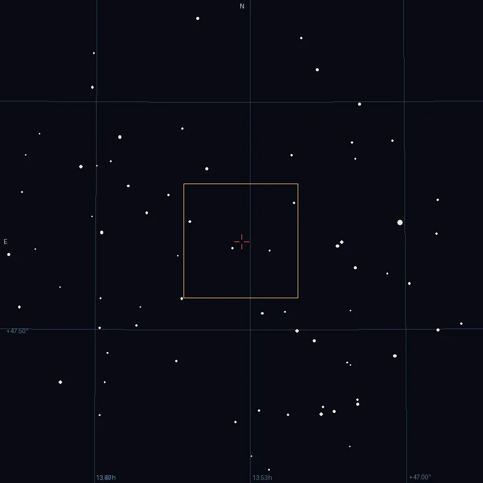

## Résumé

`FindingChart` dessine une **carte du ciel synthétique** centrée sur le champ d'une
fenêtre résolue : grille RA/Dec, **empreinte** du champ source (ses coins projetés sur la
carte), étoiles du catalogue en disques proportionnels à la magnitude, marqueur central et
points cardinaux (nord en haut, est à gauche). Process **global** : la carte s'ouvre en
nouvelle fenêtre — elle-même résolue, le readout céleste y répond immédiatement.

*Le champ, et la carte tracée depuis sa seule solution astrométrique — trois fois plus large que la pose, ce qui est la raison même d'en faire une.*

## Cas d'usage

- **Situer une cible** dans son environnement après un plate-solve.
- **Documenter une session** : exporter la carte à côté du master.
- **Vérifier un plan de mosaïque** : le champ voisin recouvre-t-il comme prévu ?

## Fonctionnement

Un WCS TAN synthétique est construit au centre du champ, couvrant `field_factor` × la
diagonale du champ source sur `size` pixels. La grille réutilise le traceur de
`Annotation` sur ce WCS ; les étoiles viennent de Gaia DR3 (les plus brillantes d'abord,
cône ADQL) ou de `set_objects()` en headless/tests ; l'empreinte est la projection des
coins de l'image source.

## Paramètres

- **Fenêtre source** — fenêtre à cartographier (vide = fenêtre active).
- **Taille de la carte (px)** / **Facteur de champ** — géométrie de la carte.
- **Pas de la grille** — en degrés, `0` choisit une valeur ronde selon le champ.
- **Catalogue** / **Magnitude limite** / **Objets max** — contenu stellaire (`none` =
  grille et empreinte seules, entièrement hors ligne).
- **Id de la nouvelle image** — identifiant de la fenêtre produite.

## Astuces & pièges

- `catalog: none` ne demande aucun réseau — grille + empreinte sont du pur calcul WCS.
- La fenêtre de la carte a son propre WCS : `CatalogAnnotation` peut l'annoter aussi.

## Voir aussi

PlateSolve, Annotation, CatalogAnnotation
