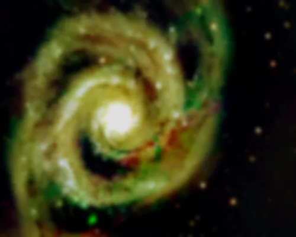

## Summary

`GaussianConvolution` applies a **Gaussian blur** to the image: each pixel is replaced by a
weighted average of its neighborhood, with weights following a Gaussian curve whose width is set
by `sigma`. It is the most fundamental smoothing operator in the catalogue — the first process in
the project to be ported to native Rust (`retina._core`), and it serves as the reference example
for the "compiled operator releasing the GIL" pattern described in `CLAUDE.md`.

*Before, and after a Gaussian blur of σ = 3 — the reference smoothing.*

## Use cases

- **Soften noise** before an operation sensitive to high frequencies (FWHM measurement, source
  detection) without introducing ringing artifacts.
- **Prepare a feathered mask**: convolved with a large `sigma`, a binary mask (stars, background)
  gains smooth transitions that avoid visible seams.
- **Simulate/estimate a Gaussian PSF** for deconvolution testing (`Deconvolution`), or build the
  "high-frequency" complement used by `UnsharpMask`.
- **Lightly reduce grain** on an already-stretched image as a final cosmetic touch.

## How it works

The 2D Gaussian kernel is **separable**: instead of convolving with a square kernel costing
$O(n^2)$ operations per pixel, the implementation applies two successive 1D convolutions —
horizontal then vertical — each in $O(n)$, producing a strictly identical result.

1. A discrete 1D kernel is sampled from the continuous Gaussian and normalized so weights sum to
   1 (preserves the mean brightness). Its radius is set to $\lceil 3\sigma \rceil$ pixels on each
   side of the center — beyond that, the Gaussian contribution is negligible.
2. The kernel is convolved along the horizontal axis, channel by channel, using **reflected
   (mirror) borders** to avoid the artificial darkening typical of zero-padded convolutions.
3. The intermediate result undergoes the same convolution along the vertical axis.
4. If `sigma <= 0`, the image is returned unchanged (a copy), with no computation.

The computation is carried out by the `retina_core` crate (Rust/PyO3, parallelized with `rayon`,
GIL released via `allow_threads`); when the native binary is unavailable, `backend.gaussian_convolve`
automatically falls back to `scipy.ndimage.gaussian_filter`, then to a pure-numpy implementation —
the output is numerically equivalent in all three cases.

## Mathematics

The continuous 1D Gaussian kernel of width $\sigma$ is:

$$ g_\sigma(x) = \frac{1}{\sqrt{2\pi}\,\sigma} \, \exp\!\left(-\frac{x^2}{2\sigma^2}\right). $$

The implementation samples its discrete, normalized version over a radius
$r = \lceil 3\sigma \rceil$:

$$ k[i] = \frac{\exp\!\left(-\dfrac{i^2}{2\sigma^2}\right)}{\displaystyle\sum_{j=-r}^{r} \exp\!\left(-\dfrac{j^2}{2\sigma^2}\right)}, \qquad i = -r, \dots, r. $$

Because the 2D Gaussian is **separable**, $g_\sigma(x,y) = g_\sigma(x)\,g_\sigma(y)$, the full
convolution is obtained via two successive 1D passes, for each channel $c$:

$$ I'(x,y,c) = \sum_{j=-r}^{r} k[j] \left( \sum_{i=-r}^{r} k[i]\, I(x+i,\, y+j,\, c) \right). $$

Out-of-bounds indices are folded back by border reflection ($x \mapsto -x-1$ or
$x \mapsto 2n-x-1$) rather than zeroed, avoiding the typical darkening of zero-padded convolutions.
The `sigma` parameter directly controls the **spatial standard deviation** of the blur: the
effective cutoff frequency of the low-pass filter decreases as $1/\sigma$ — the larger `sigma`,
the more fine detail the smoothing erases.

## Parameters

- **`sigma`** — *real*, default `2.0`, range `0.0`–`50.0`. Standard deviation of the Gaussian
  kernel, in pixels. A value of `0` disables all smoothing (image unchanged). Small values
  (`0.5`–`2`) attenuate fine noise; large values (`10`+) produce a heavy blur, useful for masks or
  very smooth background estimates.

## Tips & pitfalls

> **Warning** — too high a `sigma` on the main image permanently erases fine detail (faint stars,
> tenuous nebular structure). Prefer working under a mask or on a copy/preview to judge the
> smoothing-vs-signal-loss trade-off.

- Computational cost grows with `sigma` (kernel radius $\propto \sigma$) but stays linear per
  pixel thanks to separability — no need to artificially cap `sigma` out of fear of a full 2D
  kernel's quadratic cost.
- For a faster, coarser blur (box approximation) or edge enhancement (Laplacian), see the generic
  `Convolution` process, which shares the same category but relies on `scipy.ndimage`.
- Do not confuse with `NoiseReduction`, which aims to preserve edges (adaptive filtering), whereas
  `GaussianConvolution` smooths uniformly, edges included.

## See also

- [Convolution](retina-doc://Convolution) — generic filter (gaussian/box/laplacian) via scipy.
- [UnsharpMask](retina-doc://UnsharpMask) — sharpness enhancement based on a Gaussian blur.
- [Deconvolution](retina-doc://Deconvolution) — inverts a blur (PSF) rather than applying one.
- [NoiseReduction](retina-doc://NoiseReduction) — edge-preserving denoising.

## References

- Gonzalez, R. C. & Woods, R. E. — *Digital Image Processing*, chapter on spatial filtering.
- PixInsight — *Convolution* tool reference.
