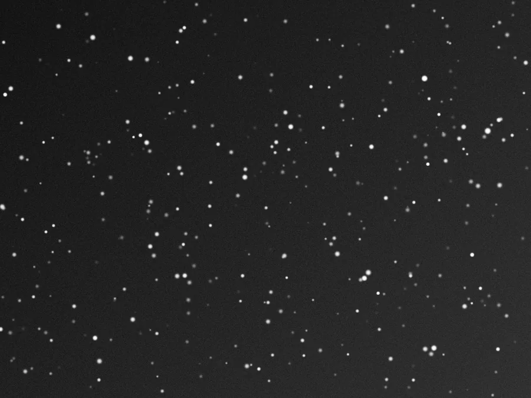

## Summary

`GeneralizedHyperbolicStretch` (GHS) transforms tones by **focusing contrast around a point you
choose**, instead of spreading it uniformly. That is the essential difference from
`HistogramTransformation`: you only ever have a finite contrast budget, and GHS lets you spend
it exactly where the data you care about lives.

Proposed by David Payne in 2021 and developed with Mike Cranfield, it became a native PixInsight
module and remains at the heart of award-winning workflows.

*The linear frame as stored, and the same frame after a hyperbolic stretch.*

## Use cases

- **First stretch of linear data**: the gesture it was designed for. Place the symmetry point
  just right of the background peak, set a strong local intensity, and raise the stretch factor
  until the peak lands around 0.2–0.25.
- **Adding contrast** to a flat area of an already non-linear image, without touching the rest.
- **Darkening the background** without clipping: low symmetry point, `HP` equal to `SP`, strong
  intensity.
- **Going back**: the transformation is exactly invertible (`invert`), which lets you stretch,
  remove stars, then return both images to their linear state.

## How it works

The curve is built from **four pieces**, joined by their tangents and then normalized to run
from 0 to 1:

| Range | Shape |
|---|---|
| `0 ≤ x < LP` | **linear** segment, tangent to the curve at `LP` |
| `LP ≤ x < SP` | the upper part mirrored, rotated about `(SP, 0)` |
| `SP ≤ x < HP` | the generalised hyperbolic equation, whose slope peaks at `SP` |
| `HP ≤ x ≤ 1` | **linear** segment, tangent to the curve at `HP` |

Those two linear segments are what `LP` and `HP` do: they *reserve* contrast for the shadows and
highlights instead of letting it all go to the neighbourhood of `SP`.

The base equation depends on the local intensity `b`, and changes form at three points:

$$ b = -1 : \ln(1 + Dx) \qquad b < 0 : \frac{1 - (1 - bDx)^{\frac{b+1}{b}}}{D(b+1)} \qquad
   b = 0 : 1 - e^{-Dx} \qquad b > 0 : 1 - (1 + bDx)^{-\frac{1}{b}} $$

where $D = e^{\texttt{stretch\_factor}} - 1$. The slider sets $\ln(D+1)$ rather than $D$,
because that is the quantity that varies linearly with the perceived effect.

> **An implementation detail that matters**: these sub-families are not on the same scale — the
> derivative at zero is $D$ for three of them and $1$ for the integral one. Since the final
> curve is normalized, the difference cancels exactly, and that is precisely what keeps the
> curve **continuous in `b`** as the slider crosses $-1$ and $0$.

## Parameters

- **`stretch_factor`** — *real*, default `0.0`, range `0`–`20`. The amount of stretch, expressed
  as $\ln(D+1)$. At zero the transformation is the identity.
- **`local_intensity`** (`b`) — *real*, default `0.0`, range `-5`–`15`. How tightly the stretch
  focuses around `SP`. A **high** value (around 10) digs a narrow contrast peak — what you want
  for a first stretch, which must separate background from data without burning the stars. A
  **low or negative** value spreads contrast and brightness more evenly, which suits later
  adjustments.
- **`symmetry_point`** (`SP`) — *real*, default `0.0`, range `0`–`1`. Where contrast is spent.
  Values move away from this point.
- **`protect_shadows`** (`LP`) — *real*, default `0.0`. Below it the transformation is linear:
  the background keeps its definition. Clamped to `SP` if it exceeds it.
- **`protect_highlights`** (`HP`) — *real*, default `1.0`. Above it the transformation is linear:
  stars keep their definition.
- **`mode`** — *enum* `rgb` | `lightness` | `colour`, default `rgb`.
  - `rgb`: each channel independently. Simple, but it **desaturates** — see below.
  - `lightness`: CIE L\* only, chrominance untouched.
  - `colour`: the arcsinh route — stretch the channel average and apply the *ratio*, which keeps
    the proportions between channels exactly, hence the saturation.
- **`clip_type`** — *enum* `clip` | `rescale`, default `rescale`. What to do, in `colour` mode,
  with a pixel that exceeds 1. `rescale` brings it back whole and **keeps its hue**; `clip`
  truncates, which turns star cores white.
- **`invert`** — *bool*, default `False`. Applies the inverse transformation.

## Tips & pitfalls

> **Why `rgb` mode washes the image out.** A pixel's saturation is the proportional gap between
> its brightest and dimmest channel. A tone curve stretches low values more than high ones, so
> it pulls the channels together — and the colour goes. `colour` mode exists for that.

- **Work in several stretches**, not one. That is the whole point of GHS: each pass spends a
  little contrast where it is needed, rather than settling everything at once.
- The real-time preview is the right place to set `SP`: it is very sensitive to it.
- For a first stretch, `LP` is usually pointless, and so is `HP` — a strong local intensity
  already protects the stars well.
- `colour` mode can clip, so it is **not strictly invertible**. If you intend to go back
  analytically, stay in `rgb`.

## See also

- [HistogramTransformation](retina-doc://HistogramTransformation) — the midtones transfer
  function, simpler but with no point of focus.
- [ArcsinhStretch](retina-doc://ArcsinhStretch) — same concern for preserving colour, a single
  curve shape.
- [MaskedStretch](retina-doc://MaskedStretch) — iterative, masked approach.
- [CurvesTransformation](retina-doc://CurvesTransformation) — a free-form curve, when you know
  exactly the shape you want.

## References

- Payne, D. & Cranfield, M. — *Generalised Hyperbolic Stretch*, reference documentation of the
  PixInsight module, ghsastro.co.uk. The equations implemented here come from it.
