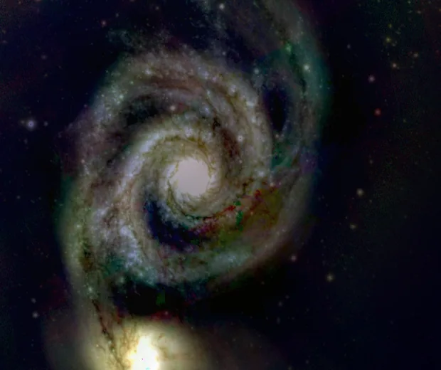

## Summary

`GradientHDRCompression` compresses an image's dynamic range by working not on pixels but on
their **gradients**, in a simplified version of Fattal et al.'s (2002) method. It attenuates
**large** gradients — the sharp transitions between a bright core and the sky background that
saturate local contrast — while preserving **small** gradients that carry fine detail. The
final image is reconstructed by solving a Poisson equation over the modified gradient field.
Unlike `HDRMultiscaleTransform`, which works by multiscale decomposition, this approach does
not produce ring haloes around bright objects.

*Before, and after compressing the dynamic range in the gradient domain (beta 0.6).*

## Use cases

- **Reveal core and faint extensions simultaneously** on a very high-dynamic-range object
  (galaxy core, central star of a planetary nebula, the heart of M42) without crushing one to
  save the other.
- **Halo-free alternative** to `HDRMultiscaleTransform` when it produces bright/dark rings
  around stars or a galactic bulge.
- **Prepare a high-dynamic-range linear image** before a classic stretch
  (`HistogramTransformation`, `ArcsinhStretch`), by shrinking the gap between extreme tones
  that the final stretch would otherwise have to handle.

## How it works

Processing runs independently, channel by channel:

1. **Log-luminance**: `data` is first clipped to a small positive floor (avoids `log(0)`),
   then log-transformed — the natural space for reasoning about dynamic-range *ratios* rather
   than absolute differences.
2. **Forward gradients** ($g_x$, $g_y$) of the log-luminance, computed by finite differences
   (right/bottom edge set to zero).
3. **Adaptive threshold** $\alpha$ = `alpha` parameter × the average gradient magnitude over
   the whole image — so the threshold adapts to image content rather than being a fixed
   absolute value.
4. **Attenuation**: each gradient component is multiplied by a factor $\Phi$ that is ≈1 near
   the threshold, compresses gradients well above it (sharp transitions), and relatively boosts
   gradients well below it (fine detail) — see the formula below.
5. **Reconstruction via a Poisson solve**: the attenuated gradient field is generally no longer
   an exact gradient (it is no longer integrable), so the algorithm seeks the image whose
   gradient *best approximates* it in a least-squares sense, which amounts to solving
   $\nabla^2 I = \operatorname{div}(g_x', g_y')$ with **Neumann** boundary conditions. The
   solve uses a DCT-II (the discrete 5-point Laplacian is diagonal in that basis), with the
   constant (DC) mode left undetermined and fixed at 0.
6. **Back to linear space** (exponential), followed by per-channel **renormalization** onto
   `[min, max] → [0, 1]` and a final clip.

## Mathematics

Let $L = \log(\max(I, 10^{-4}))$ be the log-luminance of one channel, and
$\nabla L = (g_x, g_y)$ its discrete gradient (forward differences). The adaptive threshold is:

$$ \alpha = \max\!\big(\texttt{alpha} \cdot \overline{|\nabla L|},\; 10^{-6}\big) $$

where $\overline{|\nabla L|}$ is the average gradient magnitude over the whole image. The
attenuation factor applied to a gradient of magnitude $g = |\nabla L|$ is:

$$ \Phi(g) = \left(\frac{\alpha}{g}\right)\left(\frac{g}{\alpha}\right)^{\beta}
           = \left(\frac{g}{\alpha}\right)^{\beta - 1}, $$

with $\beta$ = the `beta` parameter. The attenuated gradient is $g' = \Phi(g)\, g$, which
simplifies to:

$$ g' = \alpha \left(\frac{g}{\alpha}\right)^{\beta} . $$

Since $\beta < 1$, this power law is **concave**: at the fixed point $g = \alpha$, $g' = \alpha$
(no change); for $g \gg \alpha$ (a large transition), $g'$ grows much more slowly than $g$ —
that is the **compression**; for $g \ll \alpha$ (fine detail), $g'$ is lifted proportionally
higher than $g$ — that is the **local boost**. The smaller $\beta$ is, the stronger this effect
(large-gradient compression / small-gradient enhancement).

The reconstructed image $I'$ then solves, in the least-squares sense,

$$ \nabla^2 I' = \operatorname{div}(g_x', g_y'), $$

diagonalized via the DCT-II: if $\hat{d}$ is the transform of the divergence and
$\lambda_{u,v} = 2\cos(\pi u / H) - 2 + 2\cos(\pi v / W) - 2$ are the eigenvalues of the
discrete 5-point Laplacian with Neumann boundary conditions, then
$\hat{I}'_{u,v} = \hat{d}_{u,v} / \lambda_{u,v}$ (the $u=v=0$ mode fixed at 0). The final
result is $\exp(I')$, linearly renormalized into $[0,1]$ per channel.

## Parameters

- **`beta`** — *real*, default `0.85`, range `0.1`–`1.0`. Compression exponent. The closer to
  `0.1`, the stronger the compression of large gradients (and the boost to small ones); at
  `1.0`, $\Phi \equiv 1$ and the operator is (nearly) a no-op.
- **`alpha`** — *real*, default `0.1`, range `0.01`–`1.0`. Gradient threshold, expressed as a
  fraction of the image's average gradient magnitude. A small `alpha` classifies more gradients
  as "large" (more of the image gets compressed); a large `alpha` restricts compression to the
  harshest transitions only.

## Tips & pitfalls

> **Warning** — the process renormalizes each channel onto its own `[min, max]` after
> reconstruction: absolute black point and white point are not preserved across applications.
> Always recheck the STF/histogram afterwards.

> **Note** — channels are processed **independently** in log-domain and renormalized
> separately; on a color image this can slightly shift color balance. On a target where hue
> fidelity matters, consider applying the process on a separated luminance channel
> (`ComponentSeparation`) and recombining afterward.

- Requires strictly positive pixels after the $10^{-4}$ clip: run a background correction
  first (`BackgroundExtraction`) to avoid a sky background crushed to zero, which would distort
  the log-luminance.
- Compared to `HDRMultiscaleTransform`, this method works on the full-resolution gradient
  (no multiscale pyramid): that is what avoids ring haloes, at the cost of a more "global"
  effect that is less finely tunable per scale.
- On already well-stretched images the effect can look aggressive: start from near-linear data
  and follow up with a gentle stretch (`HistogramTransformation`, `ArcsinhStretch`).

## See also

- [HDRMultiscaleTransform](retina-doc://HDRMultiscaleTransform) — HDR compression via
  multiscale decomposition (can produce haloes).
- [GradientHDRComposition](retina-doc://GradientHDRComposition) — multi-exposure composition
  in gradient domain (global process, same Poisson solver).
- [HDRComposition](retina-doc://HDRComposition) — classic HDR composition by weighting
  increasing-duration exposures.
- [MultiscaleLinearTransform](retina-doc://MultiscaleLinearTransform) — à trous wavelet
  decomposition, the basis for other multiscale processing.

## References

- Fattal, R., Lischinski, D., Werman, M. — *Gradient Domain High Dynamic Range Compression*,
  SIGGRAPH 2002.
- Pérez, P., Gangnet, M., Blake, A. — *Poisson Image Editing*, SIGGRAPH 2003.
- PixInsight — *HDRMultiscaleTransform* tool reference (related approach).
