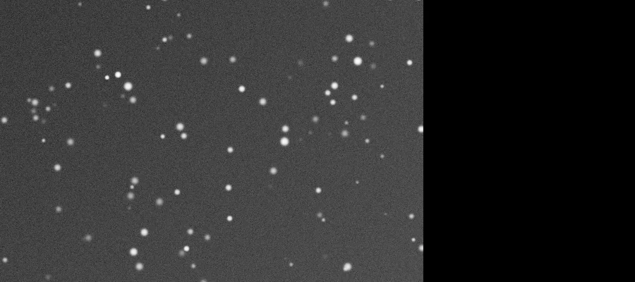
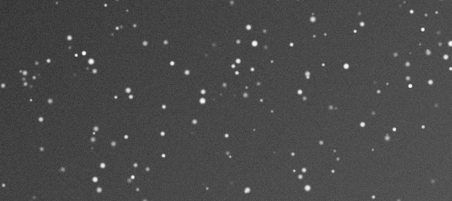

## Résumé

`GradientMergeMosaic` assemble deux **panneaux** d'une mosaïque grand champ déjà projetés sur
la même grille de pixels (même WCS, même résolution) en une seule image continue. Il **égalise
le niveau de fond** des deux panneaux dans leur zone de recouvrement, puis compose le résultat :
recouvrement moyenné, zones exclusives à un seul panneau recopiées telles quelles. C'est l'étape
finale d'un flux de mosaïque, après recalage astrométrique (`PlateSolve`, `StarAlignment`) et
reprojection commune (`MosaicReproject`).

*Deux panneaux d'un champ stellaire réel, et l'image unique qu'ils forment.*

## Cas d'usage

- **Assembler une mosaïque grand champ** de plusieurs tuiles acquises et traitées séparément
  (nébuleuses étendues, Voie lactée, grands champs à foyer court).
- **Recoller des panneaux dont l'exposition ou le fond de ciel diffèrent légèrement** (nuits
  différentes, lune, gradient de pollution lumineuse variable d'un pointage à l'autre).
- **Fusionner par étapes** une mosaïque à N panneaux : appliquer le process successivement,
  panneau après panneau, sur une image de composition qui grandit à chaque appel.

## Fonctionnement

Le process attend que la **vue courante** (`data`) et la vue nommée par `other` soient déjà
projetées sur une **grille identique** (mêmes dimensions, même repère céleste) — c'est le rôle
de `StarAlignment`/`PlateSolve` en amont, éventuellement suivi de `MosaicReproject` pour une
grille WCS commune. Le panneau `other` est résolu via `context.resolve_image_full`, qui retrouve
le tableau de pixels complet `(H, W, C)` de la vue nommée dans l'espace de noms de l'application.

Le traitement se déroule en trois temps :

1. **Détection des zones utiles** de chaque panneau : un pixel est considéré « rempli » si la
   somme de ses canaux est strictement positive (`sum(axis=2) > 0`). Cela distingue le contenu
   réel des bords vides (zéros) introduits par la reprojection ou le recalage.
2. **Égalisation du fond dans le recouvrement** : là où les deux panneaux se chevauchent, on
   calcule un **offset médian** unique entre les médianes de pixels des deux panneaux sur cette
   zone commune, et on l'applique au panneau `other` tout entier. Cela corrige un décalage
   global de fond de ciel (piédestal, transparence, pollution lumineuse) sans toucher au
   contraste local.
3. **Composition** : dans les zones où seul le panneau courant est rempli, on garde ses pixels ;
   dans les zones où seul `other` est rempli, on garde ceux (égalisés) de `other` ; dans le
   recouvrement, on prend la **moyenne simple** des deux. Le résultat est enfin écrêté à `[0,1]`.

Si `other` est vide, introuvable, ou de géométrie différente de la vue courante, le process est
un no-op : il retourne une copie de l'image d'entrée sans modification.

## Mathématiques

Soient $a$ le panneau courant et $b$ le panneau `other`, tous deux de forme $(H, W, C)$. On
définit les masques de zones remplies par canal-somme :

$$ v_a(x,y) = \mathbb{1}\!\left[\sum_c a(x,y,c) > 0\right], \qquad
   v_b(x,y) = \mathbb{1}\!\left[\sum_c b(x,y,c) > 0\right] $$

et le recouvrement $\Omega = \{(x,y) : v_a(x,y) \wedge v_b(x,y)\}$. Si $\Omega \neq \varnothing$,
l'offset d'égalisation de fond est la différence des **médianes robustes** des valeurs de pixel
sur le recouvrement :

$$ \delta = \operatorname{med}_{(x,y) \in \Omega}\big[a(x,y,\cdot)\big] -
            \operatorname{med}_{(x,y) \in \Omega}\big[b(x,y,\cdot)\big] $$

appliqué uniformément : $b' = b + \delta$. La médiane est utilisée plutôt que la moyenne pour
rester insensible aux étoiles brillantes et aux résidus de bruit qui peuvent tomber dans le
recouvrement. La composition finale, par pixel :

$$
I(x,y) =
\begin{cases}
a(x,y) & \text{si } v_a \wedge \lnot v_b \\
b'(x,y) & \text{si } v_b \wedge \lnot v_a \\
\tfrac{1}{2}\big(a(x,y) + b'(x,y)\big) & \text{si } v_a \wedge v_b \\
0 & \text{sinon}
\end{cases}
$$

suivie d'un écrêtage $I \leftarrow \operatorname{clip}(I, 0, 1)$. Le moyennage simple dans le
recouvrement laisse une **couture visible** si les deux panneaux ont un bruit ou une résolution
très différents ; il n'y a pas de fondu progressif (feathering) pondéré par la distance au bord.

## Paramètres

- **`other`** — *str*, défaut `""`. Identifiant de la vue du **second panneau** à fusionner avec
  la vue courante. Doit désigner une vue déjà ouverte, projetée sur la même grille de pixels que
  la vue active. Si vide ou introuvable, le process ne fait rien.

## Astuces & pièges

> **Attention** — les deux panneaux doivent être **exactement recalés sur la même grille**
> (mêmes dimensions, même orientation, même échantillonnage). `GradientMergeMosaic` ne recale
> rien lui-même : passez d'abord par `StarAlignment`/`PlateSolve`, puis par `MosaicReproject`
> pour une grille WCS commune si les panneaux viennent de pointages différents.

> **Note** — la détection de zone utile repose sur `sum(axis=2) > 0` : un pixel réellement noir
> (valeur nulle sur tous les canaux) dans une zone de signal réel sera à tort traité comme un
> bord vide. Un léger piédestal préalable (voir `GradientCorrection`) évite ce faux négatif.

- Pour une mosaïque à plus de deux panneaux, appliquez le process **itérativement** : fusionnez
  d'abord deux panneaux, puis fusionnez le résultat avec le panneau suivant, et ainsi de suite.
- Si les fonds de ciel restent visiblement décalés après fusion (couture visible hors
  recouvrement), égalisez d'abord chaque panneau séparément avec `GradientCorrection` ou
  `BackgroundExtraction` avant la fusion.
- L'égalisation ne corrige qu'un **offset constant** ; un gradient résiduel différent entre les
  deux panneaux (ex. pollution lumineuse asymétrique) doit être traité en amont.

## Voir aussi

- [MosaicReproject](retina-doc://MosaicReproject) — reprojection commune sur une grille WCS partagée.
- [StarAlignment](retina-doc://StarAlignment) — recalage préalable des panneaux entre eux.
- [PlateSolve](retina-doc://PlateSolve) — résolution astrométrique de chaque panneau.
- [GradientCorrection](retina-doc://GradientCorrection) — égalisation de fond au sein d'un panneau avant fusion.

## Références

- PixInsight — scripts communautaires de mosaïque (CFosterMosaic et approches similaires).
- Techniques de fondu de panneaux par PixelMath pour mosaïques grand champ.
