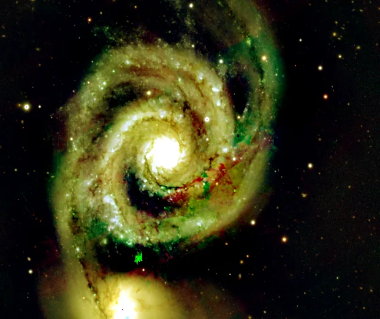

## Summary

`HDRMultiscaleTransform` (HDRMT) compresses an image's **global dynamic range** while fully
preserving its **local contrast**. The principle: decompose the image with a starlet
transform (detail layers + a large-scale residual), flatten the residual — which carries the
global brightness dynamics — through a power law, then reconstruct by adding the detail
layers back untouched. Result: a galaxy's or bright star's saturated core and its faint
surrounding extensions become visible at the same time, without the halo or local-contrast
crushing a plain curves stretch would produce.

*Before, and after a 6-layer HDR compression: the core comes back into range.*

## Use cases

- **Reveal a galaxy's core and extensions** (bright bulge + faint spiral arms) in a single
  image, with no mask or manual compositing.
- **Tame the core of a very high-contrast nebula** (M42/Orion) while keeping the faint
  filaments around it visible.
- **Local alternative to `GradientHDRCompression`** when the scene has no sharp gradient but a
  global dynamic range too wide for a plain histogram/curve stretch.
- **Finishing step** before a light structure enhancement (`MultiscaleLinearTransform`,
  `UnsharpMask`), once the global dynamic range has been brought into a workable span.

## How it works

For each channel, independently:

1. **Starlet decomposition** (`starlet_transform`, "à trous" B3-spline kernel) into `layers`
   detail layers $w_1, \dots, w_J$ (finest to largest structures) plus a **residual** $c_J$
   that carries the very-large-scale brightness trend.
2. **Residual compression**: the residual is normalized to $[0,1]$ and passed through a power
   law whose exponent depends on `overdrive` — the higher `overdrive`, the stronger the
   compression (the residual flattens, narrowing the gap between bright and dark large-scale
   regions).
3. **Reconstruction**: the detail layers are added back **unchanged** to the compressed
   residual — local contrast (edges, small structures, noise granularity) is therefore never
   touched by the compression.
4. **Min-max renormalization** of the reconstructed channel back to `[0, 1]`, followed by
   final clipping.

This strict separation between the global scale (compressed) and the local scales (preserved)
is what distinguishes HDRMT from a plain histogram stretch or global gamma: only the
component responsible for the dynamic-range "width" is touched.

## Mathematics

The starlet decomposition at $J$ = `layers` scales is obtained by recursive "à trous"
filtering with the separable B3-spline kernel $h = \tfrac{1}{16}[1,4,6,4,1]$, dilated by a
factor $2^{j}$ at scale $j$:

$$ c_0 = I, \qquad c_{j+1} = h_{2^{j}} * c_j, \qquad w_{j+1} = c_j - c_{j+1}, \quad j = 0,\dots,J-1 $$

where $c_J$ is the **residual** (largest-scale component) and the $w_j$ are the detail layers.
Exact reconstruction is the telescoping sum:

$$ I = \sum_{j=1}^{J} w_j + c_J . $$

HDRMT only touches the residual. After local normalization $r = (c_J - \min c_J)/(\max c_J -
\min c_J)$, a power-law compression is applied:

$$ r' = r^{\,\gamma}, \qquad \gamma = 1 - \tfrac{1}{2}\,\texttt{overdrive} \in [0.5,\ 1] $$

which is then rescaled back to the original range before reconstruction:

$$ I' = \sum_{j=1}^{J} w_j \;+\; \big(r' \cdot (\max c_J - \min c_J) + \min c_J\big). $$

With `overdrive = 0`, $\gamma = 1$: the residual is left unchanged and the transform is
(near) the identity. With `overdrive = 1`, $\gamma = 0.5$ (square root): low residual values
are strongly boosted relative to high ones — the large-scale brightness dynamics compress. A
final min-max renormalization of $I'$ brings the result back into $[0,1]$, since compressing
the residual shifts the overall brightness scale.

## Parameters

- **`layers`** — *int*, default `6`, range `2`–`12`. Number of detail layers in the starlet
  decomposition. The higher `layers`, the larger the spatial scale carried by the compressed
  residual (very extended structures) and the more of the fine detail is preserved in the
  layers; too low a `layers` leaves medium-sized structures in the residual, which then get
  compressed along with the global dynamics.
- **`overdrive`** — *real*, default `0.0`, range `0.0`–`1.0`. Strength of the residual
  (global-contrast) compression. `0` = no compression (identity); `1` = maximum compression
  (square-root law), which strongly equalizes large-scale brightness.

## Tips & pitfalls

> **Warning** — a high `overdrive` can produce a "flat" or artificial look if the image does
> not truly have extreme global dynamics: reserve strong values for intrinsically
> high-contrast targets (galactic nuclei, saturated nebular cores).

> **Note** — detail layers are **never** attenuated by this process, so fine noise is
> preserved as-is. Denoise (`NoiseReduction`, `WaveletDenoise`) before HDRMT rather than after,
> to avoid amplifying noise already present in the small scales.

- Increase `overdrive` gradually in small steps (0.1–0.2) and judge from the histogram: the
  goal is better legibility of faint extensions, not flattening every structure.
- On a color image, HDRMT operates independently per channel; if visible hue drift appears,
  consider applying it to luminance alone (`ComponentSeparation` / `LRGBCombination`) rather
  than directly on RGB.
- For a related but "multi-exposure fusion" oriented need, see `HDRComposition`; for dynamic
  range compression in the gradient domain (useful in the presence of strong sky-background
  gradients), see `GradientHDRCompression`.

## See also

- [MultiscaleLinearTransform](retina-doc://MultiscaleLinearTransform) — the same starlet
  transform, exposed to act freely scale by scale (bias, noise thresholding).
- [MultiscaleAdaptiveStretch](retina-doc://MultiscaleAdaptiveStretch) — variant that applies
  an adaptive stretch (rather than a power law) to the large-scale component.
- [GradientHDRCompression](retina-doc://GradientHDRCompression) — gradient-domain dynamic
  range compression, an alternative for scenes with strong background gradients.
- [HDRComposition](retina-doc://HDRComposition) — multi-exposure fusion to extend captured
  dynamic range upstream, rather than compressing it after the fact.

## References

- PixInsight — *HDRMultiscaleTransform* tool reference.
- Starck, J.-L. & Murtagh, F. — *Astronomical Image and Data Analysis* (starlet / à trous wavelet transform).
