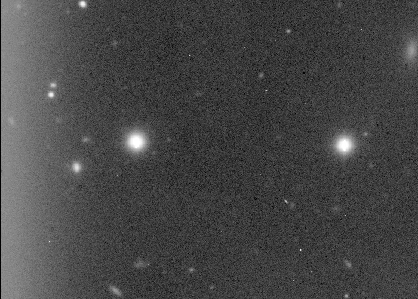
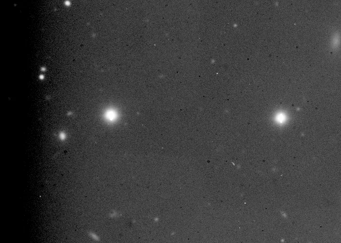

## Summary

`ImageCalibration` applies the three fundamental CCD/CMOS preprocessing corrections to the
active view: **bias subtraction**, **dark subtraction**, and **flat-field correction**. Unlike
PixInsight's `ImageCalibration` (which handles units, exposure time, and dark scaling via
`ccdproc`), this is a **pragmatic array-arithmetic version**: masters are supplied as file paths
and combined directly, with no unit bookkeeping. It is sufficient for a standard calibration
pipeline where darks and lights share the same exposure time and sensor temperature.

*A real Palomar light frame, and the same frame after bias, dark and flat correction with masters combined from that same night. Each is shown with its own screen stretch: calibration removes the bias pedestal on purpose, so a shared stretch would render the corrected frame black.*

## Use cases

- **Preprocess a whole session** of lights before alignment and integration, one pass per image
  (bias → dark → flat).
- **Remove dark current and read noise** with a master dark built at the same exposure/
  temperature as the lights (see `Integration`).
- **Even out sensor response and correct vignetting** with the master flat.
- **Calibrate without a dark** (flat-only) on short exposures where dark current is negligible,
  by leaving `master_dark` empty.

## How it works

The process runs the image through three sequential, individually optional steps (each is
enabled as soon as the corresponding path is non-empty):

1. **Bias**: if `master_bias` is set, the master is loaded (`load_image_array`, which infers the
   format from the extension — FITS/XISF/raster/RAW) and **subtracted** as-is from the image, in
   float32.
2. **Dark**: if `master_dark` is set, it is subtracted the same way. No exposure-time scaling is
   applied: the master dark must have been acquired at the same **exposure and temperature** as
   the lights being calibrated.
3. **Flat**: if `master_flat` is set, it is loaded and **normalized by its mean** (so the flat
   does not shift the image's overall level), and the image is **divided** by this normalized
   flat. Flat pixels at or below zero are neutralized (replaced with 1) to avoid dividing by
   zero or a negative value.

The result is finally **clipped** to `[0, 1]` to stay compatible with Retina's normalized
floating-point range convention.

## Mathematics

Let $I(x,y)$ be the input image, $B(x,y)$ the master bias, $D(x,y)$ the master dark, and
$F(x,y)$ the raw master flat. Calibration proceeds through successive stages:

$$ I_1 = I - B \qquad\text{(if bias supplied)} $$

$$ I_2 = I_1 - D \qquad\text{(if dark supplied)} $$

The flat is first normalized by its mean value $\bar F$:

$$ \hat F(x,y) = \frac{F(x,y)}{\max(\bar F,\, \varepsilon)}, \qquad
   \bar F = \frac{1}{HW}\sum_{x,y} F(x,y), $$

with $\varepsilon = 10^{-6}$ to avoid division by zero when the flat is near-null. Flat-field
correction divides the image by this normalized flat, neutralizing non-positive pixels:

$$ I_3(x,y) = \frac{I_2(x,y)}{\hat F'(x,y)}, \qquad
   \hat F'(x,y) = \begin{cases} 1 & \text{if } \hat F(x,y) \le 0 \\ \hat F(x,y) & \text{otherwise} \end{cases}. $$

The final output is clipped: $I_{\text{out}} = \operatorname{clip}(I_3,\, 0,\, 1)$.

Dividing by a flat **normalized by its mean** (rather than the raw flat) preserves the image's
overall background level while correcting relative pixel-to-pixel sensitivity variations and
vignetting.

## Parameters

- **`master_bias`** — *path*, default `""`. Path to the master bias (electronic offset + read
  noise). Left empty, no bias subtraction is performed.
- **`master_dark`** — *path*, default `""`. Path to the master dark (dark current). Must be
  acquired at the same exposure and temperature as the lights; left empty, no dark subtraction
  is performed.
- **`master_flat`** — *path*, default `""`. Path to the master flat (sensor/optics response).
  Automatically normalized by its mean before division; left empty, no flat correction is
  performed.

## Tips & pitfalls

> **Warning** — no exposure-time scaling is applied to the dark: if the master dark's exposure
> differs from the lights', the subtraction will be wrong (over- or under-subtracting dark
> current). Use darks matched to the exposure, or pre-scale the dark upstream ("dark scaling").

> **Note** — masters are assumed to already be built (via `Integration` with sigma rejection
> over a stack of raw bias/dark/flat frames) and to match the geometry of the image being
> calibrated.

- Always build masters through **robust stacking** (`Integration`) rather than from a single raw
  frame, to reduce residual noise.
- A flat with poorly captured dust motes or vignetting leaves circular artifacts after division:
  check the flat in isolation before calibrating a whole session.
- This version does not handle **physical units** (`ccdproc.ccd_process`): if the pipeline needs
  rigorous gain/read-noise bookkeeping in electrons, treat this process as a pragmatic step, not
  a full photometric calibration.

## See also

- [Integration](retina-doc://Integration) — build the bias/dark/flat masters via robust averaging.
- [Superbias](retina-doc://Superbias) — smoothed bias model to reduce residual noise.
- [CosmeticCorrection](retina-doc://CosmeticCorrection) — clean up hot/dead pixels after calibration.
- [StarAlignment](retina-doc://StarAlignment) — next pipeline step, before integration.

## References

- PixInsight — *ImageCalibration* tool reference.
- Howell, S. B. — *Handbook of CCD Astronomy* (calibration frames).
- ccdproc — *CCD data reduction* (`ccd_process`).
