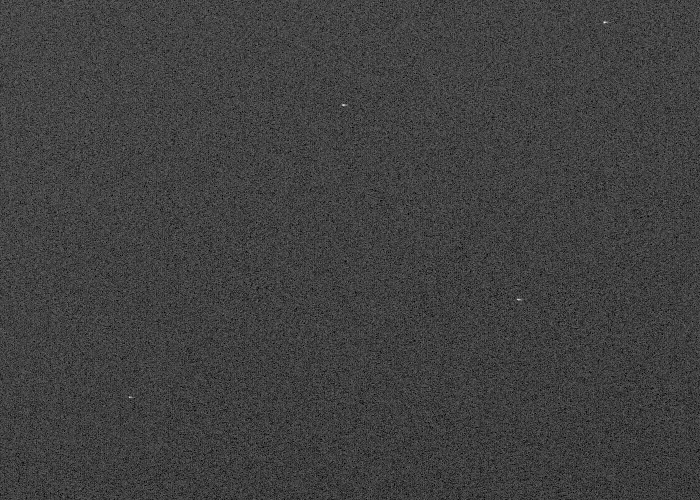
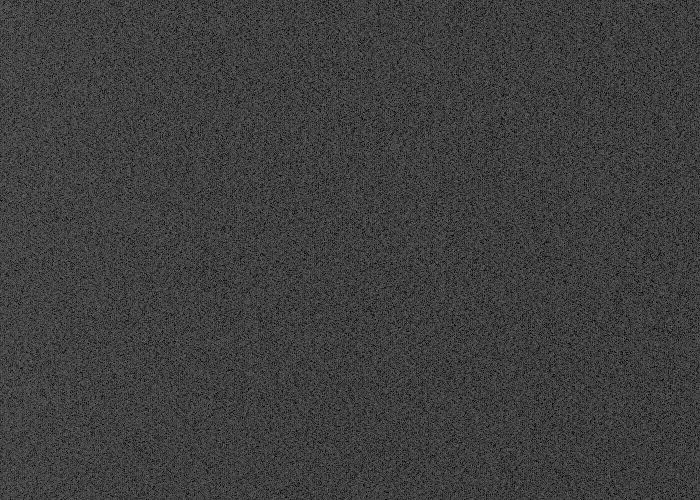

## Résumé

`Integration` empile plusieurs poses alignées en une seule image à **rapport signal/bruit**
fortement amélioré. Un **rejet sigma robuste** écarte, pixel par pixel, les valeurs aberrantes
(rayons cosmiques, satellites, pixels chauds) avant la moyenne. C'est un process **global** :
il lit une liste de fichiers et crée une nouvelle fenêtre. Il sert aussi à fabriquer les
**masters** (bias, dark, flat) par moyenne robuste.

*Une pose d'offset, et l'empilement de six. Des offsets plutôt que des poses, parce que le jeu ne porte qu'une pose par filtre et qu'un offset n'est *que* du bruit — la paire montre donc exactement ce à quoi sert l'empilement : six poses divisent le bruit par environ racine de six. Chacune a son étirement d'écran, l'effet portant sur la dispersion des valeurs et non sur leur niveau.*

## Cas d'usage

- **Empiler les poses** d'une session (après calibration et alignement) pour gagner en SNR.
- **Construire des masters** de calibration (moyenne de biases/darks/flats).
- **Nettoyer les intrus** : traînées de satellites, avions, rayons cosmiques, sans image médiane pure.

## Fonctionnement

Les frames sont chargées et empilées en un cube $(N, H, W, C)$. Pour chaque position de pixel,
l'algorithme calcule des statistiques **résistantes aux valeurs extrêmes** — la **médiane** comme
centre et le **mad_std** (écart-type dérivé de l'écart absolu médian) comme dispersion — puis
rejette les échantillons hors de l'intervalle $[\,\text{med} - \sigma_\text{low}\cdot s,\;
\text{med} + \sigma_\text{high}\cdot s\,]$. La sortie est la **moyenne des échantillons conservés**.
Si aucun échantillon n'est retenu, on retombe sur la moyenne simple.

## Mathématiques

Pour une pile de valeurs $\{x_i\}_{i=1}^{N}$ à une position de pixel, on estime le centre et
l'échelle robustes :

$$ \tilde{x} = \operatorname{med}(x_i), \qquad
   s = \operatorname{mad\_std}(x_i) = 1.4826 \cdot \operatorname{med}\!\big(|x_i - \tilde{x}|\big). $$

Le facteur $1.4826$ rend le mad_std cohérent avec l'écart-type pour une loi normale. Un
échantillon est **conservé** s'il vérifie :

$$ \tilde{x} - \sigma_\text{low}\, s \;\le\; x_i \;\le\; \tilde{x} + \sigma_\text{high}\, s . $$

La valeur intégrée est la moyenne des conservés :

$$ \bar{x} = \frac{1}{|K|}\sum_{i \in K} x_i, \qquad
   K = \{\, i : x_i \text{ conservé} \,\}. $$

Utiliser la médiane et le mad_std (plutôt que moyenne/écart-type) est essentiel : un seul intrus
gonflerait un écart-type classique au point d'**échapper au rejet**.

## Paramètres

- **`frames`** — *pathlist*, défaut `[]`. Liste des fichiers à empiler (déjà calibrés/alignés).
- **`rejection`** — *enum*, défaut `sigma`, choix : `none`, `sigma`. Type de rejet des aberrants.
- **`sigma_low`** — *real*, défaut `3.0`, plage `0`–`10`. Seuil de rejet côté bas (en $\sigma$ robustes).
- **`sigma_high`** — *real*, défaut `3.0`, plage `0`–`10`. Seuil de rejet côté haut.
- **`new_image_id`** — *str*, défaut `integration`. Identifiant de la fenêtre résultat.

## Astuces & pièges

> **Note** — l'intégration suppose des frames **alignées** (voir `StarAlignment`) et de même
> géométrie. Des frames non recalées produisent un flou, pas un gain de SNR.

- Peu de frames (< 10) : des seuils sigma serrés rejettent trop ; assouplissez `sigma_low/high`.
- Pour les masters de bias/dark/flat, le rejet sigma élimine les pixels parasites transitoires.

## Voir aussi

- [ImageCalibration](retina-doc://ImageCalibration) — étape préalable (bias/dark/flat).
- [StarAlignment](retina-doc://StarAlignment) — recalage des frames avant empilement.
- [DrizzleIntegration](retina-doc://DrizzleIntegration) — intégration drizzle (sur-échantillonnage).

## Références

- PixInsight — *ImageIntegration* tool reference.
- astropy.stats — *sigma_clip* with median / mad_std estimators.
