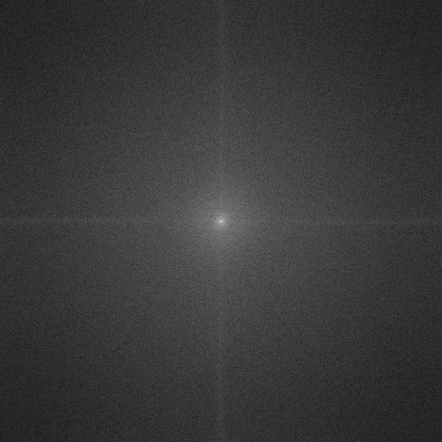
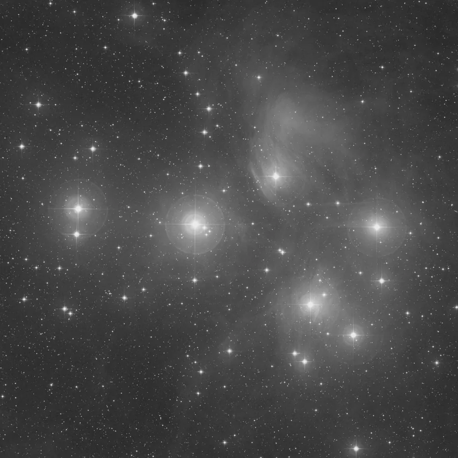

## Résumé

`InverseFourierTransform` referme la boucle ouverte par `FourierTransform` en mode `complex` :
il reprend l'image à `2·C` canaux ([parties réelles | parties imaginaires], fftshiftées) et
reconstruit **exactement** l'image spatiale d'origine, canal par canal. C'est l'équivalent du
`InverseFourierTransform` de PixInsight : sans paramètre, il applique un traitement
mathématiquement défini qui ne fait qu'inverser la FFT directe, sans aucune approximation au-delà
de l'arrondi flottant.

*Le spectre d'amplitude, et l'image que la transformée inverse restitue. Ce n'est pas un avant/après : l'aller-retour est sans perte, les deux bouts seraient la même image.*

## Cas d'usage

- **Clore un filtrage fréquentiel** : après avoir passé une image en `mode="complex"` avec
  `FourierTransform`, l'avoir modifiée (atténuation d'une bande, suppression d'un pic périodique)
  via `PixelMath` ou en console, on repasse par `InverseFourierTransform` pour revenir dans le
  domaine spatial et poursuivre le traitement normalement.
- **Vérifier un round-trip** : confirmer qu'une chaîne `FourierTransform(mode='complex')` suivie
  d'`InverseFourierTransform` restitue bien l'image de départ (test de non-régression, pédagogie,
  débogage d'un filtre fréquentiel personnalisé).
- **Restauration s'appuyant sur le domaine fréquentiel** : étape finale d'un pipeline de
  déconvolution ou de filtrage de Wiener construit manuellement dans le domaine de Fourier.

## Fonctionnement

Pour chaque canal $k$ parmi les $C$ canaux de sortie, l'opérateur lit la partie réelle dans le
canal $k$ de l'entrée et la partie imaginaire dans le canal $C+k$ (convention imposée par
`FourierTransform(mode='complex')`), recompose le spectre complexe, annule le recentrage
appliqué à l'aller (`fftshift`) avec `numpy.fft.ifftshift`, puis applique la FFT inverse 2D
(`numpy.fft.ifft2`). Seule la **partie réelle** du résultat est conservée : pour une image
d'origine réelle, la partie imaginaire de la reconstruction est nulle aux erreurs d'arrondi
flottant près, et sa mise au rebut n'introduit aucune perte d'information.

Le process exige un nombre pair de canaux en entrée (`2·C`) ; une entrée à nombre de canaux
impair — signe qu'elle ne provient pas d'un `FourierTransform(mode='complex')` — déclenche une
erreur explicite plutôt qu'un résultat silencieusement faux.

## Mathématiques

Soit $F(u, v) = \Re(F) + i\,\Im(F)$ le spectre complexe fftshifté d'un canal, tel qu'encodé par
`FourierTransform(mode='complex')` dans les canaux $k$ (réel) et $C+k$ (imaginaire). La
reconstruction procède en trois étapes :

1. **Recomposition** du nombre complexe à partir des deux canaux :
   $$ F(u, v) = I_{\text{re}}(u, v) + i\, I_{\text{im}}(u, v). $$
2. **Annulation du recentrage** (`ifftshift`), qui replace la fréquence nulle dans le coin
   supérieur gauche du tableau, convention attendue par la FFT inverse.
3. **Transformée de Fourier inverse 2D**, qui redonne le signal spatial :
   $$ I(x, y) = \frac{1}{HW} \sum_{u=0}^{H-1} \sum_{v=0}^{W-1} F(u, v)\,
      e^{+2i\pi \left(\frac{ux}{H} + \frac{vy}{W}\right)}, $$
   dont on ne garde que la partie réelle : $I(x, y) \leftarrow \Re\big(I(x, y)\big)$.

Cette suite d'opérations est l'inverse exacte de celle de `FourierTransform` (`fft2` puis
`fftshift`) : composer les deux donne l'identité, à la précision flottante `float32` près,
$$ \texttt{InverseFourierTransform}\big(\texttt{FourierTransform}_{\text{complex}}(I)\big) = I. $$

## Paramètres

Ce process n'a **aucun paramètre**. Son comportement est entièrement déterminé par les données
d'entrée : la géométrie et le contenu spectral encodés dans l'image `(H, W, 2·C)` produite par
`FourierTransform(mode='complex')` suffisent à définir la reconstruction, sans réglage utilisateur.

## Astuces & pièges

> **Attention** — l'entrée doit provenir de `FourierTransform(mode='complex')` (ou respecter
> exactement sa convention : réel puis imaginaire, fftshiftés). Appliquer ce process à une image
> ordinaire, ou au spectre d'**amplitude** (`mode='magnitude'`), produit un résultat sans sens —
> le mode amplitude a irrémédiablement perdu la phase et n'est pas inversible.

> **Note** — le nombre de canaux de sortie est la **moitié** de celui de l'entrée (`C` contre
> `2·C`). Une entrée à nombre de canaux impair est rejetée avec une erreur explicite.

- Pour un filtrage fréquentiel manuel entre les deux étapes, restez cohérent : toute modification
  du spectre doit préserver la symétrie hermitienne si l'on veut un résultat réel propre (sinon
  la partie imaginaire écartée contenait de l'information non négligeable).
- Le round-trip complet (`FourierTransform` → `InverseFourierTransform`) est **exact** au bruit
  d'arrondi `float32` près : utile comme test de référence pour valider tout code manipulant le
  spectre entre les deux étapes.

## Voir aussi

- [FourierTransform](retina-doc://FourierTransform) — transformée directe, source de la représentation `complex`.
- [Convolution](retina-doc://Convolution) — opération spatiale équivalente à une multiplication fréquentielle.
- [Deconvolution](retina-doc://Deconvolution) — restauration s'appuyant sur le domaine fréquentiel.
- [MultiscaleLinearTransform](retina-doc://MultiscaleLinearTransform) — décomposition en échelles, alternative au filtrage de Fourier.

## Références

- PixInsight — *FourierTransform* / *InverseFourierTransform* tool reference.
- numpy.fft — *Discrete Fourier Transform* (`ifft2`, `ifftshift`).
- Cooley, J. W. & Tukey, J. W. (1965) — *An algorithm for the machine calculation of complex Fourier series*.
