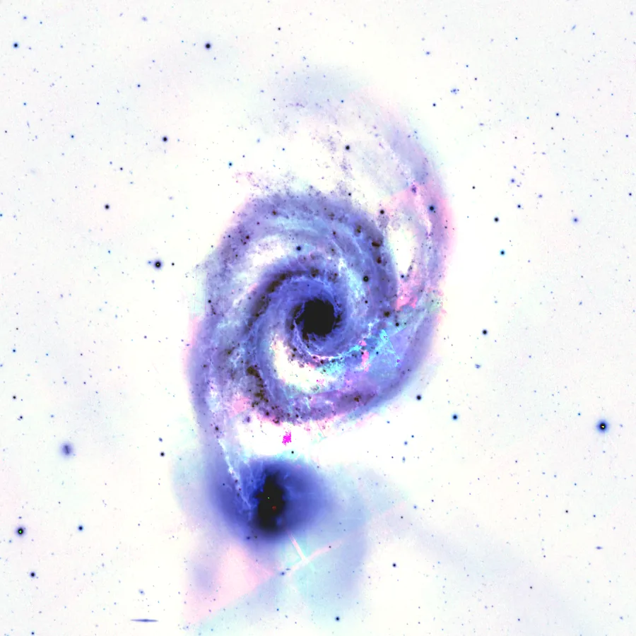

## Summary

`Invert` turns every sample of the image into its **complement to 1**: bright tones become dark
and vice versa, exactly like the negative of a photographic film. It is the simplest pixel-wise
operator in the catalog — no parameters, no neighborhood, essentially zero computational cost —
yet it remains a valuable working tool, in particular for visually inspecting faint detail.

*Before, and after inversion — the photographic negative, one minus the pixel.*

## Use cases

- **Track sky-background gradients**: on an inverted image, gentle background variations (light
  pollution, residual vignetting) stand out as dark patches on a bright field, often easier to
  judge than on the direct image.
- **Spot artifacts**: dust motes, halos, hot-pixel columns or satellite trails frequently show up
  more clearly in negative, a habit inherited from quality control on film prints.
- **Intermediate step in a PixelMath chain**: combine `Invert` with `Rescale` or `Binarize` to
  build masks (e.g. turning a star mask into a background mask).
- **Artistic or educational effect**: view an image in an unusual light to reveal structures that
  are otherwise invisible to the eye.

## How it works

The process reads the view's numpy array `(H, W, C)`, float32 normalized to `[0, 1]` (Retina's
internal convention), and returns `1.0 - data` computed element-wise across all channels. There is
no state and no neighborhood dependency: every pixel is processed independently, which makes the
operation trivial to parallelize and free of any notable memory overhead beyond the output array.
The operation is involutive: applying `Invert` twice in a row exactly restores the original image
(up to floating-point rounding).

## Mathematics

Let $x$ be a sample value in $[0,1]$ (per channel, independently). Inversion computes:

$$ y = 1 - x $$

applied component-wise across the $(H, W, C)$ tensor. This transformation is:

- **affine and bijective** on $[0,1]$, with slope $-1$: it preserves relative differences between
  pixels (local contrast unchanged in absolute value) while reversing their sign;
- **involutive**: $y = 1-x \Rightarrow 1-y = x$, so $\operatorname{Invert}\circ\operatorname{Invert} = \operatorname{id}$;
- **dynamic-range preserving**: min and max swap roles ($\min(y) = 1-\max(x)$,
  $\max(y) = 1-\min(x)$), so an image that was well stretched before inversion stays well
  stretched afterwards.

There is no threshold, kernel, or statistic involved: it is a point symmetry about $x = 0.5$.

## Parameters

This process has no parameters: `Invert` only computes $1 - x$ for every sample, with no exposed
setting.

## Tips & pitfalls

> **Warning** — `Invert` assumes data normalized to `[0, 1]`. On an unstretched image (linear
> data tightly bunched near 0), the resulting negative will look almost uniformly white: apply a
> stretch first (`HistogramTransformation`, `AutoHistogram`) or work with the active STF to
> visually judge the result.

- Combined with a mask, `Invert` lets you quickly flip a star mask into a background mask (or the
  reverse) without recomputing the extraction.
- Because the operation is involutive, it is convenient for quick A/B comparisons in the console:
  calling `Invert().execute_on(view)` twice in a row leaves the pixels unchanged (but adds two
  entries to the history).
- Do not confuse this with inverting a **mask** (`invert_mask` on `ImageWindow`), which flips the
  mask's protecting/revealing role without touching the image's own pixels.

## See also

- [Rescale](retina-doc://Rescale) — linear range remapping, complementary for adjusting dynamic
  range before or after inversion.
- [Binarize](retina-doc://Binarize) — all-or-nothing thresholding, often used with `Invert` to
  build masks.
- [PixelMath](retina-doc://PixelMath) — for arbitrary expressions with inversion as a special
  case (`1 - $T`).
- [CurvesTransformation](retina-doc://CurvesTransformation) — free tonal curve transformation, of
  which inversion is a limiting case (descending diagonal curve).

## References

- PixInsight — *Invert* tool reference.
- Film photography — negative/positive inversion.
