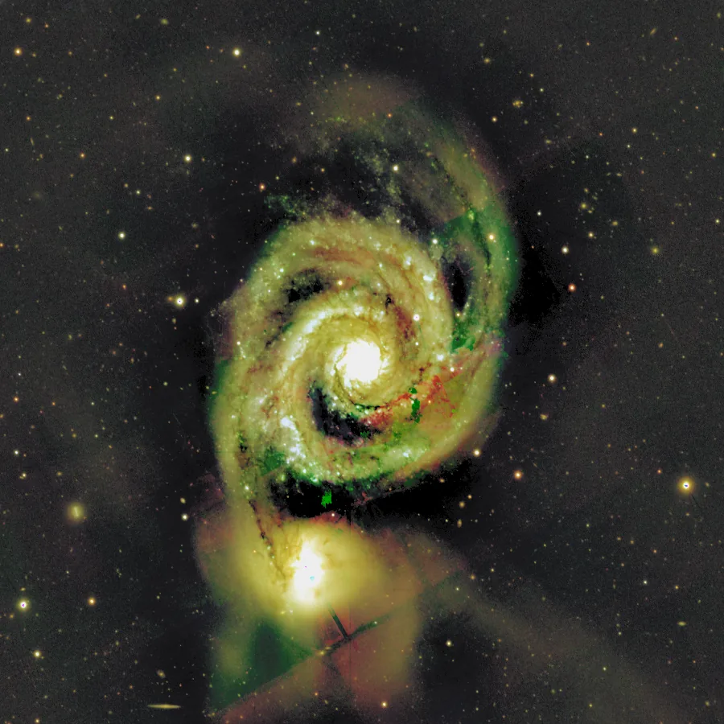

## Résumé

`LRGBCombination` réalise la combinaison **LRGB** classique en imagerie planétaire et
deep-sky : une image de **luminance** (généralement plus fine, plus profonde, souvent prise
sans filtre ou en Ha/OIII pour la netteté) est injectée dans le canal de **luminosité** d'une
image couleur RGB, tandis que la **chrominance** (teinte et saturation) de cette dernière est
préservée. L'opération travaille dans l'espace perceptuel **L\*a\*b\*** : le canal `L*` porte
la clarté, les canaux `a*`/`b*` portent la couleur, ce qui permet de substituer l'un sans
perturber l'autre.

*Avant, et après remplacement de la luminance en gardant la chrominance.*

## Cas d'usage

- **Combiner une luminance dédiée** (pose longue, filtre clair ou luminance synthétique) avec
  une image RGB plus bruitée ou moins résolue, pour gagner en netteté et en profondeur sans
  sacrifier la couleur.
- **Réinjecter une luminance retravaillée** (débruitée, déconvoluée, étirée séparément) dans
  une composition couleur déjà satisfaisante en teinte.
- **Mélanger progressivement** deux sources de détail via `weight`, par exemple pour doser
  entre la luminance native du RGB et une luminance externe plus profonde.
- Étape finale d'un flux **L + RVB** avant export, après alignement et étirement séparés de
  chaque canal.

## Fonctionnement

1. La vue courante (RGB, valeurs supposées dans `[0, 1]`) est écrêtée puis convertie en
   `L*a*b*` (`skimage.color.rgb2lab`), ce qui sépare clarté (`L*`) et couleur (`a*`, `b*`).
2. La vue nommée par `luminance` est résolue par son identifiant via le registre de vues de
   l'application (`process.context.resolve_image_full`) ; son premier canal est extrait et
   traité comme la nouvelle luminance, supposée normalisée dans `[0, 1]`.
3. Cette luminance est mise à l'échelle de `L*` (`[0, 100]`) et **mélangée linéairement** avec
   la clarté existante selon `weight` : à `weight = 1`, `L*` est intégralement remplacé ; à
   `weight = 0`, l'image d'origine ressort inchangée (aux erreurs d'arrondi Lab près).
4. Le triplet `L*a*b*` recomposé est reconverti en RGB (`lab2rgb`) puis réécrêté dans
   `[0, 1]`. Un éventuel canal alpha (4ᵉ canal) est conservé tel quel.
5. Si `luminance` est vide, si la vue n'est pas trouvée, ou si l'image n'a pas au moins 3
   canaux, le process est **sans effet** (copie inchangée).

## Mathématiques

Soit $I_{rgb}$ l'image RGB courante écrêtée dans $[0,1]$, et $(L, a, b) = \operatorname{RGB2Lab}(I_{rgb})$
sa représentation dans l'espace CIE L\*a\*b\* (illuminant D65 par défaut de scikit-image), où
$L \in [0,100]$ est la clarté perceptuelle et $(a, b)$ portent la chrominance, indépendants de
la luminosité.

Soit $\ell(x,y)$ le premier canal de la vue de luminance externe, ramené à l'échelle de $L^*$ :

$$ L_{\text{new}}(x,y) = 100 \cdot \ell(x,y). $$

Le mélange, contrôlé par le poids $w$ = `weight` $\in [0,1]$, est une **interpolation linéaire**
sur le canal `L*` uniquement :

$$ L'(x,y) = (1 - w)\, L(x,y) \;+\; w \, L_{\text{new}}(x,y), $$

les canaux de chrominance restant inchangés : $a' = a$, $b' = b$. L'image finale est :

$$ I'_{rgb} = \operatorname{clip}\!\big(\operatorname{Lab2RGB}(L', a', b'),\; 0,\; 1\big). $$

Comme $a$ et $b$ ne sont jamais modifiés, la **teinte et la saturation perceptuelles** de
l'image d'origine sont préservées à l'identique ; seule la clarté varie, ce qui est exactement
la propriété recherchée par une combinaison LRGB.

## Paramètres

- **`luminance`** — *str*, défaut `""`. Identifiant de la vue à utiliser comme source de
  luminance. Doit désigner une vue existante avec au moins un canal ; son premier canal est
  utilisé. Si vide ou introuvable, le process ne fait rien.
- **`weight`** — *real*, défaut `1.0`, plage `0`–`1`. Poids de la nouvelle luminance dans le
  mélange avec `L*` existant. `1.0` = remplacement total, `0.0` = image RGB inchangée,
  valeurs intermédiaires = fondu progressif.

## Astuces & pièges

> **Attention** — la vue de luminance doit avoir **exactement la même géométrie** (largeur,
> hauteur) que la vue RGB cible et être **déjà alignée** sur elle : le process ne redimensionne
> ni ne recale les images. Utilisez `StarAlignment` ou `FeatureAlignment` au préalable si les
> poses L et RVB proviennent d'acquisitions séparées.

> **Note** — la luminance externe doit être fournie **normalisée dans `[0, 1]`** (comme une
> image linéaire ou déjà étirée cohérente avec le RGB). Une luminance non normalisée produira
> un `L*` hors plage, écrêté silencieusement par `lab2rgb`.

- Étirez et débruitez la luminance **séparément** avant combinaison : c'est elle qui porte le
  détail fin, la combinaison LRGB permet justement de la traiter indépendamment du bruit
  chromatique du RGB.
- Pour composer la luminance elle-même à partir de plusieurs canaux (Ha, OIII, ou un master L),
  utilisez `PixelMath` ou `ChannelCombination` en amont, puis passez le résultat en `luminance`.
- Un `weight` proche de `0.5` permet un compromis doux entre le piqué du RGB natif et celui
  d'une luminance plus profonde, utile quand cette dernière est légèrement bruitée.

## Voir aussi

- [ChannelCombination](retina-doc://ChannelCombination) — assembler des canaux séparés en une image couleur.
- [ChannelExtraction](retina-doc://ChannelExtraction) — extraire un canal ou une luminance depuis une image couleur.
- [ColorSaturation](retina-doc://ColorSaturation) — ajuster la saturation après combinaison.
- [ComponentSeparation](retina-doc://ComponentSeparation) — séparer luminance et chrominance (PCA/ICA).

## Références

- PixInsight — *LRGBCombination* tool reference.
- CIE — espace colorimétrique *L\*a\*b\** (CIE 1976).
- scikit-image — `skimage.color.rgb2lab` / `lab2rgb`.
