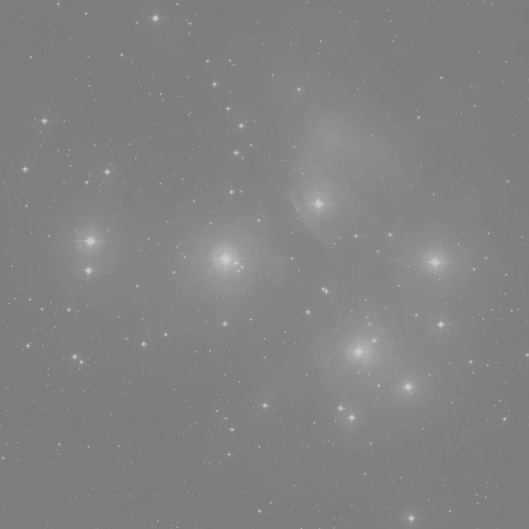

## Summary

`LinearFit` statistically rescales an image onto a **reference view** by finding, for each
channel, the affine transform `out = a·in + b` that minimizes the squared error against the
corresponding channel of the reference. It is the equivalent of PixInsight's `LinearFit` tool: a
**relative calibration** tool between images, not a stretch — the data stays linear, only the
gain (`a`) and offset (`b`) of each channel are adjusted.

*Before, and after rescaling a frame onto a reference's level by least squares.*

## Use cases

- **Equalize mosaic panels** before assembly (`MosaicReproject`), so overlap regions blend
  without a visible level jump.
- **Align L, R, G, B exposures** onto a common reference before `LRGBCombination`, when exposure
  times or shooting conditions differ between filters.
- **Compare/rescale sessions** taken on different nights (varying sky background, transparency)
  before combining or differencing them (transient/comet detection).
- Prepare a **clean subtraction** between two images (e.g. before/after) by bringing one onto the
  other's scale.

## How it works

The process takes a reference view identifier (`reference`) as its only parameter. If it is empty
or cannot be resolved, the image is returned unchanged. Otherwise, for **each channel** `c` of the
active image:

1. The corresponding reference channel is extracted (if the reference has fewer channels than the
   image — e.g. a monochrome reference for a color image — the last available reference channel
   is reused for the extra channels).
2. Both channels, flattened to vectors, are fitted with a **first-degree least-squares linear
   regression** (`numpy.polyfit`): the line that best predicts the reference values from the
   current image's values.
3. The resulting `a·x + b` transform is applied to the **whole channel**, not only the pixels used
   for the estimation.
4. The result is clipped to `[0, 1]` and cast back to `float32`.

The fit is therefore **global per channel** (a single `(a, b)` pair per channel, no spatial
variation) — unlike `HistogramMatching`, which reshapes the whole tone distribution, or
`LocalNormalization`, which allows spatially varying gains.

## Mathematics

For a given channel, let $x_i$ be the pixel values of the image being fitted and $y_i$ the
corresponding values of the reference (same positions, flattened images). We seek the
coefficients $(a, b)$ that minimize the squared error:

$$ (a, b) = \underset{a,\,b}{\arg\min} \sum_i \big(a\,x_i + b - y_i\big)^2 . $$

The ordinary least-squares solution is expressed with empirical means and covariance:

$$ a = \frac{\operatorname{cov}(x, y)}{\operatorname{var}(x)}
     = \frac{\sum_i (x_i - \bar{x})(y_i - \bar{y})}{\sum_i (x_i - \bar{x})^2},
   \qquad
   b = \bar{y} - a\,\bar{x}. $$

The corrected channel is then obtained by the affine transform followed by clipping:

$$ x'_i = \operatorname{clip}\!\big(a\,x_i + b,\; 0,\; 1\big). $$

Gain $a$ compensates for scale differences (exposure time, transmission, sensor gain), and offset
$b$ compensates for background level differences between the image and the reference. If both
images already match up to a factor, $a \approx 1$ and $b \approx 0$.

## Parameters

- **`reference`** — *str*, default `""`. Identifier of the view (window or preview) used as the
  reference for the fit. Empty or unresolvable identifier → the image is returned unchanged with
  no error.

## Tips & pitfalls

> **Warning** — the regression runs over **all pixels** of the channel, including stars.
> Saturated stars that differ significantly between the two images (wear, seeing) can bias the
> estimated gain. On mosaics, consider cropping to the **common overlap area** before running
> `LinearFit` if the mismatch is large.

> **Note** — this process only adjusts per-channel gain and offset; it does not correct residual
> spatial gradients. Combine it with `BackgroundExtraction` or `MultiscaleGradientCorrection` if
> the sky background is not flat.

- Works on **linear** data (before stretching); applied after a non-linear stretch, the affine
  fit no longer has physical meaning.
- If the reference image has a single (luminance) channel and the target has several, every
  target channel is fitted onto that same reference channel — useful to align L/R/G/B layers
  onto a common luminance.
- Check the result with `Statistics` before/after to confirm that median and spread are indeed
  closer to the reference.

## See also

- [ColorCalibration](retina-doc://ColorCalibration) — white balance via reference regions.
- [LRGBCombination](retina-doc://LRGBCombination) — L/R/G/B layer combination, to prepare with `LinearFit`.
- [MosaicReproject](retina-doc://MosaicReproject) — WCS mosaic assembly, where panel equalization helps the blend.
- [HistogramMatching](retina-doc://HistogramMatching) — matches the whole tone distribution, not just gain/offset.

## References

- PixInsight — *LinearFit* tool reference.
- numpy.polyfit — *polynomial least-squares fitting*.
