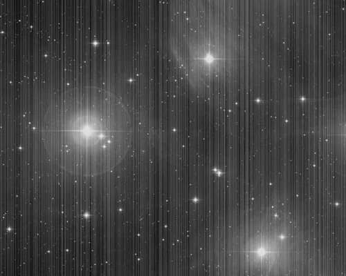
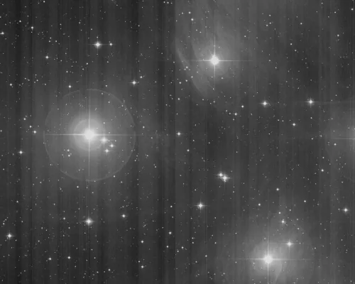

## Summary

Many CMOS sensors show **banding**: columns — sometimes rows — whose level departs from their
neighbours by a few ADU. On a single frame it is invisible.

On a hundred stacked frames it is not, and for a reason worth stating: the pattern is **fixed**,
so it adds up from frame to frame, while the noise averages down. The pattern's
signal-to-noise ratio *increases* with the number of frames. This is WBPP's **LPS** step.

*Column banding, and the frame after it is subtracted. The pattern is injected: it is what an uncorrected read-out leaves, and it must go before debayering, since interpolation afterwards mixes it between colours and it is no longer separable.*

## How the pattern is separated from the sky

For each column we take the **median** of its pixels. The median of a column of an astronomical
image is the sky background at that place: stars and nebulae are a minority there and weigh
nothing.

What remains is separating, in that sequence of medians, what varies **slowly** — the real
background gradient, which must not be touched — from what **jumps** between neighbouring
columns, which is the pattern. A median filter along the axis makes that split: the trend
follows the gradient, and the departure from the trend is the pattern.

On a test field carrying a 0.03 pattern and a real gradient, the correction leaves a residual of
0.0002 on the faulty columns — and the gradient's slope is unchanged to within 2%.

## CFA mode, and why LPS comes before debayering

On an **undebayered** image, every other column sees a different filter. Their medians have no
reason to be equal, and correcting that difference would **erase the mosaic**, that is, the
colour information. `cfa` mode processes the four sub-planes separately.

That is also why the step sits **before** debayering: afterwards, interpolation has mixed the
pattern between colours and it is no longer separable. In the pipeline, the `cfa` flag is set
automatically according to whether a debayer follows.

## The two modes

- **`auto`** (default): each column is brought back onto its neighbours' trend. Nothing to
  measure beforehand, nothing to carry between frames. A false positive costs nothing — a
  healthy column is then shifted by less than the noise.
- **`defect_list`**: only the columns listed in a JSON produced by
  [LinearDefectDetection](retina-doc://LinearDefectDetection) are corrected, and **nothing
  else**. This is the conservative mode, and the one that makes sense in a pipeline: the pattern
  is a property of the **sensor**, measured once.

## What is not there, and why

There is **no** rejection of extreme departures. A first attempt had one, to guard against a
satellite trail aligned on a column. It in fact discarded exactly the defects to be corrected —
which are, by construction, the largest departures in the distribution — and the process did
nothing at all. Protection against an aligned structure lies elsewhere: in the column's
**median**, which a trail crossing a few pixels does not move.

## Parameters

- **`columns`** / **`rows`** — *bool*, defaults `True` / `False`. Which axis to correct. CMOS
  banding is almost always in columns; rows point rather to a power supply issue.
- **`mode`** — *enum* `auto` | `defect_list`, default `auto`.
- **`defects_path`** — *path*. The `LinearDefectDetection` JSON (`defect_list` mode).
- **`cfa`** — *bool*, default `False`. Undebayered CFA image.

## Tips & pitfalls

> **Do not apply it after debayering.** The pattern is mixed between colours there, and the
> correction would leave coloured fringes.

- Check there is a pattern first: `LinearDefectDetection` on a calibrated frame says so in a
  second. Correcting a pattern that is not there breaks nothing but gains nothing.
- On a very structured image (a large nebula covering the whole field), the column median is no
  longer the sky background. The result stays bounded, but the assumption no longer holds.

## See also

- [LinearDefectDetection](retina-doc://LinearDefectDetection) — find the faulty columns.
- [CosmeticCorrection](retina-doc://CosmeticCorrection) — isolated hot and cold pixels.
- [Overscan](retina-doc://Overscan) — the other correction done right at the start.

## References

- PixInsight — *LinearDefectDetection* / *LinearPatternSubtraction* scripts, WBPP's LPS step.
