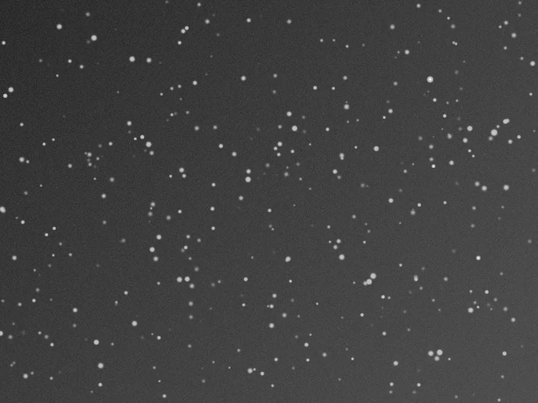

## Résumé

`MaskedStretch` étire une image linéaire vers une image affichable en répétant, itération
après itération, un petit pas d'étirement **MTF** dont l'intensité est pondérée par un masque
de protection dérivé de la **luminosité du pixel lui-même** : plus un pixel est déjà clair,
moins il reçoit de stretch. C'est l'équivalent de l'outil `MaskedStretch` de PixInsight — un
substitut pratique à un étirement classique + masque d'étoiles manuel, quand on veut amener
le fond de ciel à un niveau cible sans faire exploser le cœur des étoiles ni saturer les
hautes lumières.

*La pose linéaire telle que stockée, et la même après un étirement masqué vers un fond à 0,25.*

## Cas d'usage

- **Premier étirement** d'une image linéaire (post-calibration/intégration) quand on veut
  amener le fond de ciel proche d'une valeur cible tout en gardant les étoiles compactes.
- **Alternative à `HistogramTransformation` + masque d'étoiles manuel** : le masque de
  protection est ici calculé automatiquement, sans passer par `StarMask`.
- **Champs très étoilés** (amas, régions riches en étoiles) où un étirement global ferait
  gonfler et saturer massivement les cœurs stellaires.
- Étape préparatoire avant un raffinement fin par `CurvesTransformation` ou
  `HistogramTransformation`.

## Fonctionnement

À chaque itération, et indépendamment pour chaque canal :

1. On mesure la **médiane** courante du canal — un estimateur robuste du niveau de fond de ciel.
2. Si cette médiane est déjà supérieure ou égale au fond cible (`target_background`), ou nulle,
   le canal est laissé tel quel pour cette itération (rien à étirer, ou rien de valide à
   étirer).
3. Sinon, on calcule le paramètre `midtones` de la **MTF** (Midtones Transfer Function, le même
   modèle que `HistogramTransformation`/STF) qui amène exactement cette médiane sur la cible,
   et on applique cette MTF à tout le canal pour obtenir une version `stretched`.
4. On mélange pixel à pixel l'original et la version étirée, avec un **poids de protection
   égal à `1 - valeur du pixel`** : un pixel sombre (proche de 0) reçoit presque 100 % du
   stretch, un pixel déjà clair (proche de 1, typiquement le cœur d'une étoile) n'en reçoit
   presque rien et reste proche de sa valeur d'origine.

En répétant ce cycle (par défaut 20 fois), le fond de ciel converge progressivement vers la
cible pendant que les hautes lumières restent contenues — d'où le nom « masqué » : le masque
de protection n'est pas une image externe (pas besoin de `StarMask`), il est reconstruit à
chaque passe à partir de la luminosité courante des pixels.

> **Note** — le flag `is_maskable` du process (comme pour tout process) permet en plus
> d'appliquer un **vrai masque de vue** par-dessus ce mécanisme interne ; les deux protections
> se cumulent si besoin.

## Mathématiques

Soit $x \in [0,1]$ la valeur d'un pixel du canal à une itération donnée, $\tilde{x}$ sa
médiane, et $t$ = `target_background`. Si $\tilde{x} \le 0$ ou $\tilde{x} \ge t$, le canal
n'est pas modifié à cette itération.

Sinon, on cherche le paramètre $m$ de la fonction de transfert des tons moyens tel que
$\operatorname{mtf}(m, \tilde{x}) = t$ :

$$ \operatorname{mtf}(m, x) = \frac{(m-1)\,x}{(2m-1)\,x - m}. $$

En résolvant cette équation pour $m$, on obtient une propriété élégante de la MTF : la
solution s'exprime avec la **même fonction**, arguments échangés,

$$ m = \operatorname{mtf}(t,\, \tilde{x}), $$

ce que le code exploite directement (`mtf(target, med)`) plutôt que d'inverser l'équation
à la main. On applique ensuite cette MTF à tout le canal :

$$ s(x) = \operatorname{mtf}(m, x), $$

puis on combine original et version étirée avec un poids de protection $w(x) = 1 - x$
(pondération purement fonction de la luminosité du pixel, pas d'un masque externe) :

$$ x' = x \cdot \big(1 - w(x)\big) + s(x)\cdot w(x) = x^2 + s(x)\,(1 - x). $$

Pour $x \to 1$ (hautes lumières), $w(x) \to 0$ et $x' \to x$ : le pixel est **quasi
inchangé**. Pour $x \to 0$ (fond de ciel), $w(x) \to 1$ et $x' \to s(x)$ : le pixel reçoit le
**stretch complet**. L'itération répète ce pas jusqu'à ce que la médiane du canal atteigne la
cible ou que le budget d'`iterations` soit épuisé.

## Paramètres

- **`target_background`** — *real*, défaut `0.25`, plage `0.01`–`0.9`. Niveau de fond de ciel
  visé, exprimé dans l'intervalle `[0,1]` des données étirées. Une valeur plus haute donne une
  image visuellement plus lumineuse et plus contrastée dans les tons moyens.
- **`iterations`** — *int*, défaut `20`, plage `1`–`200`. Nombre de passes d'étirement. Plus
  d'itérations rapprochent davantage la médiane de la cible, avec des pas de plus en plus
  petits ; au-delà d'un certain nombre, le gain devient négligeable.

## Astuces & pièges

> **Attention** — le masque de protection est basé sur la **valeur brute des pixels**, pas sur
> une segmentation d'étoiles réelle. Une nébulosité très brillante (mais sans être une étoile)
> sera protégée de la même façon qu'une étoile — ce qui est en général souhaitable, mais peut
> surprendre sur des images à fort contraste local.

- Une image encore très sombre (médiane proche de 0) nécessite souvent plus d'itérations pour
  converger ; augmentez `iterations` plutôt que `target_background` si le résultat reste terne.
- Pour un contrôle plus fin après ce premier étirement global, enchaînez avec
  `CurvesTransformation` ou `HistogramTransformation` sur le résultat déjà « dégrossi ».
- Contrairement à la STF (aperçu non destructif), `MaskedStretch` **réécrit les pixels** :
  travaillez sur une copie ou vérifiez l'historique avant d'enchaîner d'autres traitements
  linéaires (qui supposeraient une image non étirée).

## Voir aussi

- [HistogramTransformation](retina-doc://HistogramTransformation) — étirement MTF manuel à
  trois curseurs (shadows/midtones/highlights).
- [ArcsinhStretch](retina-doc://ArcsinhStretch) — étirement préservant les ratios de couleur.
- [AutoHistogram](retina-doc://AutoHistogram) — étirement automatique en une passe.
- [AdaptiveStretch](retina-doc://AdaptiveStretch) — étirement adaptatif basé sur le contraste local.

## Références

- PixInsight — *MaskedStretch* tool reference.
- Conejero, J. — *Midtones Transfer Function (MTF)*.
