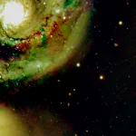
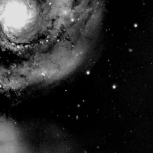

## Résumé

`MergeCFA` recompose une mosaïque CFA (Bayer) pleine résolution à partir de **4 plans
demi-résolution**, un par site du motif (00, 01, 10, 11). C'est l'inverse exact de `SplitCFA` :
là où `SplitCFA` décime une mosaïque Bayer en 4 canaux séparés, `MergeCFA` réentrelace ces 4
canaux pour reformer l'image CFA brute à géométrie originale, prête pour `Debayer`.

*Les quatre plans CFA, et la mosaïque qu'ils reconstituent — l'inverse de `SplitCFA`.*

## Cas d'usage

- **Refermer un aller-retour `SplitCFA` → traitement par site → `MergeCFA`** : calibrer
  (bias/dark), corriger les pixels chauds/froids ou débruiter chaque site du motif Bayer
  **séparément**, sans que l'interpolation couleur ne propage les artefacts entre canaux, puis
  recomposer la mosaïque avant démosaïçage.
- **Isoler la correction cosmétique par site** : un pixel défectueux capturé par `CosmeticCorrection`
  ou une `DefectMap` sur un plan CFA individuel est corrigé sans contaminer les sites voisins de
  couleur différente, contrairement à une correction après débayerisation.
- **Pipeline de calibration avancé pour capteurs couleur** (OSC/DSLR) : bias/dark appliqués canal
  CFA par canal CFA pour respecter le gain et le bruit propres à chaque site du filtre de Bayer.

## Fonctionnement

`MergeCFA` attend une image à **4 canaux** — typiquement la sortie de `SplitCFA`, éventuellement
retraitée entre-temps (calibration, correction cosmétique, débruitage). Chaque canal $i$
représente le sous-échantillonnage du site $i$ du motif $2\times2$ du CFA, à la résolution
$H \times W$ (moitié de la mosaïque d'origine dans chaque dimension).

L'opérateur réindexe simplement les 4 plans dans une grille $2H \times 2W$ à un seul canal, en
plaçant chaque plan à sa position de site d'origine (lignes/colonnes paires ou impaires) — une
opération purement géométrique, sans interpolation ni calcul de valeur. Si l'image fournie a
moins de 4 canaux, `MergeCFA` la retourne inchangée (copie), en repli défensif pour ne pas casser
un pipeline appliqué par erreur à une image déjà mono/RGB.

## Mathématiques

Soit $P_0, P_1, P_2, P_3$ les quatre plans d'entrée, chacun de taille $H \times W$. La mosaïque
reconstruite $M$, de taille $2H \times 2W$, est définie pixel par pixel par :

$$
M(2i,\,2j) = P_0(i,j), \qquad M(2i,\,2j{+}1) = P_1(i,j),
$$
$$
M(2i{+}1,\,2j) = P_2(i,j), \qquad M(2i{+}1,\,2j{+}1) = P_3(i,j),
$$

pour $0 \le i < H$ et $0 \le j < W$. C'est exactement l'inverse de la décimation de `SplitCFA` :

$$ \texttt{MergeCFA}\big(\texttt{SplitCFA}(M)\big) = M $$

pour toute mosaïque $M$ de dimensions paires. Cette opération est un **pixel shuffle** (aussi
appelé *depth-to-space*, facteur 2) : elle réarrange l'information portée par l'axe des canaux
vers l'axe spatial, sans aucune interpolation — le même principe que la couche de sur-échantillonnage
sous-pixellique utilisée en super-résolution (Shi et al., 2016), appliqué ici à l'empaquetage CFA
plutôt qu'à des canaux de features.

## Paramètres

Ce process n'a pas de paramètre : c'est une opération purement géométrique et déterministe,
sans réglage utilisateur.

## Astuces & pièges

> **Attention** — `MergeCFA` ne connaît pas le motif CFA réel (RGGB, GRBG, BGGR, GBRG) : il replace
> chaque canal $i$ à une position de site **fixe**. L'ordre des canaux produit par `SplitCFA` doit
> être préservé strictement (pas de réordonnancement, de sélection ou de suppression de canal)
> entre les deux appels, sinon la mosaïque reconstruite est incohérente et `Debayer` produira de
> fausses couleurs.

> **Note** — appliqué à une image de moins de 4 canaux, `MergeCFA` renvoie une copie inchangée
> sans erreur. C'est un filet de sécurité, pas une débayerisation implicite : vérifiez le nombre de
> canaux si le résultat semble ne rien avoir fait.

- Si la mosaïque d'origine avait une dimension impaire, `SplitCFA` l'aura tronquée à la parité
  paire avant de séparer les plans : l'aller-retour `SplitCFA` → `MergeCFA` perd alors la dernière
  ligne et/ou colonne.
- La sortie est toujours une image **mono-canal** (mosaïque CFA brute, pas encore couleur) :
  enchaînez avec `Debayer` pour obtenir une image RVB.

## Voir aussi

- [SplitCFA](retina-doc://SplitCFA) — opération inverse : décompose la mosaïque en 4 plans.
- [Debayer](retina-doc://Debayer) — démosaïçage de la mosaïque CFA reconstruite en image couleur.
- [CosmeticCorrection](retina-doc://CosmeticCorrection) — correction des pixels chauds/froids,
  applicable site par site entre `SplitCFA` et `MergeCFA`.
- [DefectMap](retina-doc://DefectMap) — carte de défauts statiques, également applicable par site CFA.

## Références

- Peris, V. — scripts PixInsight *SplitCFA* / *MergeCFA* (traitement par site CFA avant
  débayerisation).
- Shi, W. et al. (2016) — *Real-Time Single Image and Video Super-Resolution Using an Efficient
  Sub-Pixel Convolutional Neural Network* (pixel shuffle).
