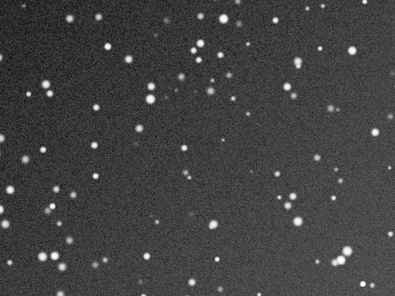
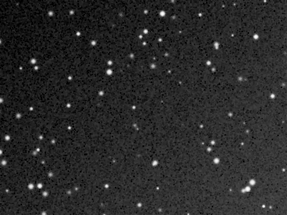

## Summary

`MorphologicalTransformation` applies a **grayscale mathematical-morphology operator** to the
pixels, computed independently on each channel with a **flat square** structuring element of
side `size`. Depending on the chosen operation, the tool erodes or dilates local structures,
smooths them (opening/closing), isolates small bright or dark details (top-hat), or extracts
their outlines (gradient). It is a shape-based tool, complementary to linear filters
(convolution): it acts on the **local geometry** of extrema rather than a weighted average.

*Before, and after an erosion with a 3-pixel structuring element.*

## Use cases

- **Isolate small stars** or bright spikes with `white_tophat`, to build or refine a star mask.
- **Spot dark defects** (cold pixels, residual sensor dust) with `black_tophat`.
- **Clean a binary image or mask** of isolated stray pixels via `opening` (erosion then
  dilation) without altering the overall shape of the structures that remain.
- **Fill small holes** in a mask via `closing` (dilation then erosion).
- **Extract the outline** of a structure (galaxy, sharp-edged nebula) with `gradient`.

## How it works

The process delegates the computation to the grayscale morphology functions of
`scipy.ndimage`. For each channel of the image, a **flat structuring element** — a square
window of side `size` where all weights are equal — slides over the image:

- `erosion` replaces each pixel with the local **minimum** under the window: bright structures
  shrink, dark structures expand.
- `dilation` replaces each pixel with the local **maximum**: the opposite effect.
- `opening` chains erosion then dilation: removes small isolated bright structures (smaller
  than `size`) without shifting the boundaries of larger structures.
- `closing` chains dilation then erosion: fills small holes or dark dents.
- `white_tophat` subtracts the opening from the original image: keeps only **bright
  structures smaller than the structuring element** (typically point-like stars).
- `black_tophat` subtracts the original image from the closing: keeps only **dark structures
  smaller than the structuring element** (hot/cold pixels, defects).
- `gradient` computes dilation minus erosion: an edge map whose thickness depends on `size`.

Processing is applied channel by channel (no color mixing), and the result is cast back to
`float32`.

## Mathematics

Let $f$ be the image (one channel) and $B$ the flat structuring element, a square window of
side $n$ = `size` centered on each pixel. Grayscale erosion and dilation are defined as:

$$ (f \ominus B)(x,y) = \min_{(i,j)\in B} f(x+i,\,y+j), \qquad
   (f \oplus B)(x,y) = \max_{(i,j)\in B} f(x-i,\,y-j). $$

Since $B$ is flat (zero weights, no altitude term), these reduce to a sliding
minimum/maximum over the $n \times n$ window. The compound operators derive from them:

$$ f \circ B = (f \ominus B) \oplus B \quad \text{(opening)}, \qquad
   f \bullet B = (f \oplus B) \ominus B \quad \text{(closing)}. $$

Opening is **anti-extensive** ($f \circ B \le f$) and removes peaks narrower than $B$;
closing is **extensive** ($f \bullet B \ge f$) and fills dents narrower than $B$. The
top-hats isolate exactly what these operators remove:

$$ \text{white\_tophat}(f) = f - (f \circ B), \qquad
   \text{black\_tophat}(f) = (f \bullet B) - f. $$

The Beucher morphological gradient approximates the local gradient magnitude by the range of
values inside the window:

$$ \text{gradient}(f) = (f \oplus B) - (f \ominus B). $$

Opening and closing are **idempotent**: $ (f \circ B) \circ B = f \circ B $. This is a
property that sets them apart from plain blurring — repeating the operation with the same
$B$ no longer changes the result.

## Parameters

- **`operation`** — *enum*, default `opening`, choices: `erosion`, `dilation`, `opening`,
  `closing`, `white_tophat`, `black_tophat`, `gradient`. Morphological operator applied.
- **`size`** — *int*, default `3`, range `1`–`51`. Side (in pixels) of the flat square
  structuring element. Sets the scale of affected structures: the larger `size`, the wider the
  details removed (or isolated by top-hat) can be.

## Tips & pitfalls

> **Warning** — `erosion` and `dilation` alone **shift edges** and bias star photometry
> (shrinking or growing cores). For cleanup without global geometric distortion, prefer
> `opening`/`closing`, which restore the size of the structures they preserve.

> **Note** — the operations are applied independently per channel; on a color image with a
> strong channel imbalance, this can introduce slight color fringing on the processed edges.

- `size` should preferably stay **odd** (centered window) and match the scale of the targeted
  detail: too small and the operator has no visible effect; too large and it also destroys
  useful structures.
- For plain noise reduction with no notion of shape, `NoiseReduction` or `WaveletDenoise` are
  generally better suited; morphology specifically targets the **geometric size** of
  structures, not their statistical amplitude.
- `white_tophat`/`black_tophat` work well as **pre-processing** before thresholding
  (`Binarize`) to build a small-source mask.

## See also

- [StarMask](retina-doc://StarMask) — dedicated star mask, an alternative to `white_tophat`.
- [NoiseReduction](retina-doc://NoiseReduction) — amplitude-based denoising rather than shape-based.
- [CosmeticCorrection](retina-doc://CosmeticCorrection) — targeted hot/cold pixel correction.
- [UnsharpMask](retina-doc://UnsharpMask) — edge enhancement via a linear filter.

## References

- PixInsight — *MorphologicalTransformation* tool reference.
- Serra, J. — *Image Analysis and Mathematical Morphology* (1982).
- scipy.ndimage — *grey_erosion*, *grey_dilation*, *grey_opening*, *grey_closing*,
  *white_tophat*, *black_tophat*, *morphological_gradient*.
