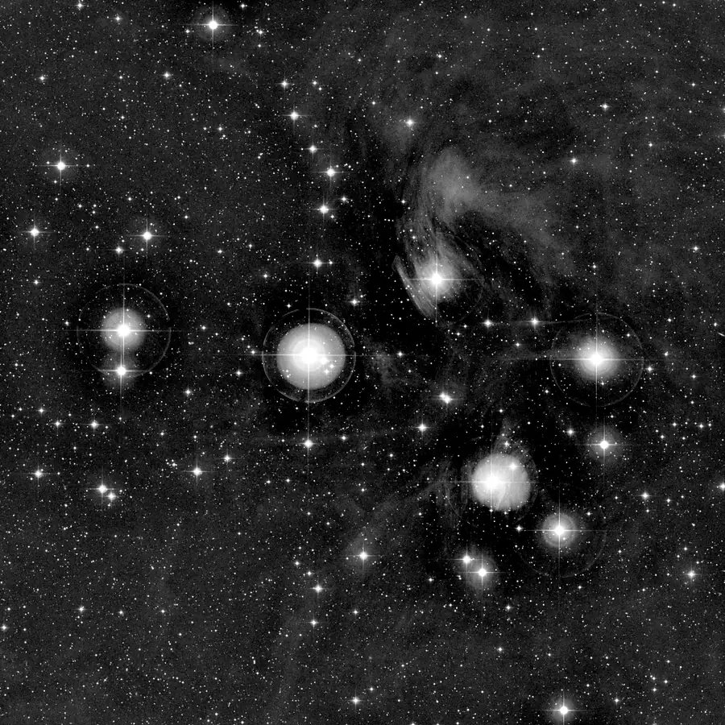

## Résumé

`MultiscaleAdaptiveStretch` combine deux idées complémentaires de PixInsight en un seul process :
la décomposition en ondelettes **starlet** (à trous) de `MultiscaleLinearTransform` et la courbe
de transfert **dérivée des données** de `AdaptiveStretch`. L'image est séparée en couches de
détail (structures fines) et un résidu grande échelle (la tonalité globale). Seul ce résidu subit
l'étirement adaptatif — les couches de détail sont réinjectées ensuite, avec un gain réglable.
Résultat : la dynamique globale se déploie (extensions faibles révélées, hautes lumières non
écrasées) **sans** que le contraste local ne soit lissé ou amplifié artificiellement par la courbe
de tonalité, contrairement à un `AdaptiveStretch` ou `HistogramTransformation` appliqué directement
sur l'image pleine résolution.

*Avant, et après un étirement adaptatif calculé échelle par échelle sur six couches.*

## Cas d'usage

- **Révéler les extensions faibles** d'une nébuleuse ou d'une galaxie (queues de marée, halo)
  tout en gardant un cœur détaillé et non saturé.
- **Étirement final d'une intégration** linéaire quand un `HistogramTransformation` classique
  écrase soit les détails fins, soit les hautes lumières selon le réglage des midtones.
- **Renforcer sélectivement le micro-contraste** (`detail_boost` > 1) après avoir étiré la
  tonalité, sans recommencer tout l'étirement.
- Alternative à `HDRMultiscaleTransform` quand on veut une courbe de tonalité **pilotée par les
  statistiques locales de l'image** plutôt qu'une simple compression de la dynamique du résidu.

## Fonctionnement

Pour chaque canal, canal par canal :

1. **Décomposition starlet** (`starlet_transform`, noyau B3-spline « à trous ») en `layers`
   couches de détail $w_1, \dots, w_J$ plus un résidu $c_J$ qui porte la tonalité globale
   (basse fréquence).
2. Le résidu est normalisé dans $[0,1]$, puis passé dans `adaptive_stretch_channel` — le même
   cœur algorithmique que le process `AdaptiveStretch` : une courbe de transfert monotone est
   construite à partir des différences entre pixels voisins du résidu (`noise_threshold` sépare
   détail réel et bruit résiduel, `contrast_protection` plafonne les pentes extrêmes de la
   courbe), puis dénormalisé.
3. Les couches de détail originales sont sommées et multipliées par `detail_boost`, puis
   rajoutées au résidu étiré. L'image finale est écrêtée dans $[0,1]$.

Parce que la courbe adaptative est calculée sur le résidu **lissé** (basse résolution) plutôt que
sur l'image brute, les votes de contraste ne sont pas pollués par le bruit pixel-à-pixel ni par
les petites structures — la tonalité globale peut donc être étirée plus agressivement sans
générer de halos autour des étoiles ni de bruit amplifié.

## Mathématiques

**Décomposition starlet.** Soit $I$ l'image d'un canal. La transformée à trous construit une
suite d'approximations lissées $c_0 = I, c_1, \dots, c_J$ par convolution avec un noyau B3-spline
dilaté d'un facteur $2^j$ à l'étape $j$, et les couches de détail par différence :

$$ w_j = c_{j-1} - c_j, \qquad j = 1, \dots, J, \qquad I = \sum_{j=1}^{J} w_j + c_J. $$

**Courbe adaptative sur le résidu.** Le résidu normalisé $r = (c_J - \min c_J)/(\max c_J - \min c_J)$
est discrétisé en $n$ niveaux d'intensité. Pour chaque paire de pixels voisins $(a,b)$ (horizontaux
et verticaux), l'écart $|a-b|$ est comparé au seuil $t = $ `noise_threshold` $\cdot(n-1)$ : si
$|a-b| > t$, le niveau le plus bas de la paire reçoit un vote « détail réel » ($\mathrm{pos}$),
sinon un vote « bruit » ($\mathrm{neg}$). La pente locale de la courbe de transfert est :

$$ \delta_k = \max\!\big(\mathrm{pos}_k - \mathrm{neg}_k,\; 0\big) + \varepsilon, \qquad k = 0, \dots, n-1, $$

avec un plancher $\varepsilon$ garantissant la stricte croissance. Si `contrast_protection` $> 0$,
les pentes sont plafonnées à un quantile de $\{\delta_k > 0\}$ pour éviter des sauts de contraste
extrêmes. La courbe finale est l'intégrale normalisée des pentes :

$$ \mathrm{curve}(k) = \frac{\sum_{i=0}^{k}\delta_i - \delta_0}{\sum_{i=0}^{n-1}\delta_i - \delta_0}, \qquad
   r'(x,y) = \mathrm{curve}\big(\lfloor r(x,y)\,(n-1)\rfloor\big). $$

**Recomposition.** Le résidu étiré est ramené à l'échelle d'origine puis combiné aux détails
pondérés par le gain $g = $ `detail_boost` :

$$ I'(x,y) = r'(x,y)\cdot(\max c_J - \min c_J) + \min c_J \;+\; g \sum_{j=1}^{J} w_j(x,y), $$

écrêté dans $[0,1]$ à la fin.

## Paramètres

- **`layers`** — *int*, défaut `5`, plage `1`–`10`. Nombre de couches de détail starlet
  préservées avant le résidu. Plus de couches capturent des structures à plus grande échelle
  spatiale dans les « détails » (donc moins dans le résidu étiré) ; moins de couches laissent
  davantage de structure moyenne échelle dans le résidu soumis à l'étirement adaptatif.
- **`noise_threshold`** — *real*, défaut `0.001`, plage `1e-06`–`0.5`. Seuil (en unités
  d'intensité normalisée) séparant les variations de pixels voisins considérées comme du
  détail réel de celles considérées comme du bruit, dans le résidu. Plus haut = courbe plus
  douce (moins d'endroits jugés « riches en détail »).
- **`contrast_protection`** — *real*, défaut `0.0`, plage `0`–`1`. Plafonne les pentes
  extrêmes de la courbe de tonalité dérivée des données. `0` = aucune protection (contraste
  potentiellement très agressif localement) ; proche de `1` = courbe fortement lissée.
- **`detail_boost`** — *real*, défaut `1.0`, plage `0`–`4`. Facteur multiplicatif appliqué à
  la somme des couches de détail avant réinjection. `1.0` = détails inchangés, `0` = détails
  supprimés (tonalité seule), `> 1` = renforcement du micro-contraste.

## Astuces & pièges

> **Attention** — un `detail_boost` élevé (> 2) combiné à un `noise_threshold` bas amplifie
> aussi le bruit résiduel présent dans les couches fines. Débruitez (`NoiseReduction`,
> `MultiscaleLinearTransform` en mode seuillage) avant d'étirer si le bruit est visible.

- Augmentez `layers` sur des champs riches en structures étendues (nébuleuses diffuses) pour que
  le résidu capture bien la tonalité globale sans y inclure de filaments fins.
- Si l'image reste trop plate après l'étirement, réduisez `contrast_protection` plutôt que
  d'augmenter `detail_boost` — ce dernier n'agit que sur les hautes fréquences, pas sur la
  dynamique globale.
- Comparez avec `AdaptiveStretch` seul sur une copie : si les deux résultats sont très proches,
  l'image n'a probablement pas assez de structure multi-échelle pour justifier la complexité
  supplémentaire.

## Voir aussi

- [AdaptiveStretch](retina-doc://AdaptiveStretch) — le même cœur d'étirement, appliqué directement
  à l'image pleine résolution.
- [MultiscaleLinearTransform](retina-doc://MultiscaleLinearTransform) — la transformée starlet
  utilisée ici pour la décomposition.
- [HDRMultiscaleTransform](retina-doc://HDRMultiscaleTransform) — approche alternative de
  compression de dynamique par échelles.
- [HistogramTransformation](retina-doc://HistogramTransformation) — étirement manuel simple, sans
  décomposition multi-échelle.

## Références

- PixInsight — *AdaptiveStretch* tool reference.
- Starck, J.-L. & Murtagh, F. — *Astronomical Image and Data Analysis* (transformée starlet à trous).
