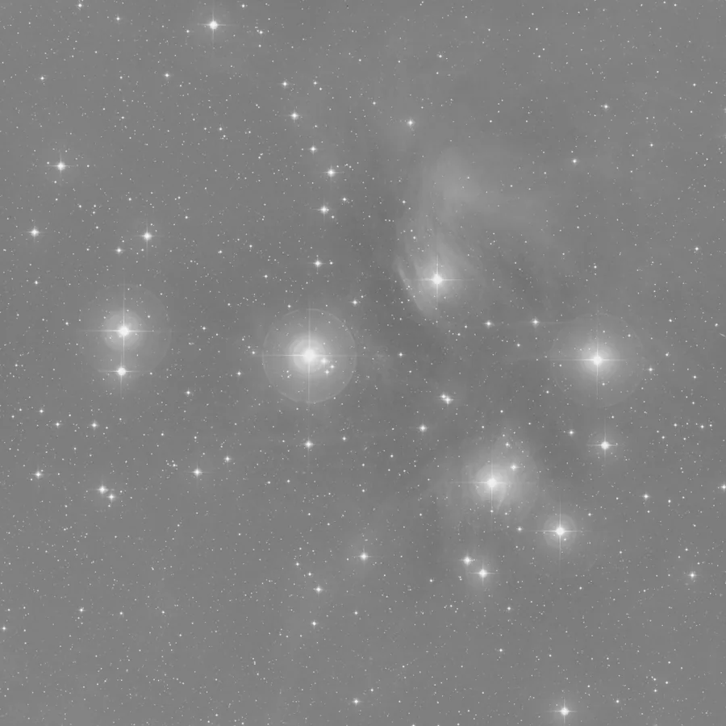

## Summary

`MultiscaleGradientCorrection` removes the **large-scale background gradient** (light
pollution, moon glow, residual vignetting) using a **starlet wavelet decomposition** (the
"à trous" transform). Unlike a simple polynomial surface fit, the separation happens in the
domain of spatial scales: all fine structures (stars, nebulosity, noise) are left untouched,
and only the very-low-frequency residual — the coarsest scale of the decomposition, which
carries the gradient — is flattened.

*Before, and after the blind mode, where the largest starlet scales are taken to be the gradient. With a survey reference supplied it does better still — see `SurveyReference`.*

## Use cases

- Remove a **light-pollution gradient** across a wide field without risking erosion of
  extended nebulosity, unlike a tile-grid background extraction.
- Correct **residual vignetting** poorly calibrated by flats, when its shape is not well
  described by a low-degree polynomial.
- Prepare a flat background before `BackgroundNeutralization` or color calibration, on
  images where the gradient is smooth and broad rather than localized.

## How it works

For each channel, the image is decomposed by the **starlet transform**
(`starlet_transform`, B3-spline "à trous" kernel) into `scale` detail layers
$w_1, \dots, w_n$ plus a low-resolution **residual** $c_n$ that holds the slowest
variations of the image — in practice, the background gradient. The process **replaces
that residual with its median** (a scalar constant), which removes its spatial structure
while preserving its average level, then reconstructs the image by summing the unchanged
detail layers with this flattened residual and a **pedestal**. The result is re-clipped to
`[0, 1]`.

The larger `scale`, the broader the spatial extent captured by the final residual (the
effective filter support doubles at each level), so the correction targets increasingly
extended gradients while sparing medium-sized structures.

## Mathematics

The starlet decomposition reconstructs the original image exactly as the sum of the
details and the residual:

$$ I = \sum_{j=1}^{n} w_j + c_n, \qquad w_j = c_{j-1} - c_j, $$

where $c_0 = I$ and $c_j$ is obtained by separable convolution of $c_{j-1}$ with the
B3-spline kernel dilated by a factor $2^{j-1}$:

$$ B_3 = \tfrac{1}{16}(1, 4, 6, 4, 1), \qquad c_j = c_{j-1} * B_3^{(2^{j-1})}. $$

Each layer $w_j$ captures spatial variations of decreasing frequency as $j$ grows, and the
final residual $c_n$ (after $n$ = `scale` levels) contains only variations whose
characteristic scale exceeds $\sim 2^{n}$ pixels — the background gradient is the archetype
of such a structure.

The correction replaces $c_n$ with its global median $\tilde{c}_n = \operatorname{med}(c_n)$
and adds a pedestal $p$:

$$ I' = \sum_{j=1}^{n} w_j + \tilde{c}_n + p = I - \big(c_n - \tilde{c}_n\big) + p. $$

The term $c_n - \tilde{c}_n$ is exactly the **subtracted gradient model**: the residual map
re-centered on its own median level. Using the median rather than the mean makes the
background-level estimate resistant to regions where the low-frequency residual is locally
contaminated by a very extended object.

## With an external reference

Replacing the residual with a constant assumes that **everything** at large scale is
gradient. That assumption is wrong whenever the field contains real extended signal:
nebulosity, IFN, the outer halo of a galaxy. They are large-scale too, and they get
flattened along with the light pollution.

Give the process a **reference** — an image of the same field known to be free of your
gradient, typically produced by [SurveyReference](retina-doc://SurveyReference) from an
all-sky survey — and the ambiguity disappears. Instead of a constant, the sky at large scale
is modelled as a robust **affine fit** of the reference's own starlet residual:

$$ \text{sky} = a\,c_n^{\text{ref}} + b, \qquad I' = \sum_{j=1}^{n} w_j + \text{sky} + p, $$

with $(a, b)$ estimated by least squares under sigma-clipping. What the image carries *in
excess* of the reference's shape is the gradient, and only that.

The affine fit is what makes the method robust to the reference itself: a survey plate is
neither linear nor photometric, and it does not need to be — any scale factor and offset are
absorbed by $a$ and $b$. The reference's stars live in the detail layers, which are
discarded, so they never enter the fit. If the reference is flat, or if the fit returns a
non-positive slope (wrong field, survey not covering the area, image already corrected), the
process **falls back** to the reference-free behaviour and says so in the notification
centre — a silent fallback would look like a correction that worked.

This is the same idea as PixInsight's *MARS*, without the proprietary survey: the gap was
one of data, not of algorithm.

## Parameters

- **`scale`** — *int*, default `7`, range `3`–`12`. Number of layers in the starlet
  decomposition (gradient scale). Larger values target a broader-support gradient; too
  small a value risks flattening medium-scale structures (diffuse nebulosity) as well.
- **`pedestal`** — *real*, default `0.1`, range `0`–`1`. Additive offset applied after
  correction, to keep the new sky background from sitting too close to 0 (negative values
  get clipped).
- **`reference`** — *str*, default empty. Id of a view holding a gradient-free image of the
  same field. Empty on both reference parameters = classic, reference-free behaviour.
- **`reference_path`** — *str*, default empty. Same thing from a file, which takes priority.
  Any aligned FITS works — a survey reference, but also a wide-field frame of your own.

## Tips & pitfalls

> **Warning** — too small a `scale` (near 3) treats extended nebulosity as gradient and
> flattens it along with the background: it loses its natural slow variation. Increase
> `scale` or work under a mask protecting the object.

> **Note** — the replaced residual is a **per-channel constant** (the global median), not
> an interpolated surface: `MultiscaleGradientCorrection` therefore corrects a gradient
> that is already relatively smooth and symmetric. For a strongly asymmetric or localized
> gradient, prefer `GradientCorrection` (2D polynomial) or `BackgroundExtraction`
> (tile grid).

- Always compare the result against `GradientCorrection` on the same image: both methods
  target the same problem through different means (spatial scale vs. polynomial surface),
  and one may fit the actual gradient shape better than the other.
- Applying it before stretching (on linear data) gives the best results, as with any
  background extraction.

## See also

- [SurveyReference](retina-doc://SurveyReference) — produces the gradient-free reference
  this process can consume.
- [GradientCorrection](retina-doc://GradientCorrection) — gradient removal by robust 2D
  polynomial surface.
- [MultiscaleLinearTransform](retina-doc://MultiscaleLinearTransform) — general starlet
  decomposition (denoising, per-scale enhancement).
- [BackgroundExtraction](retina-doc://BackgroundExtraction) — tile-grid background model
  (photutils).
- [RollingBallBackground](retina-doc://RollingBallBackground) — rolling-ball background
  extraction.

## References

- Starck, J.-L. & Murtagh, F. — *Astronomical Image and Data Analysis* (à trous wavelet /
  starlet transform).
- PixInsight — notes on *MultiscaleLinearTransform* and gradient removal.
