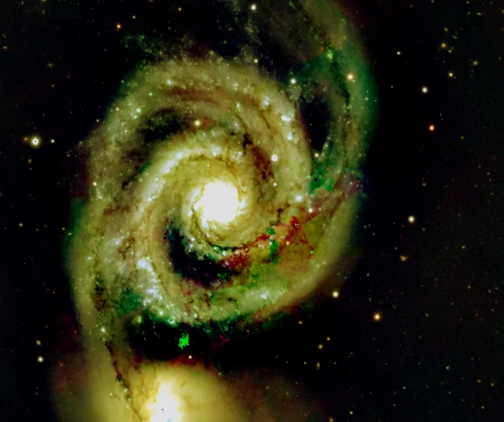
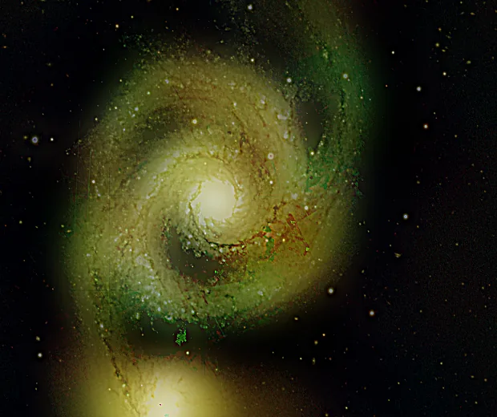

## Résumé

`MultiscaleLinearTransform` (MLT) applique la **transformée en ondelettes starlet** (dite
« à trous », *à trous wavelet transform*, noyau B3-spline) : elle décompose l'image en une
pile de **couches de détail** à des échelles spatiales croissantes (fines structures →
grandes structures), plus un **résidu** basse fréquence. Chaque couche peut ensuite être
atténuée, amplifiée ou débruitée indépendamment, avant reconstruction par simple sommation.
C'est l'outil linéaire de base pour le débruitage sélectif et le rehaussement de structures
à une échelle donnée — pendant direct de l'*ATrousWaveletTransform* / *MultiscaleLinearTransform*
de PixInsight.

*Avant, et après amplification des deux couches starlet les plus fines.*

## Cas d'usage

- **Débruiter sans flouter** : atténuer par seuillage doux le bruit concentré dans la couche
  la plus fine (échelle 1), sans toucher aux structures des échelles supérieures.
- **Rehausser des structures à une échelle donnée** (filaments fins de nébuleuse, bras de
  galaxie) en amplifiant le `bias` de la couche correspondante au-delà de 1.
- **Atténuer une échelle parasite** (grain de fond, artefact de compression JPEG source) en
  fixant son `bias` en dessous de 1, voire à 0 pour la supprimer complètement.
- Servir de **brique de base** à des traitements plus élaborés (HDRMultiscaleTransform,
  débruitage multi-échelle, séparation structure/bruit) qui réutilisent la même décomposition.

## Fonctionnement

Pour chaque canal, la décomposition est un algorithme **« à trous »** (*non décimé*, donc
redondant mais parfaitement reconstructible) :

1. On part de l'image d'entrée $c_0$ = image du canal.
2. À chaque échelle $j = 0, \dots, J-1$, on lisse $c_j$ avec le noyau **B3-spline**
   `[1, 4, 6, 4, 1] / 16` (séparable, appliqué en lignes puis en colonnes) **dilaté** d'un
   facteur $2^j$ — on insère des « trous » (zéros) entre les coefficients pour doubler la
   portée du noyau à chaque échelle sans sous-échantillonner l'image.
3. La **couche de détail** de l'échelle $j$ est la différence entre le signal avant et après
   ce lissage : $w_j = c_j - c_{j+1}$. Le lissé $c_{j+1}$ sert de point de départ à l'échelle
   suivante.
4. Après `scales` itérations, il reste un **résidu** $r = c_J$ (la tendance grande échelle,
   sans détail).
5. Chaque couche est ensuite ajustée : la couche 0 (la plus fine, dominée par le bruit de
   photons/lecture) subit un **seuillage doux** si `noise_threshold > 0`, puis toutes les
   couches sont multipliées par leur `bias` respectif (1 par défaut = inchangé).
6. **Reconstruction** : l'image de sortie est simplement la somme des couches ajustées et du
   résidu — propriété clé de la transformée à trous, qui garantit une reconstruction exacte
   quand tous les biais valent 1 et qu'aucun seuillage n'est appliqué.

## Mathématiques

Soit $h = \tfrac{1}{16}[1,4,6,4,1]$ le noyau B3-spline 1D, et $h_j$ sa version **dilatée** à
l'échelle $j$ (les 5 coefficients espacés de $2^j$ pixels, zéros ailleurs). Le lissage 2D à
l'échelle $j$ est la convolution séparable $\ast_2$ (lignes puis colonnes, bord réfléchi) :

$$ c_0 = I, \qquad c_{j+1} = c_j \ast_2 h_j \;\; (j = 0, \dots, J-1). $$

La couche de détail à l'échelle $j$ et le résidu final sont :

$$ w_j = c_j - c_{j+1}, \qquad r = c_J . $$

La somme télescopique garantit la reconstruction exacte de l'image d'entrée :

$$ I = \sum_{j=0}^{J-1} w_j + r . $$

Le débruitage de la couche la plus fine ($j=0$) utilise un **estimateur robuste** de l'écart-type
du bruit, le `mad_std` (écart absolu médian mis à l'échelle, $1.4826 \cdot \operatorname{med}|w_0
- \operatorname{med}(w_0)|$), puis un **seuillage doux** (*soft-thresholding*) :

$$ t = \texttt{noise\_threshold} \cdot \operatorname{mad\_std}(w_0), \qquad
   w_0' = \operatorname{sign}(w_0) \cdot \max(|w_0| - t,\; 0). $$

Chaque couche (y compris $w_0'$) est enfin pondérée par son biais $b_j$ (`bias[j]`, ou $1$ si
non fourni) avant sommation finale :

$$ I_{\text{out}} = \sum_{j=0}^{J-1} b_j\, w_j + r, \quad \text{écrêté dans } [0,1]. $$

## Paramètres

- **`scales`** — *int*, défaut `5`, plage `1`–`12`. Nombre d'échelles de décomposition $J$
  (nombre de couches de détail produites, plus le résidu). Plus il y a d'échelles, plus les
  structures traitées peuvent être grandes ; le coût de calcul croît linéairement avec `scales`.
- **`bias`** — *floatlist*, défaut `[]` (liste vide). Multiplicateur appliqué à chaque couche de
  détail, dans l'ordre des échelles (`bias[0]` = échelle la plus fine). Une échelle sans valeur
  fournie garde un biais de `1.0` (reconstruction fidèle sur cette couche). `0.0` supprime
  entièrement la couche, `>1.0` amplifie ses structures.
- **`noise_threshold`** — *real*, défaut `0.0`, plage `0`–`10`. Seuil de débruitage, exprimé en
  multiples du `mad_std` du bruit, appliqué **uniquement à la couche 0** (la plus fine) par
  seuillage doux. `0.0` désactive tout débruitage.

## Astuces & pièges

> **Attention** — un `noise_threshold` trop élevé écrase aussi les fines étoiles et les
> structures ténues qui vivent à l'échelle 1 : commencez bas (1–3) et contrôlez visuellement
> l'image de différence (couche 0 avant/après seuillage).

> **Note** — avec `bias` vide et `noise_threshold = 0.0`, la transformée est une **identité
> exacte** (décomposition + reconstruction sans perte) : c'est le point de départ sûr avant
> de régler les paramètres échelle par échelle.

- La transformée est **redondante** (non décimée) : chaque couche a la même résolution que
  l'image d'entrée, ce qui facilite le travail sous masque mais coûte de la mémoire pour de
  grandes valeurs de `scales` sur de grandes images.
- Pour un débruitage non linéaire plus robuste aux bords (moins d'anneaux autour des étoiles),
  préférez `MultiscaleMedianTransform`, qui utilise un filtre médian à trous au lieu du noyau
  B3-spline.
- Pour un rehaussement de structures plus ciblé en une seule passe (sans décomposer
  explicitement en couches), `UnsharpMask` offre une alternative plus simple mono-échelle.

## Voir aussi

- [MultiscaleMedianTransform](retina-doc://MultiscaleMedianTransform) — même principe avec un
  filtre médian à trous, plus robuste aux bords.
- [HDRMultiscaleTransform](retina-doc://HDRMultiscaleTransform) — réutilise la décomposition
  starlet pour compresser la dynamique globale.
- [WaveletDenoise](retina-doc://WaveletDenoise) — débruitage par ondelettes orienté qualité
  d'image plutôt que contrôle manuel par échelle.
- [UnsharpMask](retina-doc://UnsharpMask) — rehaussement de structures mono-échelle par masque flou.

## Références

- Starck, J.-L. & Murtagh, F. — *Astronomical Image and Data Analysis* (transformée en
  ondelettes à trous).
- PixInsight — *ATrousWaveletTransform* / *MultiscaleLinearTransform* tool reference.
- astropy.stats.mad_std — estimateur robuste de l'écart-type.
