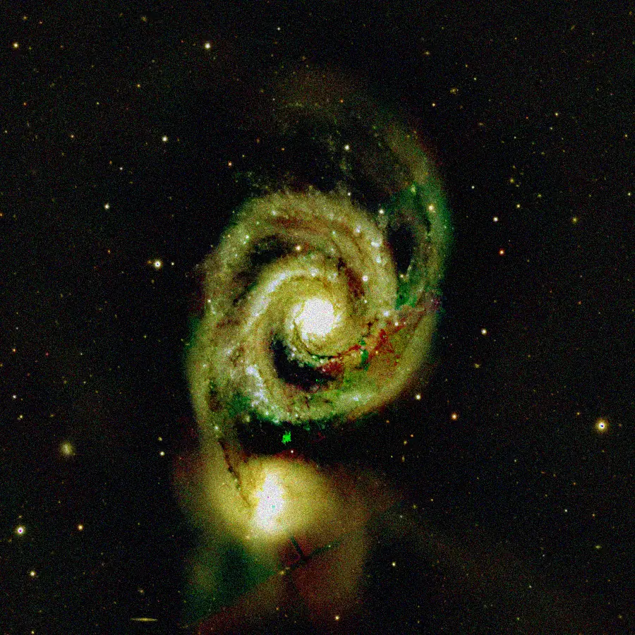

## Résumé

`NoiseGenerator` ajoute du **bruit synthétique** à chaque pixel de l'image, de façon
indépendante et identiquement distribuée (i.i.d.) canal par canal. Trois modèles sont
disponibles — **gaussien** (additif, blanc), **poisson** (dépendant du signal, façon bruit de
photons) et **uniforme** (additif, borné) — équivalents à l'outil `NoiseGeneration` de
PixInsight. C'est l'inverse fonctionnel d'un débruiteur : au lieu de retirer du bruit, on en
injecte, de façon contrôlée et reproductible via une graine.

*Avant, et après ajout d'un bruit gaussien à 0,08 — du bruit mis exprès, pour éprouver ce qui l'enlève.*

## Cas d'usage

- **Tester un pipeline de débruitage** (`NoiseReduction`, `FastNLMeansDenoise`,
  `WaveletDenoise`…) sur un signal connu, en comparant l'image bruitée à l'originale propre.
- **Simuler des frames dégradées** pour valider un script de calibration/intégration sans
  disposer de vraies acquisitions bruitées.
- **Générer une texture de fond** (mode uniforme ou gaussien à faible amplitude) pour des tests
  d'interface ou de rendu.
- **Étudier la robustesse** d'un algorithme (détection d'étoiles, extraction de source) face à
  différents niveaux et types de bruit.

## Fonctionnement

Le process instancie un générateur pseudo-aléatoire numpy (`default_rng`) initialisé par
`seed`, ce qui rend le résultat **parfaitement reproductible** pour une graine et une image
données. Selon `type` :

- **`gaussian`** — un tirage normal centré, d'écart-type `amount`, est ajouté à chaque pixel.
  C'est un bruit **additif**, indépendant du niveau du signal — modèle standard du bruit de
  lecture électronique.
- **`uniform`** — un tirage uniforme dans `[-amount, amount]` est ajouté à chaque pixel :
  additif également, mais à distribution bornée et plate plutôt que cloche gaussienne.
- **`poisson`** — l'image est d'abord mise à l'échelle par un facteur dérivé de `amount`
  (plus `amount` est petit, plus l'échelle est grande, donc moins le bruit relatif est fort),
  un tirage de Poisson est effectué sur ce signal mis à l'échelle, puis le résultat est
  redivisé par l'échelle. Contrairement aux deux autres modes, ce bruit est **dépendant du
  signal** : les zones lumineuses reçoivent (en absolu) plus de bruit que les zones sombres —
  c'est le modèle physique du bruit de photons (shot noise).

Dans tous les cas, le résultat est **écrêté** dans `[0, 1]` avant d'être reconverti en
`float32`, pour rester dans la plage de représentation standard des images de Retina.

## Mathématiques

Soit $x$ la valeur d'un pixel dans $[0,1]$ et $a$ = `amount`.

**Gaussien** : le bruit ajouté suit une loi normale centrée d'écart-type $a$ :

$$ x' = \operatorname{clip}(x + n,\; 0,\; 1), \qquad n \sim \mathcal{N}(0,\, a^2). $$

**Uniforme** : le bruit ajouté est uniforme sur un intervalle symétrique de demi-largeur $a$ :

$$ x' = \operatorname{clip}(x + u,\; 0,\; 1), \qquad u \sim \mathcal{U}(-a,\, a). $$

**Poisson** : on définit une échelle $\lambda_s = \max(a, 10^{-6}) \cdot 1000$, on tire un
compte de Poisson sur le signal remis à l'échelle, puis on renormalise :

$$ x' = \operatorname{clip}\!\left(\frac{P}{\lambda_s},\; 0,\; 1\right),
   \qquad P \sim \operatorname{Poisson}\big(\operatorname{clip}(x,0,1)\cdot \lambda_s\big). $$

Le bruit de Poisson a pour propriété fondamentale que sa variance est égale à sa moyenne :
$\operatorname{Var}(P) = \lambda_s x$. Après renormalisation par $\lambda_s$, l'écart-type
relatif du bruit décroît en $1/\sqrt{\lambda_s x}$ — plus le signal $x$ est fort (ou $\lambda_s$
grand, donc `amount` grand), plus le bruit relatif est faible : c'est le comportement attendu
d'un bruit de photons, où le rapport signal/bruit croît avec le nombre de photons collectés.

## Paramètres

- **`type`** — *enum*, défaut `gaussian`, choix : `gaussian`, `poisson`, `uniform`. Modèle
  statistique du bruit ajouté : gaussien additif (bruit de lecture), Poisson dépendant du
  signal (bruit de photons), ou uniforme additif.
- **`amount`** — *real*, défaut `0.05`, plage `0`–`1`. Amplitude du bruit. Pour `gaussian` et
  `uniform`, c'est directement l'écart-type / la demi-largeur du tirage additif. Pour
  `poisson`, une valeur plus faible produit *plus* de bruit relatif (échelle interne plus
  petite).
- **`seed`** — *int*, défaut `0`, plage `0`–`2147483647`. Graine du générateur
  pseudo-aléatoire ; fixe le tirage pour rendre le résultat reproductible d'une exécution à
  l'autre.

## Astuces & pièges

> **Attention** — le mode `poisson` a une échelle interne différente des modes additifs :
> `amount` n'y représente pas un écart-type direct. Ne comparez pas les trois modes à
> `amount` identique en vous attendant à un bruit de même intensité visuelle.

- Pour reproduire exactement un test (rapports de bug, benchmarks), fixez `seed` à une valeur
  non nulle et notez-la : la graine `0` par défaut donne toujours la même séquence.
- Sur une image déjà proche de 0 ou de 1, l'écrêtage final dans `[0, 1]` biaise localement la
  distribution du bruit (une partie des tirages est tronquée) — utile à savoir en analyse
  quantitative.
- Pour du bruit texturé et corrélé spatialement (plutôt que du bruit blanc pixel à pixel),
  voir [SimplexNoise](retina-doc://SimplexNoise).

## Voir aussi

- [SimplexNoise](retina-doc://SimplexNoise) — bruit fractal lisse mélangé à l'image.
- [NoiseReduction](retina-doc://NoiseReduction) — débruitage à tester sur une image bruitée.
- [FastNLMeansDenoise](retina-doc://FastNLMeansDenoise) — débruitage non local rapide.
- [WaveletDenoise](retina-doc://WaveletDenoise) — débruitage par seuillage d'ondelettes.

## Références

- PixInsight — *NoiseGeneration* tool reference.
- numpy.random.Generator — *normal*, *poisson*, *uniform*.
