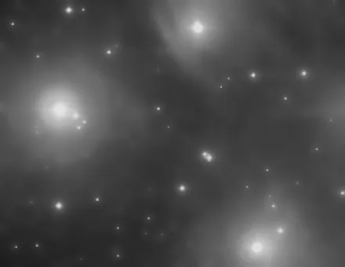

## Summary

`NoiseReduction` is Retina's **general-purpose** denoiser: a single process, three
interchangeable algorithms selected through the `method` parameter — **total variation**
(`tv`), **wavelet thresholding** (`wavelet`) and **bilateral filtering** (`bilateral`). It is
the simplest entry point for smoothing residual noise after integration, before reaching for
the more specialized tools (`TGVDenoise`, `WaveletDenoise`, `NonLocalMeansDenoise`…) that offer
finer control. It is a thin wrapper around `skimage.restoration`.

*Before, and after total-variation denoising at 0.15, on a crop at the pixel scale.*

## Use cases

- **Quick clean-up** of an integrated image before stretching, without tuning many parameters.
- **Comparing three denoising families** by simply switching `method`, to pick the one that
  best matches the image's noise texture (gaussian noise, photon shot noise, chroma noise).
- **`tv`**: a very noisy sky background to flatten while keeping sharp edges (galaxies, nebula
  boundaries).
- **`wavelet`**: multi-scale noise, with automatic thresholding adapted to the estimated noise
  level — little tuning required.
- **`bilateral`**: gentle smoothing that respects brightness transitions while still giving
  explicit control through `strength`.

## How it works

The process delegates the computation entirely to `skimage.restoration` functions, selected by
`method`:

- **`tv`** — `denoise_tv_chambolle(data, weight=strength, channel_axis=-1)`: minimizes an
  energy combining data fidelity and total variation, solved with Chambolle's dual projection
  algorithm. Channels are processed **jointly** (`channel_axis`), which avoids color fringing
  at edges.
- **`wavelet`** — `denoise_wavelet(data, channel_axis=-1, rescale_sigma=True)`: decomposes the
  image into wavelet coefficients, robustly estimates the noise per channel, and applies soft
  thresholding (scikit-image's default BayesShrink method) on the detail coefficients before
  reconstruction. Requires **PyWavelets** (pulled in by the `[astro]` extra); without it, an
  explicit error is raised.
- **`bilateral`** — `denoise_bilateral(sigma_color=strength, sigma_spatial=3)`, applied **per
  channel independently** (Python loop): a weighted average over both spatial proximity and
  intensity similarity, which preserves edges while smoothing homogeneous regions.

## Mathematics

**Total variation (Chambolle).** The denoised image $u$ minimizes

$$ E(u) = \frac{1}{2}\int (u-f)^2\,dx \;+\; \lambda \int |\nabla u|\,dx, $$

where $f$ is the noisy image and $\lambda$ = `strength` (`weight`). The total-variation term
penalizes strong local variation while tolerating sharp discontinuities (unlike a Gaussian
blur) — hence a smoothing that preserves edges but can produce a "staircase" effect on smooth
gradients.

**Wavelet (soft thresholding, BayesShrink).** For each detail subband $w$, the noise
$\hat\sigma$ is estimated robustly (median absolute deviation of the finest-scale
coefficients):

$$ \hat\sigma = \frac{\operatorname{MAD}(w_{\text{fine}})}{0.6745}. $$

The per-subband BayesShrink threshold is $T = \hat\sigma^2 / \hat\sigma_X$, where $\hat\sigma_X
= \sqrt{\max(\hat\sigma_Y^2-\hat\sigma^2,\,0)}$ estimates the underlying signal's standard
deviation. Each coefficient is then soft-thresholded:

$$ \eta(w, T) = \operatorname{sign}(w)\,\max(|w| - T,\; 0). $$

**Bilateral filter.** For a pixel $p$ over neighborhood $\Omega$:

$$ I'(p) = \frac{1}{W_p} \sum_{q \in \Omega} I(q)\;
   G_{\sigma_s}\!\big(\lVert p-q \rVert\big)\;
   G_{\sigma_r}\!\big(|I(p)-I(q)|\big), $$

with $G_\sigma(x) = \exp(-x^2/2\sigma^2)$, $\sigma_s$ = `sigma_spatial` (fixed at 3 by the
wrapper) and $\sigma_r$ = `sigma_color` = `strength`. The intensity-similarity factor
$G_{\sigma_r}$ shuts down smoothing across strong contrasts, which preserves edges.

## Parameters

- **`method`** — *enum*, default `tv`, choices: `tv`, `wavelet`, `bilateral`. Denoising
  algorithm used.
- **`strength`** — *real*, default `0.1`, range `0`–`2`. Smoothing intensity: the total
  variation weight ($\lambda$) for `tv`, or `sigma_color` (tolerance to intensity differences)
  for `bilateral`.

## Tips & pitfalls

> **Warning** — with `method = wavelet`, the `strength` parameter has **no effect at all**:
> thresholding is fully automatic (noise estimated per channel, `rescale_sigma=True`). For
> manual control of the threshold, use `WaveletDenoise` instead (explicit `threshold`
> parameter).

> **Note** — in `bilateral` mode, each channel is filtered **separately**: on a very noisy
> color image this can introduce a slight residual chroma noise. Prefer `tv` or `wavelet` when
> color fidelity matters most.

- A high `strength` with `tv` smooths strongly but flattens faint gradients — watch out for
  faint nebulosity and work under a star mask if needed.
- For finer, slower denoising, prefer `NonLocalMeansDenoise` (better preserves point-like
  sources) or `TGVDenoise` (avoids the staircase effect of classic TV).

## See also

- [TGVDenoise](retina-doc://TGVDenoise) — second-order total generalized variation, without
  the staircase effect.
- [WaveletDenoise](retina-doc://WaveletDenoise) — wavelet thresholding with a manual threshold
  (`k × MAD`).
- [NonLocalMeansDenoise](retina-doc://NonLocalMeansDenoise) — averages similar patches, better
  preserves point-like structures.
- [ACDNR](retina-doc://ACDNR) — adaptive smoothing that protects high-contrast structures.

## References

- scikit-image — *skimage.restoration.denoise_tv_chambolle*, *denoise_wavelet*,
  *denoise_bilateral*.
- Chambolle, A. (2004) — *An Algorithm for Total Variation Minimization and Applications*.
- Chang, Yu & Vetterli (2000) — *Adaptive Wavelet Thresholding for Image Denoising*
  (BayesShrink).
- Tomasi & Manduchi (1998) — *Bilateral Filtering for Gray and Color Images*.
