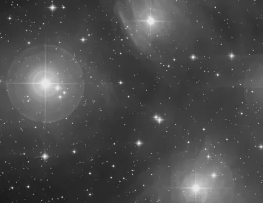

## Summary

`NonLocalMeansDenoise` reduces noise by replacing each pixel with a **weighted average of
similar pixels**, searched across a whole neighborhood rather than through a plain local
convolution filter. Similarity is measured between **patches** (small windows around each
pixel): two pixels whose patches look alike — whether adjacent or not — contribute strongly to
each other. This "non-local" principle smooths the background noise while respecting
repetitive and **point-like** structures, in particular faint stars, which classic filters
(Gaussian, median) tend to crush.

*Before, and after patch-based non-local means, on a crop at the pixel scale.*

## Use cases

- **Denoise the sky background** of a stacked image without eroding faint stars or the
  sharpness of fine nebulosity.
- **Clean up a noisy signal** before an aggressive stretch, which would otherwise amplify
  residual noise into visible artifacts.
- **Preserve texture** (dark dust lanes, filaments) where a Gaussian blur or median filter
  would indiscriminately smooth both noise and detail.
- A more faithful but slower alternative to
  [FastNLMeansDenoise](retina-doc://FastNLMeansDenoise) when compute time is not constrained.

## How it works

The process delegates to `skimage.restoration.denoise_nl_means`, applied **independently on
each channel**:

1. The channel is clipped to `[0, 1]`.
2. The noise standard deviation `sigma` is automatically estimated by `estimate_sigma` (a
   robust estimator based on the image's high-frequency texture).
3. For each pixel, the algorithm compares its **patch** (a `patch_size × patch_size` window)
   to all patches within a **search window** of radius `patch_distance` around it, and
   computes a weighted average based on patch similarity (`fast_mode=True`, which speeds up
   the distance computation via an integral-image formulation).
4. The filter strength `h` is **scaled by the estimated noise** (`h × sigma`): the same
   setting produces a consistent effect regardless of the channel's noise level.
5. The result is re-clipped to `[0, 1]` and cast back to `float32`.

Because sigma estimation and filtering are done channel by channel, a noisier channel
(often blue) gets denoised more strongly than a clean one, without the user having to tune
each channel separately.

## Mathematics

For a pixel $p$, the filtered value $\mathrm{NL}[I](p)$ is a weighted average of all pixels
$q$ in the search window $\Omega(p)$:

$$ \mathrm{NL}[I](p) = \frac{1}{Z(p)} \sum_{q \in \Omega(p)} w(p, q)\, I(q), \qquad
   Z(p) = \sum_{q \in \Omega(p)} w(p, q). $$

The weight $w(p, q)$ depends on the distance between the **patches** $N(p)$ and $N(q)$
(windows of size `patch_size` centered at $p$ and $q$), weighted by a Gaussian kernel
$\mathcal{G}_a$ that favors pixels near the patch center:

$$ w(p, q) = \exp\!\left(- \frac{\lVert I(N(p)) - I(N(q)) \rVert^2_{2,\mathcal{G}_a}}{h_\text{eff}^2}\right), $$

where $h_\text{eff} = h \times \sigma$ controls the tolerance to differences between patches:
the larger $h_\text{eff}$, the more dissimilar patches are allowed to contribute, hence the
stronger the smoothing (at the risk of blurring fine detail). The noise estimate $\sigma$
recenters this setting on the channel's actual noise scale, so `h` remains a dimensionless
multiplier. The search window $\Omega(p)$ is limited to a radius `patch_distance` around $p$
(instead of the whole image) to keep the computation tractable.

## Parameters

- **`h`** — *real*, default `1.0`, range `0.1`–`10.0`. Filter strength, expressed as a multiple
  of the per-channel estimated noise standard deviation (σ). Higher `h` gives stronger
  smoothing but increases the risk of erasing fine detail or faint stars.
- **`patch_size`** — *int*, default `5`, range `3`–`15`. Size (in pixels) of the patches
  compared against each other. A larger patch makes the comparison more robust to noise but
  less sensitive to small structures.
- **`patch_distance`** — *int*, default `6`, range `1`–`30`. Radius of the search window around
  each pixel. Larger means more similar candidates found (better smoothing) but a steeply
  rising computational cost.

## Tips & pitfalls

> **Warning** — computation cost grows quickly with `patch_distance` (search window): doubling
> it can multiply processing time by close to 4. On large fields, try
> [FastNLMeansDenoise](retina-doc://FastNLMeansDenoise) first, or reduce `patch_distance`.

- Start with `h` close to `1.0`: beyond `2`–`3`, smoothing becomes visible on fine structures
  and faint stars can lose sharpness.
- Applied under a **mask** (sky background only, stars protected), denoising can be pushed
  harder without degrading point sources.
- Since `sigma` is estimated per channel, an already-clean channel (often the luminance
  channel after LRGB combination) will barely be affected even with a high `h`.

## See also

- [FastNLMeansDenoise](retina-doc://FastNLMeansDenoise) — OpenCV variant, much faster, 8-bit.
- [TGVDenoise](retina-doc://TGVDenoise) — total generalized variation denoising, closer to PixInsight.
- [NoiseReduction](retina-doc://NoiseReduction) — generic denoising filters (wavelets, TV).
- [WaveletDenoise](retina-doc://WaveletDenoise) — multiscale wavelet denoising.

## References

- Buades, A., Coll, B., Morel, J.-M. — *A non-local algorithm for image denoising* (2005).
- scikit-image — *skimage.restoration.denoise_nl_means* / *estimate_sigma*.
