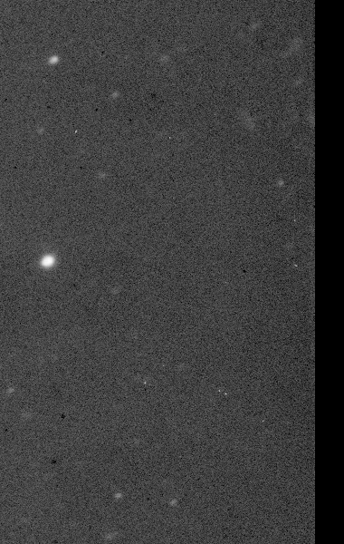
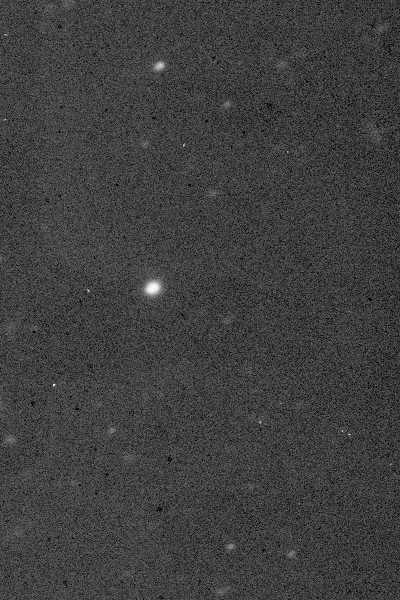

## Résumé

L'**overscan** est une bande de pixels lus par l'électronique mais **jamais exposés à la
lumière**. Elle n'enregistre donc que le piédestal électronique du capteur — le bias — mais
elle l'enregistre *pendant la pose elle-même*.

C'est là toute sa valeur, et la raison pour laquelle un master bias ne la remplace pas : le
master donne le bias **moyen d'une série**, l'overscan donne sa valeur **à l'instant de la
pose**, dérive thermique et fluctuations d'alimentation comprises. Sur un jeu réel mesuré
(Andor Aspen CG16M, poses de 90 s), l'écart entre les deux atteint 20 % du fond de ciel :
le négliger, c'est se tromper d'un cinquième sur le signal qu'on cherche à mesurer.

*Une pose réelle du Palomar avec sa bande d'overscan, et la pose corrigée, bande soustraite puis retirée. La section est lue dans le `BIASSEC` du fichier — c'est tout l'intérêt du process, et la raison du choix de ce jeu d'exemple.*

## Cas d'usage

- **Tout capteur qui déclare un `BIASSEC`** — la plupart des CCD scientifiques et une partie
  des CMOS refroidis. Le pré-traitement automatisé le détecte et l'applique seul.
- **Séries longues où le bias dérive** : montée en température de l'électronique au fil de
  la nuit, alimentation instable, ou simplement absence de bias pris le même soir.
- **Retirer la zone non exposée** avant tout : ces colonnes n'ont pas vu le ciel, et les
  garder fausse le fond de ciel, l'étirement automatique et toute mesure de bruit.

## Fonctionnement

Les régions se donnent en **sections IRAF**, la convention que la plupart des logiciels
d'acquisition écrivent dans l'en-tête : `BIASSEC` pour l'overscan, `TRIMSEC` pour la zone
utile. Le pré-traitement les lit et remplit les paramètres — là où PixInsight demande de les
saisir à la main, capteur par capteur.

Le niveau se mesure par un estimateur robuste (médiane par défaut) **le long de la zone**.
Une bande de colonnes donne un niveau **par ligne**, ce qui est le cas utile : la dérive du
registre de lecture se manifeste dans le sens de la lecture, pas uniformément. Le mode
`auto` déduit ce sens de la forme de la zone.

Trois pièges de la convention IRAF sont traités explicitement :

1. **L'ordre** — FITS énonce x en premier, numpy l'axe des lignes.
2. **L'omission** — `[4096:4109]` ne précise qu'une dimension, et c'est x. La compléter du
   mauvais côté découperait des lignes au lieu de colonnes, silencieusement et avec une
   géométrie parfaitement plausible.
3. **Les canaux** — la section n'adresse que la géométrie ; les canaux suivent en entier.

## Mathématiques

Soit une image $I$ de dimensions $H \times W$, une zone d'overscan $B$ (les colonnes
$[x_a, x_b]$) et une zone utile $T$. Pour une correction par ligne, le niveau estimé à la
ligne $y$ est

$$ b(y) = \operatorname{med}\big\{\, I(y, x) \;:\; x \in [x_a, x_b] \,\big\} $$

et l'image corrigée puis rognée vaut

$$ I'(y, x) = I(y, x) - b(y), \qquad (y, x) \in T $$

La médiane plutôt que la moyenne : quelques rayons cosmiques tombent aussi dans l'overscan,
et une moyenne les laisserait déplacer le niveau de toute une ligne.

## Paramètres

- **`bias_section`** — *str*, défaut vide. Section IRAF de l'overscan (`[4096:4109]`).
  Vide : aucune soustraction.
- **`trim_section`** — *str*, défaut vide. Section IRAF conservée (`[1:4096, :]`).
  Vide : aucun rognage.
- **`method`** — *enum*, défaut `median`. Estimateur du niveau (`median`, `mean`).
- **`axis`** — *enum*, défaut `auto`. Sens de la correction : `row` (un niveau par ligne),
  `column`, `global` (un scalaire), ou `auto` d'après la forme de la zone.

## Astuces & pièges

> **Attention** — l'overscan se corrige **avant** le master bias, jamais après : les deux
> mesurent la même chose. L'appliquer en second reviendrait à soustraire le piédestal deux
> fois. Le pré-traitement place donc cette étape tout en amont.

> **Note** — le rognage doit s'appliquer à **tous** les types de frames, sinon les
> géométries cessent de concorder : un master rogné ne s'applique pas à un light qui ne
> l'est pas.

- Une image corrigée a un fond proche de zéro, parfois légèrement négatif : c'est normal, et
  c'est le rôle du piédestal d'[ImageCalibration](retina-doc://ImageCalibration) de le
  relever sans tronquer.
- Si l'en-tête ne déclare rien, il n'y a probablement pas d'overscan : n'en inventez pas
  un, une zone mal choisie soustrairait du signal.

## Voir aussi

- [ImageCalibration](retina-doc://ImageCalibration) — la suite : bias, dark, flat.
- [Superbias](retina-doc://Superbias) — modèle multi-échelle du bias résiduel.
- [Crop](retina-doc://Crop) — rognage à des bornes fractionnaires.

## Références

- IRAF — conventions `BIASSEC` / `TRIMSEC` / `DATASEC` des sections d'image.
- Howell, S. B. — *Handbook of CCD Astronomy*, réduction des données.
- ccdproc — `subtract_overscan`, `trim_image`.
