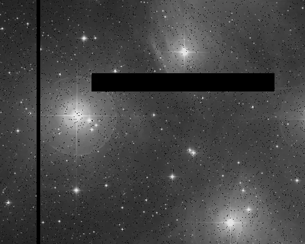
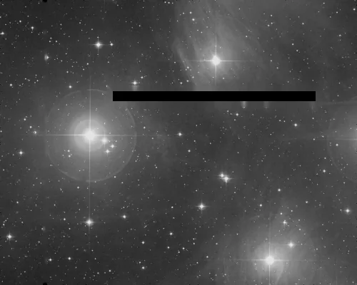

## Résumé

`PixelInterpolation` comble les trous d'une image — pixels marqués `NaN`, ou pixels à 0/négatifs
si `mark_zeros` est activé — par une **convolution gaussienne interpolante** qui n'utilise que
les voisins valides (`astropy.convolution.interpolate_replace_nans`). Chaque pixel manquant est
remplacé par la moyenne pondérée gaussienne de son voisinage sain ; les pixels déjà valides ne
sont **jamais altérés**. C'est le complément naturel de `DefectMap` : là où `DefectMap` répare des
défauts connus d'avance (carte fournie), `PixelInterpolation` répare des trous déjà marqués `NaN`
dans les données (bord de mosaïque, masque de rejet, pixels saturés mis à NaN en amont, etc.).

*Des pixels morts, une zone morte et une colonne morte, et la pose une fois comblée depuis le voisinage. Les trous sont injectés — une pose qui arrive dans la documentation est calibrée et n'en a plus.*

## Cas d'usage

- **Reboucher les trous** laissés par un traitement amont qui a mis certains pixels à `NaN`
  (rejet d'intégration, masque de cosmic-ray, zone hors champ d'une reprojection/mosaïque).
- **Éliminer les pixels morts d'un capteur** connus pour être exactement à 0 ou négatifs, en
  activant `mark_zeros` — utile après un `Debayer` ou une calibration ayant laissé des zéros francs.
- **Préparer une image pour un traitement sensible aux NaN** (FFT, ondelettes, statistiques) qui
  ne tolère aucune valeur non finie.
- **Alternative légère à `DefectMap`** quand on n'a pas de carte de défauts explicite mais que les
  pixels problématiques sont déjà identifiables par leur valeur (NaN ou zéro).

## Fonctionnement

Pour chaque canal, indépendamment :

1. Si `mark_zeros` est actif, tout pixel `≤ 0` est d'abord basculé à `NaN` — il rejoint ainsi les
   pixels déjà marqués morts.
2. S'il reste des `NaN`, `interpolate_replace_nans` convolue le canal avec un noyau gaussien 2D
   (`Gaussian2DKernel`, écart-type `sigma`) en mode `nan_treatment='interpolate'` : la convolution
   ignore les voisins non finis et **renormalise les poids** sur les seuls voisins valides.
3. Seuls les pixels initialement `NaN` sont remplacés par le résultat de cette convolution ; les
   pixels valides gardent leur valeur d'origine à l'identique (pas de lissage global de l'image).
4. Les éventuels `NaN` résiduels (trou plus grand que le support du noyau, aucun voisin valide)
   sont mis à 0 par sécurité, puis le résultat est écrêté dans `[0, 1]`.

## Mathématiques

Soit $I$ un canal image et $p$ la position d'un pixel marqué invalide. Le noyau gaussien
isotrope de rayon $\sigma$ = `sigma` vaut, pour un déplacement $(dx, dy)$ :

$$ w(dx, dy) = \exp\!\left(-\frac{dx^2 + dy^2}{2\sigma^2}\right) $$

tronqué au support fini du noyau (fenêtre discrète centrée, taille dépendant de $\sigma$). La
valeur interpolée au pixel manquant est la **moyenne pondérée gaussienne renormalisée** sur le
voisinage $N(p)$ des seuls pixels valides :

$$ \hat{I}(p) = \frac{\displaystyle\sum_{q \in N(p),\; I(q) \text{ valide}} w(p - q)\, I(q)}
                    {\displaystyle\sum_{q \in N(p),\; I(q) \text{ valide}} w(p - q)} $$

La renormalisation par la somme des poids valides (plutôt que par la somme totale du noyau)
garantit que $\hat{I}(p)$ reste une vraie moyenne pondérée même si une partie du voisinage est
elle-même invalide — condition nécessaire pour reboucher des trous de plusieurs pixels de large
par propagation itérative des voisins déjà remplis lors de convolutions successives.

## Paramètres

- **`sigma`** — *real*, défaut `2.0`, plage `0.3`–`20.0`. Écart-type (rayon) du noyau gaussien
  utilisé pour l'interpolation. Un `sigma` faible interpole étroitement (fidèle localement mais
  peut échouer sur de larges trous) ; un `sigma` élevé lisse davantage et comble des trous plus
  grands, au prix d'un flou local plus marqué autour des pixels reconstruits.
- **`mark_zeros`** — *bool*, défaut `False`. Si activé, traite tout pixel `≤ 0` comme mort : il
  est mis à `NaN` avant l'interpolation, exactement comme un `NaN` déjà présent.

## Astuces & pièges

> **Attention** — avec `mark_zeros` actif, un fond de ciel réellement à 0 (image parfaitement
> soustraite ou canal saturé côté noir) sera lui aussi interpolé. N'activez cette option que si
> les zéros francs signalent bien des pixels morts, pas un fond de ciel légitime.

> **Note** — seuls les pixels marqués invalides sont modifiés : contrairement à un flou gaussien
> classique, cette opération ne dégrade pas la netteté des pixels déjà valides.

- Pour des trous très larges (plusieurs dizaines de pixels), augmentez `sigma` ; sinon des `NaN`
  résiduels subsisteront et seront simplement mis à 0 par sécurité.
- Si vous disposez d'une carte de défauts connue à l'avance (pixels chauds/froids cartographiés),
  préférez `DefectMap`, qui utilise un médian local plutôt qu'une moyenne gaussienne.
- Pour les rayons cosmiques et traces transitoires, `CosmicClip` est plus adapté : il détecte et
  corrige sans nécessiter que les pixels soient déjà marqués `NaN`.

## Voir aussi

- [DefectMap](retina-doc://DefectMap) — remplacement par médian local à partir d'une carte de défauts.
- [CosmeticCorrection](retina-doc://CosmeticCorrection) — correction auto des pixels chauds/froids par écart au médian.
- [CosmicClip](retina-doc://CosmicClip) — détection/rejet des rayons cosmiques (modèle LA Cosmic).
- [Superbias](retina-doc://Superbias) — modélisation lissée d'un master bias.

## Références

- astropy.convolution — *Gaussian2DKernel* et *interpolate_replace_nans*.
- PixInsight — correction cosmétique et remplacement local par voisinage (PixelMath).
