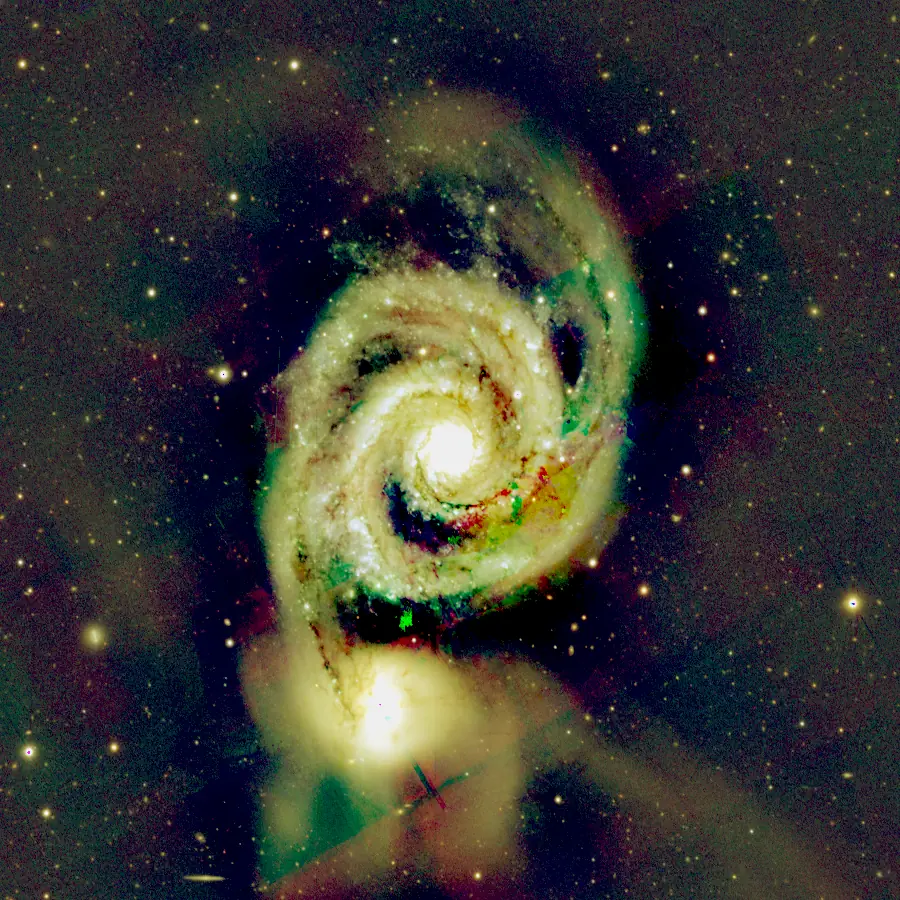

## Summary

`PixelMath` evaluates a **Python expression** over the numpy arrays of images. True to
Retina's "no home-grown language" pillar, there is **no DSL**: the expression is Python
evaluated in a sandbox (asteval), with the full power of numpy available (`sqrt`, `log`,
`clip`, `where`, element-wise operators…). It is the universal tool for combining,
correcting and generating images.

*Before, and after evaluating `img ** 0.5` — a stretch written as arithmetic rather than chosen from a menu.*

## Use cases

- **Image arithmetic**: `img_a - 0.9*img_b` (gradient subtraction, differences).
- **Conditional composition**: `where(img > 0.8, img, 0)` (threshold masking).
- **Non-linear corrections**: `img**0.5`, `log1p(img)/log1p(1.0)`.
- **Generation**: noise, ramp or pattern images from `x`, `y` and numpy functions.

## How it works

The expression is evaluated in a namespace holding the current image (`img`), any other views
referenced by identifier, and the usual numpy functions. The **`symbols`** field lets you
define preamble lines (intermediate variables) run before the final expression. After
evaluation, two optional post-steps apply:

1. **`truncate`** clamps the result to `[range_low, range_high]`.
2. **`rescale`** then linearly stretches the occupied range onto `[range_low, range_high]`.

The result replaces the current view, or creates a new image when `create_new_image` is true.

## Mathematics

Let $E(\cdot)$ be the entered expression and $I$ the input image. The raw output is
$Y = E(I, \dots)$. Clamping (`truncate`) gives:

$$ Y_t = \operatorname{clip}(Y,\; r_\text{low},\; r_\text{high}) $$

and rescaling (`rescale`), if enabled, applies:

$$ Y_r = r_\text{low} + (r_\text{high} - r_\text{low}) \,
        \frac{Y_t - \min(Y_t)}{\max(Y_t) - \min(Y_t)} $$

Random functions (`rand`, `gauss`) are deterministic for a given **`seed`**, guaranteeing
reproducibility of a recipe.

## Parameters

- **`expression`** — *text*, default `img`. Python expression evaluated over the arrays.
- **`symbols`** — *text*, default empty. Preamble lines (variable definitions).
- **`rescale`** — *bool*, default `False`. Stretch the occupied range onto `[range_low, range_high]`.
- **`truncate`** — *bool*, default `True`. Clamp the result to `[range_low, range_high]`.
- **`range_low`** — *real*, default `0.0`, range `0`–`1`. Lower bound.
- **`range_high`** — *real*, default `1.0`, range `0`–`1`. Upper bound.
- **`create_new_image`** — *bool*, default `False`. Create a new image instead of replacing.
- **`new_image_id`** — *str*, default empty. Identifier of the new image.
- **`seed`** — *int*, default `0`. Seed of the random generators (reproducibility).

## Tips & pitfalls

> **Note** — evaluation is sandboxed: no file I/O, no arbitrary imports. Stay within numpy
> and the exposed views.

- Disable `truncate` to inspect out-of-`[0,1]` results (signed differences).
- To combine several images, reference them by their view identifier inside the expression.

## See also

- [Invert](retina-doc://Invert) — the special case `1 - img`.
- [ChannelCombination](retina-doc://ChannelCombination) — recombine channels.
- [Rescale](retina-doc://Rescale) — rescaling alone.

## References

- PixInsight — *PixelMath* tool reference.
- *asteval* — safe Python expression evaluation.
