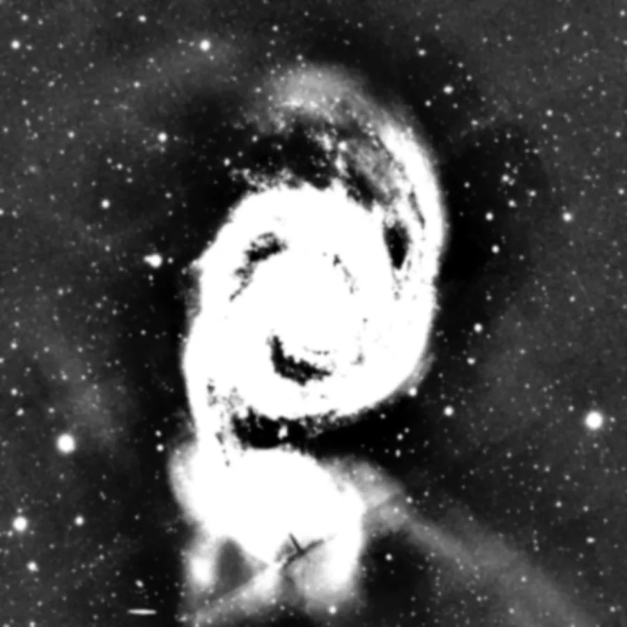

## Summary

`RangeSelection` builds a **single-channel grayscale mask** by selecting pixels whose
**luminance** falls within a range `[lower, upper]`. The edges of the selection can be
softened with a ramp (`fuzziness`) and then smoothed with a Gaussian blur (`smoothness`). It
is the equivalent of PixInsight's `RangeSelection` tool: a **non-destructive** process that
**creates a new window** (like `StarMask`), meant to be used as a protection or targeting
mask on another view.

*The source image, and the mask of the selected brightness band.*

## Use cases

- **Protect the sky background** during a stretch: select the low values (`lower=0`, low
  `upper`) to build a mask that confines the effect to faint tones.
- **Target the highlights** (star cores, galaxy nucleus) by selecting the upper range, to
  apply selective noise reduction or compression.
- **Isolate a luminance band** (e.g. mid-contrast nebulosity) without relying on structure
  detection, unlike `StarMask`.
- **Build a smooth transition mask** between two treatments, tuning `fuzziness` to avoid
  hard demarcation lines.

## How it works

1. The **luminance** is computed as the mean of the channels (already grayscale for
   single-channel images).
2. Without fuzz (`fuzziness = 0`), the mask is **binary**: 1 where the luminance lies in
   `[lower, upper]`, 0 otherwise.
3. With `fuzziness > 0`, two **linear ramps** of width `fuzziness` replace the hard edges:
   the selection rises smoothly from 0 to 1 entering the range on the low side (around
   `lower`), and falls back from 1 to 0 leaving it on the high side (around `upper`).
4. If `smoothness > 0`, a **Gaussian blur** (`scipy.ndimage.gaussian_filter`, standard
   deviation `smoothness`) further softens the mask — useful to remove jagged edge artifacts
   on fine structures.
5. If `invert` is enabled, the mask is **inverted** (`1 − mask`).
6. The result is clamped to `[0, 1]` and written into an independent single-channel window.

## Mathematics

Let $L(x,y)$ be the normalized pixel luminance, $\ell$ = `lower`, $u$ = `upper`,
$f$ = `fuzziness`.

**No-fuzz case** ($f = 0$) — indicator function of the interval:

$$ M(x,y) = \mathbb{1}_{[\ell,\, u]}\big(L(x,y)\big) =
   \begin{cases} 1 & \text{if } \ell \le L(x,y) \le u \\ 0 & \text{otherwise.} \end{cases} $$

**Fuzzy case** ($f > 0$) — two bounded ramps combine via a minimum, yielding a plateau at 1
over $[\ell, u]$ and linear transitions of width $f$ on either side:

$$ b(x,y) = \operatorname{clip}\!\left(\frac{L(x,y) - (\ell - f)}{f},\, 0,\, 1\right), \qquad
   a(x,y) = \operatorname{clip}\!\left(\frac{(u + f) - L(x,y)}{f},\, 0,\, 1\right) $$

$$ M(x,y) = \operatorname{clip}\!\big(\min(b(x,y),\, a(x,y)),\, 0,\, 1\big) $$

**Optional smoothing** (Gaussian convolution of standard deviation $\sigma$ = `smoothness`):

$$ M_\sigma(x,y) = (M * G_\sigma)(x,y), \qquad
   G_\sigma(x,y) = \frac{1}{2\pi\sigma^2}\, e^{-\frac{x^2+y^2}{2\sigma^2}} $$

**Final inversion** if `invert` is enabled:

$$ M'(x,y) = 1 - M_\sigma(x,y) $$

## Parameters

- **`lower`** — *real*, default `0.0`, range `0`–`1`. Lower bound of the selected luminance
  range.
- **`upper`** — *real*, default `1.0`, range `0`–`1`. Upper bound of the selected range.
- **`fuzziness`** — *real*, default `0.0`, range `0`–`1`. Width of the linear transition
  ramps applied on either side of `[lower, upper]`. At `0`, edges are hard (binary mask).
- **`smoothness`** — *real*, default `0.0`, range `0`–`50`. Standard deviation $\sigma$ (in
  pixels) of the Gaussian blur applied to the mask after thresholding. At `0`, no smoothing.
- **`invert`** — *bool*, default `False`. Inverts the final mask (selects the complement of
  the range).

## Tips & pitfalls

> **Warning** — `lower > upper` produces an empty range (all-black mask); the process does
> not automatically reorder the bounds.

> **Note** — the luminance used is a plain **channel average**, not a perceptual weighting
> (Rec. 709/601). On strongly colored images, work from a coherent grayscale conversion first
> if the selection must match precise perceived brightness.

- A non-zero `fuzziness` avoids hard-edge ("halo") artifacts visible when the mask blends two
  very different treatments.
- `smoothness` complements `fuzziness`: `fuzziness` softens the **intensity transition**,
  `smoothness` softens the **geometry** of the mask (irregular edges, noise).
- The produced mask is a **new window**: assign it as another view's mask via `view.mask`
  for it to affect subsequent processing.

## See also

- [StarMask](retina-doc://StarMask) — mask based on stellar structure detection.
- [Binarize](retina-doc://Binarize) — hard thresholding into a strictly binary mask.
- [HistogramTransformation](retina-doc://HistogramTransformation) — stretch the luminance
  first if the useful range has low contrast.
- [CurvesTransformation](retina-doc://CurvesTransformation) — alternative for shaping a
  selection curve more complex than a plain range.

## References

- PixInsight — *RangeSelection* tool reference.
- scipy.ndimage — *gaussian_filter* (mask smoothing).
